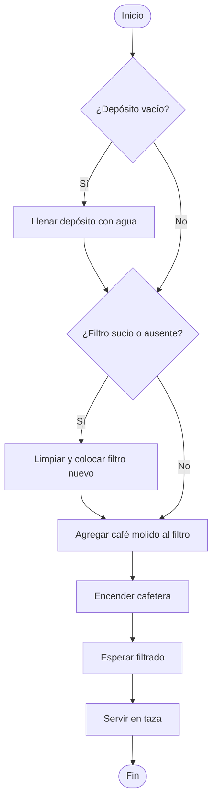
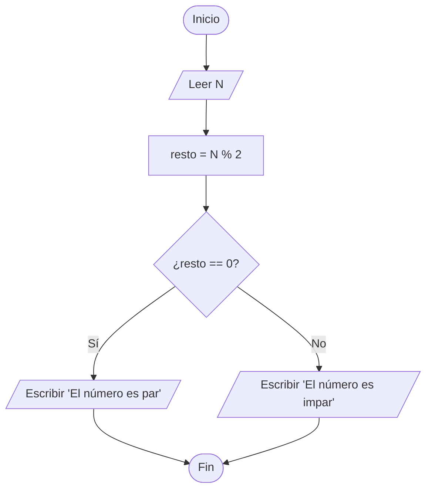
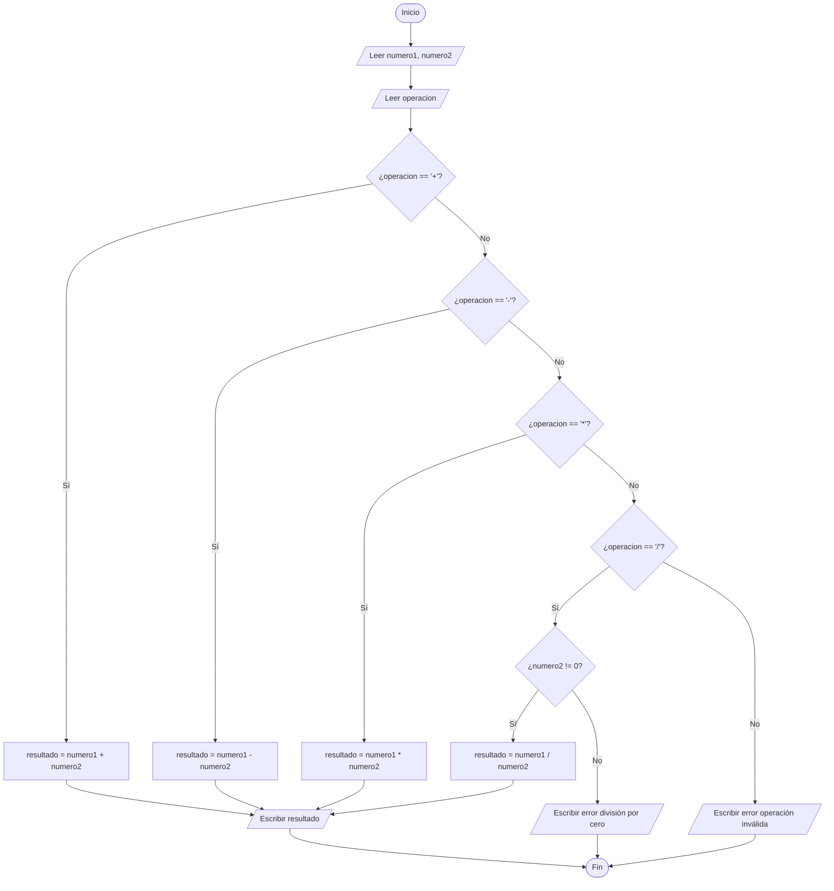
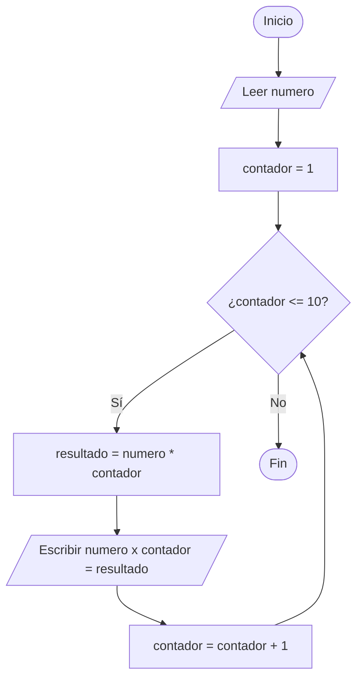
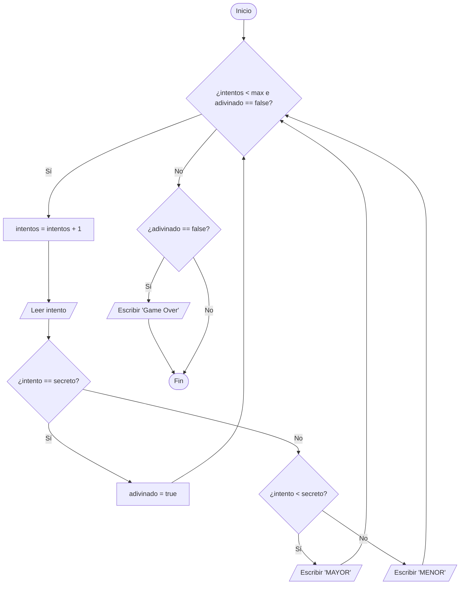

## Introducción

Antes de escribir tu primera línea de código en C, es fundamental repasar (y comprender) algunos conceptos básicos sobre cómo funcionan las computadoras y cómo comunicarnos con ellas de manera efectiva. En este apunte, sentaremos las bases algorítmicas de forma independiente de cualquier lenguaje, utilizando un pseudocódigo estructurado similar a C en español. Esto te permitirá concentrarte en el pensamiento lógico antes de abordar la sintaxis formal de C.

:::{important}
Este material es **prerrequisito** para el apunte de introducción a C, y es un repaso de los temas vistos en el Curso de Ingreso y en Introducción a la Ingeniería en Computación. Asegurate de comprender estos conceptos antes de avanzar, ya que forman la base de todo lo que veremos posteriormente.
:::

---

## ¿Qué es una computadora?

Una computadora es una máquina electrónica diseñada para procesar información de manera automática, siguiendo instrucciones precisas y explícitas. A diferencia de los seres humanos, una computadora:

- **No entiende ambigüedades**: necesita instrucciones exactas y sin interpretación posible.
- **No tiene intuición**: hace exactamente lo que le decimos, ni más ni menos, sin asumir nada.
- **Es extremadamente rápida**: puede ejecutar millones (o incluso miles de millones) de instrucciones por segundo.
- **Es determinista y sigue instrucciones de forma estricta**: ejecuta exactamente las instrucciones que le proporcionamos, pero su aritmética física está limitada por el almacenamiento finito de datos. No comete "descuidos" humanos, pero la representación matemática en hardware (por ejemplo, de números reales mediante el estándar IEEE 754) tiene imprecisiones de redondeo y límites de rango (desbordamiento o subdesbordamiento).
- **No se cansa**: puede repetir la misma operación millones de veces sin degradación en su rendimiento.

:::{note}
La computadora hará **exactamente** lo que le pidamos, incluso si está mal. De ahí la importancia de diseñar y escribir algoritmos correctos.
:::

### Componentes básicos

Para entender cómo programar, es útil conocer los componentes físicos de una computadora y cómo interactúan entre sí.

#### Hardware

El **hardware** son los componentes físicos de la computadora:

- **Procesador (CPU)**: El "cerebro" que ejecuta las instrucciones. Realiza operaciones aritméticas, lógicas y de control. Su velocidad se mide en GHz (gigahertz).
- **Memoria RAM**: Memoria de acceso rápido donde se guardan temporalmente los datos y programas mientras se ejecutan. Es **volátil**: se borra por completo cuando se apaga o reinicia el equipo.
- **Almacenamiento permanente**: Disco duro (HDD) o unidad de estado sólido (SSD) donde se guardan archivos, programas y el sistema operativo de forma persistente.
- **Dispositivos de entrada**: Permiten introducir información (teclado, mouse, sensores, etc.).
- **Dispositivos de salida**: Permiten obtener información (pantalla, parlantes, impresoras, etc.).

```{figure} 1/componentes_computadora.svg
:alt: Componentes de una computadora
:align: center
:width: 90%

Arquitectura básica de una computadora: el CPU coordina el flujo de datos entre la memoria RAM (rápida y volátil), el almacenamiento permanente (lento pero persistente), y los dispositivos de entrada/salida.
```

:::{tip} ¿Por qué necesitamos RAM y almacenamiento permanente?
La RAM es extremadamente rápida pero volátil y costosa. El disco es mucho más lento pero persistente y económico. Esta combinación nos da lo mejor de ambos mundos: velocidad para ejecutar programas en memoria activa y persistencia para guardar nuestros archivos a largo plazo.
:::

#### Software

El **software** son los programas e instrucciones de control:

- **Sistema operativo**: El programa fundamental que controla directamente el hardware y proporciona servicios básicos a las aplicaciones. Actúa como intermediario directo.
- **Programas o aplicaciones**: Software diseñado para realizar tareas específicas para el usuario (editores de texto, navegadores, compiladores).
- **Código fuente**: Las instrucciones estructuradas que los programadores escriben en lenguajes de programación. Este código debe ser traducido a código de máquina (código binario de instrucciones de CPU) para que el procesador pueda ejecutarlo.

```{figure} 1/capas_software.svg
:alt: Capas de software
:align: center
:width: 70%

Las aplicaciones utilizan los servicios del sistema operativo, que a su vez controla y gestiona el hardware.
```

---

## ¿Qué es programar?

Programar es el proceso de estructurar instrucciones detalladas para que una computadora realice una tarea específica.

Cuando programamos, debemos considerar:

1. **¿Qué problema queremos resolver?** - Entender el objetivo.
2. **¿Qué datos necesitamos?** - Identificar las entradas de información y las salidas resultantes.
3. **¿Qué pasos seguir?** - Diseñar el algoritmo.
4. **¿Cómo traducirlo a código?** - Escribir en un lenguaje de programación.
5. **¿Funciona correctamente?** - Probar y depurar.

### Analogía: La receta de cocina

Imaginá que querés hacer un bizcochuelo y le das las instrucciones a alguien que **nunca cocinó** y que seguirá **literalmente** cada palabra:

::::{grid} 1 1 2 2

:::{grid-item-card} ❌ Instrucciones vagas (no funcionan)
"Poné un poco de harina, algo de azúcar, mezclá los ingredientes y horneá hasta que esté listo."

**Problemas:**
- ¿Cuánto es "un poco"?
- ¿Qué otros ingredientes lleva?
- ¿En qué orden se mezclan?
- ¿A qué temperatura?
- ¿Cómo saber cuándo está "listo"?
:::

:::{grid-item-card} ✅ Instrucciones precisas (como un programa)
1. Precalentar el horno a 180°C.
2. En un recipiente, colocar 200 gramos de harina.
3. Agregar 150 gramos de azúcar.
4. Agregar 3 huevos.
5. Batir la mezcla durante 2 minutos a velocidad media.
6. Verter la mezcla en un molde de 20cm de diámetro previamente enmantecado.
7. Hornear durante 30 minutos.
8. Retirar del horno usando guantes protectores.

**Características:**
- Cantidades exactas e inequívocas.
- Orden cronológico específico.
- Tiempos definidos.
:::
::::

La computadora necesita instrucciones de este segundo tipo: específicas, ordenadas, sin ambigüedades y detalladas al extremo.

### Ejercicio 1

```{exercise}
:label: ex-instrucciones-precisas
Escribí instrucciones detalladas y secuenciales (como para alguien que nunca lo hizo) para:

1. Hacer un sándwich de jamón y queso.
2. Atarse los cordones de las zapatillas.
3. Calcular el promedio de tres números.
```

```{solution} ex-instrucciones-precisas
class: dropdown

**Hacer un sándwich de jamón y queso:**
1. Retirar 2 rebanadas de pan del paquete.
2. Colocar ambas rebanadas horizontalmente sobre un plato limpio.
3. Retirar una rebanada de jamón del paquete correspondiente.
4. Colocar la rebanada de jamón cubriendo la primera rebanada de pan.
5. Retirar una rebanada de queso del paquete.
6. Colocar la rebanada de queso sobre el jamón.
7. Tomar la segunda rebanada de pan.
8. Colocarla sobre el queso, tapando el sándwich.
9. Presionar suavemente hacia abajo para asentar el sándwich.

**Calcular el promedio de tres números:**
1. Obtener el primer número (llamémoslo A).
2. Obtener el segundo número (llamémoslo B).
3. Obtener el tercer número (llamémoslo C).
4. Sumar los tres valores: suma = A + B + C.
5. Dividir el resultado de la suma por 3: promedio = suma / 3.
6. Mostrar el valor del promedio obtenido.
```

---

## ¿Qué es un algoritmo?

Un **algoritmo** es una secuencia finita, ordenada y no ambigua de pasos bien definidos que resuelve un problema o realiza una tarea específica. Los algoritmos son la base fundamental de la programación y el diseño de sistemas.

```{figure} 1/algoritmo_problema_solucion.svg
:alt: Del problema a la solución
:align: center
:width: 80%

El algoritmo es el puente conceptual que transforma un problema de entrada en su solución.
```

:::{important}
Un algoritmo es **independiente** del lenguaje de programación. El mismo algoritmo lógico puede implementarse en C, Python, Java o incluso traducirse a un circuito físico de hardware.
:::

### Características de un buen algoritmo

Un algoritmo efectivo debe cumplir con los siguientes vectores de diseño:

::::{grid} 1 1 2 2

:::{grid-item-card} 1. Finito
Debe finalizar en algún momento, después de un número determinado de pasos ejecutados.
:::

:::{grid-item-card} 2. Bien definido
Cada paso debe ser unívoco, claro y libre de toda ambigüedad en su interpretación.
:::

:::{grid-item-card} 3. Con entrada (opcional)
Puede recibir cero o más datos iniciales del entorno para procesar.
:::

:::{grid-item-card} 4. Con salida
Debe retornar o producir al menos un resultado o cambio de estado visible.
:::

:::{grid-item-card} 5. Efectivo
Cada paso debe ser realizable y computable en un tiempo finito utilizando recursos de memoria finitos.
:::

:::{grid-item-card} 6. Determinista
Dado el mismo conjunto de datos de entrada, debe producir siempre exactamente el mismo resultado de salida.
:::
::::

---

## Representación de Algoritmos y Diagramas de Flujo

Los **diagramas de flujo** son representaciones gráficas estandarizadas de algoritmos. Permiten visualizar la lógica de control, bifurcaciones e iteraciones antes de escribir código.

### Símbolos estándar de diagramas de flujo

```{figure} 1/simbolos_diagramas_flujo.svg
:alt: Símbolos estándar de diagramas de flujo
:align: center
:width: 85%

Símbolos universales utilizados en diagramas de flujo para representar diferentes procesos de un algoritmo.
```

- **Óvalo / Elipse:** Representa el inicio o el fin del algoritmo.
- **Rectángulo:** Representa un proceso o instrucción de cómputo (cálculos, asignación de variables).
- **Rombo:** Representa una decisión o bifurcación condicional. Posee una pregunta adentro y al menos dos caminos de salida (generalmente Sí y No).
- **Paralelogramo:** Representa operaciones de entrada y salida de datos (leer entrada del usuario o mostrar un mensaje por pantalla).
- **Flechas de flujo:** Indican la dirección lógica de ejecución del algoritmo.

---

## Ejemplos de Algoritmos en Pseudocódigo y Diagramas de Flujo

### Ejemplo 1: Algoritmo para hacer café

Homogeneizando la estructura cotidiana mediante ramificaciones secuenciales condicionales:

```text
=================================================
 Algoritmo: Hacer café
=================================================
 Entrada: ninguna
 Salida: taza de café servida
-------------------------------------------------
 Pasos:
 1. Inicio
 2. Verificar depósito de agua
 3. Si (depósito de agua está vacío) entonces:
        a. Llenar depósito con agua
    Sino:
        b. No hacer nada
 4. Verificar portafiltro
 5. Si (filtro está sucio o ausente) entonces:
        a. Limpiar portafiltro y colocar filtro nuevo
    Sino:
        b. No hacer nada
 6. Agregar 2 cucharadas de café molido al filtro
 7. Encender cafetera
 8. Esperar a que finalice el filtrado de agua
 9. Servir café en una taza limpia
 10. Fin
=================================================
```



### Ejemplo 2: Verificar si N es par

Este algoritmo calcula si un número entero es par utilizando el operador módulo `%` (resto de la división entera):

```text
=================================================
 Algoritmo: Verificar si N es par
=================================================
 Entrada: número entero N
 Salida: mensaje por pantalla "par" o "impar"
-------------------------------------------------
 Pasos:
 1. Inicio
 2. Leer N
 3. entero resto = N % 2
 4. Si (resto == 0) entonces:
        a. Escribir "El número es par"
    Sino:
        b. Escribir "El número es impar"
 5. Fin
=================================================
```



---

## Representación de datos y memoria

Las computadoras operan sobre datos almacenados en memoria física. Para procesar esta información, es necesario asignarle un tipo de dato que defina su rango y operaciones válidas.

### Tipos de información fundamentales

```{figure} 1/tipos_datos.svg
:alt: Tipos de datos fundamentales
:align: center
:width: 95%

Los cuatro tipos de datos fundamentales: enteros, reales, cadenas de caracteres y valores lógicos.
```

1.  **Enteros (`entero` / `int`):** Números sin parte fraccionaria (ej. `5`, `-20`, `0`). Se utilizan para conteos, índices de lazos y posiciones.
2.  **Reales / Decimales (`real` / `float`):** Números con coma fraccionaria (ej. `3.1415`, `-0.75`). Tienen precisión finita debido a la representación estándar binaria IEEE 754 de hardware.
3.  **Caracteres / Cadenas (`cadena` / `char` / `str`):** Texto delimitado por comillas (ej. `"Hola Mundo"`, `'A'`). Representan símbolos legibles.
4.  **Lógicos / Booleanos (`logico` / `bool`):** Solo admiten dos estados lógicos: `verdadero` (`true`) o `falso` (`false`).

---

### Variables: Direcciones físicas de memoria

Una **variable** es un espacio reservado en la memoria física RAM de la computadora para almacenar un dato que puede cambiar durante la ejecución del programa.

Visualmente, una variable vincula una etiqueta lógica con una dirección física en el hardware:

```text
+------------------------------------------+
| Dirección Física (ej. 0x7ffd8)            | <- Celda en la memoria RAM
+------------------------------------------+
|  nombre: edad                            | <- Identificador de la variable
|  tipo: entero                            | <- Tipo de dato asignado
|  valor: 25                               | <- Dato de almacenamiento actual
+------------------------------------------+
```

Cada variable posee:
1.  **Dirección física de memoria:** La dirección hexadecimal real en el hardware RAM donde se ubica el dato.
2.  **Nombre (identificador):** La etiqueta lógica que usa el programador en el código (ej. `edad`, `temperatura`).
3.  **Tipo de dato:** Define el tamaño en bytes reservado y cómo el hardware interpretará los bits guardados.
4.  **Valor:** El contenido binario actual de la celda de memoria.

---

### El ciclo de vida de una variable en memoria

```{figure} 1/ciclo_vida_variable.svg
:alt: Ciclo de vida de una variable
:align: center
:width: 85%

Una variable se declara e inicializa en memoria, es leída o modificada durante la ejecución, y finalmente se libera de la memoria física.
```

:::{important}
En lenguajes de alto nivel como Python, la memoria ocupada por las variables se libera de forma automática mediante un recolector de basura (*garbage collector*). Sin embargo, en C la gestión de la memoria es explícita: la memoria de las variables locales (en la pila o *stack*) se libera automáticamente al salir de su ámbito de visibilidad, mientras que la memoria dinámica asignada manualmente (en el *heap*) debe ser liberada explícitamente por el programador. Si olvidás liberarla, se genera una fuga de memoria (*memory leak*).
:::

```{exercise}
:label: ex-tipos-vars
Para cada uno de los siguientes datos, indicá qué tipo de variable (`entero`, `real`, `cadena`, `logico`) usarías en pseudocódigo:

1. Cantidad de estudiantes en una clase.
2. Precio de un producto con centavos.
3. Nombre completo de una persona.
4. Si un archivo existe o no.
5. Calificación académica con decimales.
```

```{solution} ex-tipos-vars
class: dropdown

1. **`entero`**: Se cuentan individuos discretos.
2. **`real`**: Requiere representar centavos fraccionarios.
3. **`cadena`**: Secuencia de caracteres alfabéticos.
4. **`logico`**: Estado binario (verdadero/falso).
5. **`real`**: Contiene parte fraccionaria (ej: 8.5).
```

---

## Estructuras lógicas y operaciones básicas

### Operaciones aritméticas

A nivel de hardware, se ejecutan operaciones aritméticas sobre celdas numéricas:

```{figure} 1/operaciones_aritmeticas.svg
:alt: Operaciones aritméticas
:align: center
:width: 85%

Operaciones aritméticas básicas y especiales, con precedencia de evaluación.
```

-   **Módulo `%`:** Retorna el resto de la división entera. Es útil para evaluar paridad (`N % 2 == 0`) o extraer dígitos.
-   **Precedencia estándar:** 1. Paréntesis `()`, 2. Potencias, 3. Multiplicación/División/Módulo, 4. Suma/Resta.

### Operaciones lógicas y tablas de verdad

Las operaciones lógicas combinan valores booleanos para evaluar condiciones complejas:

```{figure} 1/operaciones_logicas.svg
:alt: Operaciones lógicas
:align: center
:width: 95%

Las tres operaciones lógicas fundamentales (Y, O, NO) con sus tablas de verdad.
```

-   **AND (`y`):** Da verdadero únicamente si ambos operandos son verdaderos.
-   **OR (`o`):** Da verdadero si al menos uno de los operandos es verdadero.
-   **NOT (`no`):** Invierte el estado lógico.

---

## Las Tres Estructuras Fundamentales del Pensamiento Lógico

Todo algoritmo de control estructurado puede resolverse utilizando únicamente tres estructuras lógicas:

```{figure} 1/estructuras_control.svg
:alt: Tres estructuras fundamentales de control
:align: center
:width: 100%

Las tres estructuras fundamentales del pensamiento algorítmico: secuencia, decisión y repetición.
```

### 1. Secuencia
Ejecución lineal de instrucciones en orden cronológico estricto de arriba hacia abajo. El cambio del orden de los factores altera el resultado lógico o provoca fallas en tiempo de ejecución.

### 2. Decisiones (Condicionales)
Bifurcación del flujo lógico en base al resultado de una condición booleana (`Si... Sino`).

### 3. Repetición (Lazos)
Estructuras de iteración de código. Se clasifican didácticamente en:
-   **Lazo controlado por contador (`Para` / `for`):** Utilizado cuando el límite de iteraciones es conocido de antemano.
-   **Lazo controlado por condición (`Mientras` / `while`):** Utilizado cuando la parada del lazo depende de una expresión lógica evaluada dinámicamente.

---

## Ejemplos de Programas Traducidos a Pseudocódigo Estricto (Estilo C)

A continuación se presentan los ejemplos lógicos resueltos en pseudocódigo estricto con sintaxis cercana a C en español, eliminando dependencias de lenguajes interpretados dinámicos.

### Ejemplo 1: Calculadora simple

```text
// Algoritmo: Calculadora Simple
// Entrada: dos números reales y un carácter de operación
// Salida: el resultado de la operación matemática por pantalla

real numero1;
real numero2;
real resultado;
caracter operacion;

Escribir("=== CALCULADORA SIMPLE ===");
Escribir("Ingrese el primer número: ");
Leer(numero1);
Escribir("Ingrese el segundo número: ");
Leer(numero2);
Escribir("Ingrese la operación (+, -, *, /): ");
Leer(operacion);

Si (operacion == '+')
{
    resultado = numero1 + numero2;
    Escribir("Resultado: ", resultado);
}
Sino Si (operacion == '-')
{
    resultado = numero1 - numero2;
    Escribir("Resultado: ", resultado);
}
Sino Si (operacion == '*')
{
    resultado = numero1 * numero2;
    Escribir("Resultado: ", resultado);
}
Sino Si (operacion == '/')
{
    Si (numero2 != 0.0)
    {
        resultado = numero1 / numero2;
        Escribir("Resultado: ", resultado);
    }
    Sino
    {
        Escribir("Error: No se puede dividir por cero.");
    }
}
Sino
{
    Escribir("Error: Operación no válida.");
}
```



### Ejemplo 2: Tabla de multiplicar

```text
// Algoritmo: Tabla de Multiplicar
// Entrada: un número entero
// Salida: la tabla de multiplicar de N del 1 al 10

entero numero;
entero contador;
entero resultado;

Escribir("=== TABLA DE MULTIPLICAR ===");
Escribir("Ingrese un número: ");
Leer(numero);

Escribir("Tabla del ", numero, ":");
Escribir("-----------------");

// Lazo controlado por contador (Para) de 1 a 10
Para (contador = 1; contador <= 10; contador = contador + 1)
{
    resultado = numero * contador;
    Escribir(numero, " x ", contador, " = ", resultado);
}
```



### Ejemplo 3: Adivinar número

```text
// Algoritmo: Adivinar Número
// Entrada: intento numérico del usuario
// Salida: mensajes guía (mayor/menor) e indicación de éxito o derrota

entero numero_secreto = 42; // Simulado para propósitos de prueba
entero intentos_maximos = 5;
entero intentos_realizados = 0;
entero intento;
logico adivinado = false;

Escribir("=== ADIVINA EL NÚMERO ===");
Escribir("Tenés 5 intentos para adivinar un número entre 1 y 100");

Mientras (intentos_realizados < intentos_maximos y adivinado == false)
{
    intentos_realizados = intentos_realizados + 1;
    Escribir("Intento ", intentos_realizados, " de ", intentos_maximos, ":");
    Leer(intento);

    Si (intento == numero_secreto)
    {
        adivinado = true;
        Escribir("¡Adivinaste el número!");
    }
    Sino Si (intento < numero_secreto)
    {
        Escribir("El número secreto es MAYOR");
    }
    Sino
    {
        Escribir("El número secreto es MENOR");
    }
}

Si (adivinado == false)
{
    Escribir("Game Over. El número secreto era: ", numero_secreto);
}
```



---

## Ejercicio 2: Aplicación Algorítmica

```{exercise}
:label: ex-pseudo-2
Escribí en pseudocódigo estructurado (estilo C en español) algoritmos para resolver las siguientes cuestiones, sin declarar subprogramas (`def`) ni importar librerías complejas:

A. Convertir una temperatura dada de grados Celsius a Fahrenheit.
B. Determinar si tres medidas de lados reales pueden formar un triángulo (la suma de dos lados cualesquiera debe ser siempre estrictamente mayor que el tercer lado).
C. Calcular el Máximo Común Divisor (MCD) de dos números enteros utilizando el algoritmo de Euclides.
D. Determinar si una cadena de caracteres es un palíndromo (se lee igual de izquierda a derecha que de derecha a izquierda), comparando sus extremos mediante un lazo.
```

:::{solution} ex-pseudo-2
class: dropdown

**A. Conversión de temperatura:**
```text
real celsius;
real fahrenheit;

Escribir("Ingrese temperatura en Celsius: ");
Leer(celsius);

fahrenheit = celsius * 9.0 / 5.0 + 32.0;
Escribir("Equivalente en Fahrenheit: ", fahrenheit);
```


**B. Verificar triángulo:**
```text
real lado1;
real lado2;
real lado3;

Escribir("Ingrese lado 1: ");
Leer(lado1);
Escribir("Ingrese lado 2: ");
Leer(lado2);
Escribir("Ingrese lado 3: ");
Leer(lado3);

Si (lado1 + lado2 > lado3 y lado1 + lado3 > lado2 y lado2 + lado3 > lado1)
{
    Escribir("Los lados pueden formar un triángulo.");
}
Sino
{
    Escribir("Los lados NO pueden formar un triángulo.");
}
```

**C. MCD (Algoritmo de Euclides):**
```text
entero a;
entero b;
entero temporal;

Escribir("Ingrese el primer número: ");
Leer(a);
Escribir("Ingrese el segundo número: ");
Leer(b);

Mientras (b != 0)
{
    temporal = b;
    b = a % b;
    a = temporal;
}

Escribir("El MCD es: ", a);
```

**D. Palíndromo (lazo de comparación de extremos):**
```text
cadena palabra;
entero longitud;
entero inicio = 0;
entero fin;
logico coincide = true;

Escribir("Ingrese la palabra: ");
Leer(palabra);
Escribir("Ingrese la longitud de la palabra: ");
Leer(longitud);

fin = longitud - 1;

Mientras (inicio < fin y coincide == true)
{
    Si (palabra[inicio] != palabra[fin])
    {
        coincide = false;
    }
    inicio = inicio + 1;
    fin = fin - 1;
}

Si (coincide == true)
{
    Escribir("La palabra es un palíndromo.");
}
Sino
{
    Escribir("La palabra NO es un palíndromo.");
}
```
:::

---

## Ejercicio 3 : Integradores

:::{exercise}
:label: ex-integrador-1
Analizá el siguiente pseudocódigo estructurado y respondé las consignas:

```text
entero n;
entero suma = 0;
entero i = 1;

Escribir("Ingrese un número: ");
Leer(n);

Mientras (i <= n)
{
    Si (i % 2 == 0)
    {
        suma = suma + i;
    }
    i = i + 1;
}
Escribir("Resultado: ", suma);
```

1. ¿Qué hace este algoritmo?
2. Si `n` ingresado es 10, ¿cuál es la salida final?
3. Modificalo para que realice la suma exclusiva de números impares.
:::

:::{solution} ex-integrador-1
class: dropdown
1. **¿Qué hace?** Suma todos los números pares en el rango de 1 a `n` inclusive.
2. **Resultado para n=10:** 2 + 4 + 6 + 8 + 10 = **30**.
3. **Modificación para impares:** Modificar la condición del módulo en la decisión (`i % 2 != 0`):

```text
entero n;
entero suma = 0;
entero i = 1;

Escribir("Ingrese un número: ");
Leer(n);

Mientras (i <= n)
{
    Si (i % 2 != 0) // Cambio de paridad
    {
        suma = suma + i;
    }
    i = i + 1;
}
Escribir("Resultado: ", suma);
```
:::

---

## Errores comunes y estrategias para prevenirlos

### 1. Secuencia incorrecta de asignaciones
Las variables deben poseer datos válidos antes de ser leídas o manipuladas en expresiones.

-   **Incorrecto (Lectura ciega tardía):**
    ```text
    entero a;
    entero b;
    entero resultado = a + b; // a y b no tienen datos definidos en memoria RAM
    Leer(a);
    Leer(b);
    ```
-   **Correcto (Orden lineal lógico):**
    ```text
    entero a;
    entero b;
    Leer(a);
    Leer(b);
    entero resultado = a + b;
    ```

### 2. Lazos infinitos
Ocurren cuando la condición de permanencia de un lazo `Mientras` nunca resulta en `falsa`. Es obligatorio asegurar que el bloque interno altere la variable de control.

-   **Incorrecto (Falta de paso de iteración):**
    ```text
    entero contador = 1;
    Mientras (contador <= 10)
    {
        Escribir(contador);
        // contador se mantiene en 1 eternamente
    }
    ```
-   **Correcto (Paso de iteración explícito):**
    ```text
    entero contador = 1;
    Mientras (contador <= 10)
    {
        Escribir(contador);
        contador = contador + 1;
    }
    ```

### 3. Desbordamiento numérico e imprecisión de reales

Las variables en memoria física tienen un almacenamiento binario de tamaño finito. Esto introduce limitaciones físicas ausentes en la matemática pura.

#### Desbordamiento (Overflow y Underflow)
Ocurre cuando una operación aritmética produce un valor que excede el límite almacenable por el tipo de dato.

- **Overflow (sobreflujo):** El valor supera el límite máximo representable. Para enteros con signo, esto constituye un **Comportamiento Indefinido** (*Undefined Behavior* o *UB*) según el estándar C. Esto significa que el estándar no garantiza qué va a suceder: el compilador es libre de optimizar el código asumiendo que el desbordamiento nunca ocurrirá, lo que puede provocar fallas lógicas o de seguridad críticas. El comportamiento modular cíclico de desbordamiento (aritmética módulo $2^w$, donde $w$ es la cantidad de bits del tipo de dato) está estrictamente garantizado por el estándar únicamente para los tipos enteros sin signo (`unsigned`). En sistemas reales, dependiendo de la arquitectura de la CPU y de la optimización del compilador, un overflow con signo suele manifestarse como un salto cíclico al valor mínimo o **comportamientos erráticos**.
- **Underflow (subflujo):** El valor es menor al límite mínimo representable. En números reales de punto flotante, ocurre cuando el valor absoluto es tan pequeño y cercano a cero que el hardware es incapaz de representarlo con una mantisa válida, diferenciándose únicamente de cero por subdesbordamiento.

Ejemplo de desbordamiento de enteros sin signo en C (comportamiento modular cíclico garantizado):
```c
unsigned short numero = 65535; // Valor máximo para 16 bits sin signo
numero = numero + 1;           // Garantizado por estándar: produce 0
```

Ejemplo de desbordamiento de enteros con signo en C (comportamiento indefinido):
```c
short numero = 32767;          // Valor máximo para 16 bits con signo
numero = numero + 1;           // ¡Comportamiento Indefinido! No asumas que dará -32768.
```

#### Imprecisión de reales y estándar IEEE 754
Las computadoras almacenan números reales mediante el estándar IEEE 754. Al representar infinitos números reales con un número finito de bits, la gran mayoría de los números fraccionarios no pueden representarse de forma exacta, lo que obliga al hardware a realizar un redondeo o truncamiento.

##### Demostración de la periodicidad binaria de $0.1$

Para comprender el origen de esta imprecisión, considerá la conversión del número decimal $0.1_{10}$ a base binaria. El método consiste en multiplicar de manera sucesiva la parte fraccionaria por $2$ y tomar la parte entera resultante como el siguiente bit a la derecha del punto binario:

1. $0.1 \times 2 = 0.2 \rightarrow \text{bit } 0$ (resto $0.2$)
2. $0.2 \times 2 = 0.4 \rightarrow \text{bit } 0$ (resto $0.4$)
3. $0.4 \times 2 = 0.8 \rightarrow \text{bit } 0$ (resto $0.8$)
4. $0.8 \times 2 = 1.6 \rightarrow \text{bit } 1$ (resto $0.6$)
5. $0.6 \times 2 = 1.2 \rightarrow \text{bit } 1$ (resto $0.2$)
6. $0.2 \times 2 = 0.4 \rightarrow \text{bit } 0$ (se repite la secuencia de restos)
7. $0.4 \times 2 = 0.8 \rightarrow \text{bit } 0$
8. $0.8 \times 2 = 1.6 \rightarrow \text{bit } 1$
9. $0.6 \times 2 = 1.2 \rightarrow \text{bit } 1$

A partir del paso 6 la parte fraccionaria vuelve a ser $0.2$, lo que genera un ciclo periódico infinito. Por lo tanto, la representación binaria exacta de $0.1$ es:

$$0.1_{10} = 0.00011001100110011\dots_2 = 0.0\overline{0011}_2$$

##### El límite físico del hardware

Dado que la memoria de una computadora es finita, es imposible almacenar infinitos dígitos. En el estándar IEEE 754 de precisión simple (`float`), se reservan únicamente 23 bits para la mantisa. En consecuencia, la secuencia binaria infinita de $0.1$ se corta y se redondea en el bit 23, guardándose en la celda de memoria el valor aproximado:

$$0.100000001490116119384765625$$

Este error de redondeo se acumula al realizar operaciones aritméticas. Por este motivo, una comparación de igualdad directa entre números reales resulta en un comportamiento incorrecto.

Ejemplo de error en C:
```c
float a = 0.1f;
float b = 0.2f;
if (a + b == 0.3f) {
    // Esta condición resulta falsa debido a la imprecisión de redondeo
}
```

#### Solución: Margen de tolerancia (Épsilon)
Para comparar dos números reales de forma segura, se debe verificar si la diferencia absoluta entre ellos es menor que un valor de tolerancia sumamente pequeño (denominado *épsilon* o $\epsilon$).

Ejemplo de comparación robusta en C:
```c
#include <math.h>
#include <stdbool.h>
#include <stdio.h>

#define EPSILON 0.00001f

bool son_casi_iguales(float a, float b) {
    return fabsf(a - b) < EPSILON;
}
```

---
## Próximos Pasos: El Lenguaje C

Ahora que comprendés estos conceptos fundamentales mediante pseudocódigo estructurado, estás mucho mejor preparado para abordar el lenguaje C. En el próximo apunte veremos:

- Cómo escribir estos mismos algoritmos en el lenguaje C
- La sintaxis más estricta y detallada de C
- El proceso de compilación y ejecución de programas
- Variables y tipos de datos estáticos en C
- Estructuras de control (`if`, `while`, `for`) en C

Recordá que toda la lógica que vimos aquí se aplica directamente a C. La principal diferencia será la sintaxis y la necesidad de gestionar la memoria de forma más explícita.

## Glosario

::{glossary}
Algoritmo
: Secuencia finita, ordenada y unívoca de pasos lógicos diseñados para resolver un problema.

Variable
: Espacio con nombre asignado en la memoria física RAM asociado a una dirección de memoria, cuyo valor puede modificarse.

Tipo de dato
: Definición del conjunto de valores y operaciones válidos asignados a una variable.

Lazo
: Estructura de control diseñada para repetir la ejecución de un bloque de instrucciones (`Para`, `Mientras`).

Pseudocódigo
: Notación estructurada en lenguaje natural que representa un algoritmo de forma cercana a un lenguaje de programación.

Diagrama de flujo
: Modelado gráfico y estandarizado del flujo lógico de un algoritmo.
:::

---

## Recursos adicionales

- Practicá resolviendo problemas simples mediante pseudocódigo estructurado orientado a C.
- Dibujá diagramas de flujo antes de empezar a codificar.
- Intentá "ejecutar" tus algoritmos mentalmente o en papel para seguir la lógica.
- Discutí tus soluciones con compañeros - hay muchas formas de resolver un problema.

```{figure} 1/xkcd-algorithms.png
:label: fig-xkcd-algorithms
:alt: XKCD Algorithms
:align: center

Fuente: [xkcd.com](https://xkcd.com/1667/)
```

## Referencias y Lecturas Complementarias

### Fundamentos de Algoritmos

- {cite:t}`cormen_introduction_2009`. Capítulos 3-4: Growth of Functions y Divide-and-Conquer.
  
- {cite:t}`sedgewick_algorithms_2011`. Capítulo 1: Fundamentals. Introducción accesible con visualizaciones.
  - Disponible en: https://algs4.cs.princeton.edu/

### Pensamiento Computacional

- {cite:t}`wing_computational_2006`. El artículo que popularizó el término "pensamiento computacional".

- {cite:t}`aho_foundations_1995`. Conceptos fundamentales: algoritmos, estructuras de datos, lógica.

### Resolución de Problemas

- {cite:t}`polya_how_2014`. Clásico sobre heurísticas de resolución de problemas (1945).

- {cite:t}`bentley_programming_1999`. Columnas sobre diseño de algoritmos y resolución de problemas.

### Recursos en Línea

- **Khan Academy - Algorithms** - https://www.khanacademy.org/computing/computer-science/algorithms
  - Curso interactivo sobre algoritmos básicos.
  - Visualizaciones y ejercicios progresivos.

- **Visualgo** - https://visualgo.net/
  - Visualización de algoritmos y estructuras de datos.
  - Muy útil para entender ejecución paso a paso.

- **CS Unplugged** - https://csunplugged.org/
  - Actividades para aprender conceptos sin computadora.
  - Ideal para desarrollar intuición algorítmica.

---

En el próximo apunte, [](2_gradual.md), comenzaremos a traducir estos conceptos
al lenguaje C y escribiremos nuestros primeros programas.
