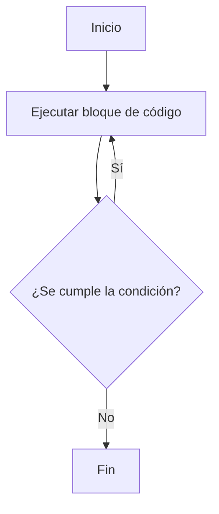

## Introducción

Antes de iniciar el estudio de la programación en C, es fundamental comprender que programar no consiste únicamente en aprender un lenguaje, sino en desarrollar una forma de pensar. El lenguaje es la herramienta, pero el verdadero arte reside en la construcción de instrucciones lógicas para resolver problemas.

:::{note} Prerrequisito: Fundamentos de Algoritmos
Este capítulo asume que ya comprendés los conceptos fundamentales de algoritmos, variables, tipos de datos, estructuras de control (if, while, for) y funciones que se presentaron en el [](1_base). Si necesitás repasar estos conceptos, consultá ese capítulo primero para entender la lógica antes de enfocarte en la sintaxis de C.
:::

Programar es el acto de proporcionar instrucciones precisas a una computadora para que realice una tarea específica. Una diferencia clave con la comunicación humana es que la computadora **no interpreta ambigüedades**. No comprende conceptos como «más o menos». Cada paso debe estar perfectamente definido. En este sentido, C presenta ciertas ambigüedades que pueden conducir a resultados inesperados.

Durante la programación, la omisión de un solo detalle puede provocar que el programa no funcione. Por ello, es necesario aprender a **pensar como una máquina**, pero también a **estructurar el pensamiento como un ser humano inteligente**.

En C, no existen atajos, lo cual es una ventaja, ya que obliga a pensar de forma clara y lógica.

---

## ¿Por qué aprender C?

El lenguaje C fue creado en 1972 por **Dennis Ritchie** y **Brian Kernighan** en los Bell Labs. A pesar de tener más de 50 años de existencia, se sigue utilizando ampliamente debido a sus características fundamentales:

- **Simplicidad**: Tiene una sintaxis reducida que facilita entender cómo se relacionan las instrucciones con el hardware.
- **Eficiencia**: El código compilado en C es muy rápido, cercano al rendimiento del lenguaje ensamblador.
- **Portabilidad**: Permite escribir programas que pueden ejecutarse en distintos sistemas operativos con mínimas modificaciones.
- **Historia y origen:** Nació de la necesidad de tener un lenguaje eficiente y portable para desarrollar el sistema operativo UNIX.
- **Evolución y estandarización:** C ha estado en constante revisión y mejora. Ha sido estandarizado primero por el {abbr}`ANSI (Instituto Nacional Estadounidense de Estándares)` y luego por la {abbr}`ISO (Organización Internacional de Normalización)` e {abbr}`IEC (Comisión Electrotécnica Internacional)`. Para mantener la vigencia del lenguaje y su compatibilidad entre implementaciones, se han publicado revisiones periódicas:
  - [ANSI X3.159-1989](https://nvlpubs.nist.gov/nistpubs/Legacy/FIPS/fipspub160.pdf)
  - [ISO/IEC 9899:1990](https://www.iso.org/standard/17782.html)
  - [ISO/IEC 9899:1999](https://www.iso.org/standard/29237.html)
  - [ISO/IEC 9899:2011](https://www.iso.org/standard/57853.html)
  - [ISO/IEC 9899:2018](https://www.iso.org/standard/74528.html)
  - [ISO/IEC 9899:2024](https://www.iso.org/standard/82075.html)
- **Influencia:** C ha servido como base e inspiración para muchos de los lenguajes más utilizados hoy en día (C++, C#, Java, JavaScript, PHP). Aprender C proporciona una base sólida para entender cómo funcionan muchos otros lenguajes.
- **Popularidad**: Figura entre los lenguajes más usados según el [índice TIOBE](https://www.tiobe.com/tiobe-index/c/), que mide el interés en los diferentes lenguajes.

---

## Características Principales de C

### Nivel de Abstracción

Aunque C es considerado un lenguaje de **nivel medio**, en el momento en el que fue creado se lo consideraba de alto nivel en comparación con el {term}`Lenguaje Ensamblador`.

Hoy en día, y teniendo en cuenta que pasaron _solo_ 50 años desde que fue creado, se lo sitúa en un nivel superior a los de bajo nivel, pero inferior a los que actualmente son considerados de alto nivel como Python o Java.

Esto le da un balance único:
- Permite un control muy cercano al hardware del sistema (gestión de memoria, registros, etc.).
- Ofrece construcciones de programación estructurada que facilitan el desarrollo de algoritmos complejos.

C es un lenguaje **compilado**. El código fuente se traduce directamente a código máquina integramente antes de ejecutarse mediante un compilador, a diferencia de los lenguajes **interpretados** que son traducidos línea por línea en tiempo de ejecución.

### Atributos Clave

- **Compilado:** El código fuente se traduce por completo a instrucciones nativas de CPU antes de su ejecución.
- **Imperativo:** Un programa consiste en una secuencia de instrucciones que modifican el estado (las variables) del programa.
- **Estructurado:** El código se organiza en bloques lógicos y funciones, lo que promueve la claridad y la reutilización.

---

### Fortalezas del Lenguaje C

#### Acceso a conceptos de bajo nivel
C provee acceso a conceptos directamente relacionados con el hardware. Conceptos como el tamaño de la memoria, punteros y direccionamiento físico de memoria son muy similares a los que la CPU utiliza, de forma que los programas sean lo más rápidos posible.

#### C es un lenguaje pequeño
El lenguaje C posee un núcleo sintáctico y un conjunto de palabras clave reducido. Todo lo demás provisto por el entorno se cubre mediante la biblioteca estándar de C y funciones auxiliares.

#### C es un lenguaje permisivo
El lenguaje asume que el programador sabe lo que está haciendo, por lo que permite un control absoluto sobre el sistema, reduciendo las capas de validación del compilador, para bien y para mal.

---

### Debilidades del Lenguaje C

#### Los programas en C pueden ser propensos a errores
La gran flexibilidad y permisividad de C facilitan la introducción de fallas de lógica o memoria que no siempre son detectadas por el compilador en tiempo de traducción. La mayoría de los errores de memoria (como el acceso fuera de límites o desreferencia de punteros nulos) se detectan recién en tiempo de ejecución.

#### Los programas en C pueden ser difíciles de entender
Debido a su diseño conciso e histórico (creado en una época donde la entrada de texto por consola era lenta), C utiliza una sintaxis compacta y operadores que pueden combinarse de forma críptica, exigiendo un cuidado extremo para mantener la legibilidad.

#### Los programas en C pueden ser difíciles de modificar
Los programas grandes escritos en C pueden ser difíciles de mantener si no se diseñan con cuidado. A diferencia de lenguajes orientados a objetos, C carece de conceptos como clases o paquetes integrados, delegando la modularidad a la estructuración de archivos del desarrollador.

---

## Las herramientas del aprendiz

### Preparación del entorno

Para los usuarios de Windows, la cátedra ha preparado un programa para simplificar la instalación de las herramientas necesarias para editar, compilar y ejecutar los programas.

[INGCOM-UNRN-P1/entorno](https://github.com/INGCOM-UNRN-P1/entorno)

Esencialmente, instala `clang`, `VSCode`, `git` y una terminal, tambien podes instalar manualmente todo siguiendo la guía: [compilador](../guias/compilador)

En sistemas basados en Debian/Ubuntu:

```bash
sudo apt install build-essential
```

:::{warning} ¡Importante!
Si surgen problemas o dificultades en la instalación del entorno, consultá inmediatamente en las clases prácticas o en el espacio de [Discussions](https://github.com/orgs/INGCOM-UNRN-P1/discussions).
:::

### Primer programa: el «Hola Mundo» en C

```{code-block} c
:label: holamundo
:caption: El indispensable Hola Mundo!
:linenos:
:filename: hola.c
#include <stdio.h>              // directiva del preprocesador

int main()                      // punto de entrada del programa
{                               // inicio de un bloque de código
    printf("Hola mundo C.\n");  // llamada a función de biblioteca para salida
    return 0;                   // finalización del programa
}                               // fin del bloque de código
```

#### Compilación y Ejecución

Para ejecutar un programa en C, primero hay que compilarlo. Esto se realiza desde la terminal traduciendo el código fuente en un ejecutable de código máquina.

:::{figure} 2/compilation_process.svg
:name: fig-compilation-process
:alt: Proceso de compilación en C

El proceso de compilación transforma el código fuente en un ejecutable que la máquina puede ejecutar directamente.
:::

```{code-block} sh
:label: salidamundo
:caption: La salida por la terminal.

# Compila el archivo hola.c y crea un ejecutable por defecto llamado a.out (a.exe en Windows)
$> gcc hola.c

# Ejecuta el programa
$> ./a.out
Hola mundo C.
$>
```

En la función `printf`, el carácter especial `\n` es una secuencia de control que indica un salto de línea en la consola de salida.

#### Pieza por pieza

1. `#include <stdio.h>`: Es una **directiva del preprocesador**. Le indica al preprocesador que inserte el contenido de la cabecera de la biblioteca estándar de entrada/salida (`stdio.h`), que contiene la declaración de la función `printf`.
2. `int main()`: Es la definición de la función principal y el **punto de entrada** del programa. Todo ejecutable en C comienza su ejecución en esta función. `int` indica que devolverá un valor numérico entero al sistema operativo.
3. `{ ... }`: Las llaves delimitan el **bloque de código** del cuerpo de la función.
4. `printf("Hola mundo C.\n");`: Es una **llamada a función de biblioteca para salida** que imprime la cadena en pantalla.
5. `return 0;`: Finaliza la ejecución de la función `main` devolviendo el estado `0` al entorno. Por convención, un retorno de `0` significa finalización exitosa.

---
:::{warning} Atención
Si no ves el mensaje que está dentro de la instrucción `printf`, hay algún problema que es **fundamental** solucionar. No se debe detener en este punto, ya que es un bloqueante para todos los temas siguientes.
:::

## El Algoritmo: pensar antes de escribir

### Mentalidad de programador

1. **Leé el problema. Comprendelo. Diseñalo.**
2. **Dividilo en pasos simples e inequívocos** en papel o pseudocódigo.
3. **Escribí el código en C** basándote únicamente en el algoritmo diseñado.

:::{figure} ./2/think.jpg
:alt: Roll Safe thinking
:align: center

_Pensar es más importante que escribir._
:::

### Ejemplo: Sumar dos números enteros

Diseño algorítmico:
1. Declarar variables para almacenar dos números.
2. Solicitar y leer los números.
3. Calcular la suma y asignarla a un destino.
4. Mostrar el resultado de la suma por pantalla.

```c
#include <stdio.h>

int main() {
    int a = 0;
    int b = 0;
    printf("Ingresá dos números: ");
    scanf("%d %d", &a, &b);
    printf("La suma es: %d\n", a + b);
    return 0;
}
```

---

## Sobre las reglas de estilo

El uso de reglas de estilo es fundamental para garantizar la consistencia y legibilidad del código. Al adherirse a normas uniformes (como nomenclatura, indentación y posición de llaves), se facilita la colaboración y el mantenimiento del software. Para más detalles, consultá la regla {ref}`0x0000h`.

---

## Sintaxis y Semántica Básica

La **sintaxis** es el conjunto de reglas formales que definen cómo debe escribirse el código para que sea válido para el compilador.
La **semántica** determina el significado lógico, la estructura y el comportamiento real que tiene el código durante su ejecución. Un código puede ser sintácticamente correcto pero semánticamente erróneo.

### Identificadores y Palabras Reservadas

**Identificadores:** Son los nombres que asignamos a variables, constantes y funciones. Deben comenzar obligatoriamente con una letra o guion bajo (`_`) y pueden contener letras, dígitos y guiones bajos. C distingue entre mayúsculas y minúsculas (`suma` es un identificador distinto de `Suma`). No pueden coincidir con palabras reservadas del lenguaje.

**Palabras Reservadas:** Son palabras clave del lenguaje C que poseen un significado sintáctico especial predefinido y no pueden ser utilizadas como identificadores (ej: `int`, `float`, `char`, `if`, `else`, `while`, `return`).

Nuestros identificadores deben respetar las pautas de estilo (ver {ref}`0x0001h`).

---

## Variables y Tipos de Datos

### ¿Qué es una variable?

Una variable es un identificador asociado a una dirección física de memoria RAM que almacena un dato de un tipo específico.

:::{figure} 2/variable_memory_concept.svg
:name: fig-variable-memory
:alt: Variables y memoria

Las variables abstraen ubicaciones físicas de memoria. Cada una tiene una dirección de memoria, un nombre y un tipo.
:::

### Tipos básicos de datos en C

- `int`: Representa números enteros (ej. `42`, `-5`).
- `float`: Representa números reales con punto flotante (ej. `3.1415`).
- `char`: Representa un único carácter o símbolo (ej. `'A'`).
- `bool`: Tipo de dato lógico que admite únicamente `true` o `false`. Requiere la inclusión de la cabecera `<stdbool.h>` (estándar C99).

:::{figure} 2/data_types_overview.svg
:name: fig-data-types
:alt: Tipos de datos en C

Especificadores de formato de tipos básicos en C.
:::

### Declaración e Inicialización

Toda variable debe declararse antes de ser usada, indicando su tipo y su nombre:

```c
#include <stdbool.h>

int edad = 42;
float pi = 3.14f;
char inicial = 'A';
bool activo = true;
```

Si declarás una variable sin inicializarla, su contenido inicial en memoria física es indeterminado ("basura"). **Siempre inicializá tus variables** a un valor conocido antes de utilizarlas (ver regla de estilo {ref}`0x0003h`).

### L-Values y R-Values (Asignación y Expresiones)

Para comprender cómo el compilador evalúa y almacena los datos durante una asignación, tenés que conocer las dos categorías de expresiones en C: **L-values** y **R-values**, según lo define formalmente el estándar del lenguaje.

#### L-Values (locator values / object locators)
Un **L-value** es una expresión que identifica o localiza un objeto persistente en memoria (es decir, una celda física de memoria direccionable).
- Pensalo como una ubicación o "contenedor" que posee una dirección física en memoria lógica.
- Puede aparecer tanto a la izquierda como a la derecha de un operador de asignación (`=`).
- Son obligatorios para ciertos operadores fundamentales:
  - El operador de dirección (`&`), ya que solo se puede obtener la dirección en memoria de un objeto con ubicación física.
  - Los operadores de incremento (`++`) y decremento (`--`), porque requieren leer y reescribir sobre una posición de memoria persistente.
- Ejemplo: en `int x = 10;`, la expresión `x` es un L-value ya que referencia a una celda física de memoria asignada por el sistema.

#### R-Values (value of an expression)
Un **R-value** representa simplemente el valor de una expresión. No posee una ubicación de memoria direccionable de almacenamiento persistente; es un valor transitorio.
- Solo pueden aparecer en el lado derecho de un operador de asignación.
- No es posible aplicarles el operador de dirección `&` ni los operadores `++`/`--`.
- Ejemplos comunes de R-values:
  - Literales numéricos o caracteres (`10`, `3.14f`, `'A'`).
  - Resultados de expresiones matemáticas o lógicas (`a + b`, `x * 5`).
  - Valores de retorno temporales de funciones.

#### Restricciones del compilador
Intentar realizar asignaciones sobre un R-value producirá un error inmediato en tiempo de compilación.

```c
int x = 10;
int y = 20;

x = 50;          // VÁLIDO: 'x' es un L-value (ubicación modificable).
y = x + 5;       // VÁLIDO: 'y' es un L-value, 'x + 5' evalúa a un R-value.

// Asignaciones inválidas que causan ERROR DE COMPILACIÓN:
// 100 = x;      // ERROR: el literal '100' es un R-value, no podés asignarle nada.
// (x + y) = 15; // ERROR: la expresión 'x + y' es un R-value temporal sin dirección física.
// &x = &y;      // ERROR: la expresión de la izquierda no es un L-value asignable.
// &(x + 5);     // ERROR: el operador de dirección (&) requiere un L-value.
```


### Ejercicio 1

:::{exercise}
:label: Mostrando valores
:enumerator: Valores
Escribí un programa en C que declare e inicialice variables para tu edad, tu altura en metros y tu inicial de nombre, y muestre sus valores en la consola.
:::

:::{solution} Mostrando valores
:class: dropdown

```{code-block} c
:linenos:

#include <stdio.h>

int main() {
    int edad = 20;
    float altura = 1.82f;
    char inicial = 'J';

    printf("Edad: %d\n", edad);
    printf("Altura: %.2f\n", altura);
    printf("Inicial: %c\n", inicial);

    return 0;
}
```
:::

---

## Entrada y Salida Básica

### `printf()` - Salida Formateada

Se utiliza para imprimir texto y valores de variables formateados en la salida estándar de consola.
Podés consultar el [apunte más detallado del tema](../extras/printf).

```c
printf("Tiene %d años\n", edad);
```

El par de símbolos `\n` se usan para indicar el 'salto de línea', para que no
quede todo junto en una sola. Específicamente, cada vez que se ve una `\`, se
indica que el siguiente carácter tiene un significado diferente del que se ve;
esto se llama [secuencias de escape](../extras/printf#escape).


#### Especificadores de formato de tipos básicos

- `%d` o `%i` para enteros (`int`).
- `%f` para flotantes (`float`).
- `%c` para caracteres individuales (`char`).
- `%s` para cadenas de caracteres (arreglos de caracteres).

### `scanf()` - Entrada Formateada

Permite leer datos de entrada ingresados por teclado en la entrada estándar (`stdin`). Requiere pasar la dirección de la variable de destino anteponiendo el operador de dirección `&`.

```c
int edad = 0;
printf("Ingrese su edad: ");
scanf("%d", &edad);
```

#### El Buffer de Entrada y la Lectura de Caracteres

Al presionar "Enter" para enviar datos en la consola, se agrega un carácter de salto de línea (`\n`) en el buffer de entrada `stdin`. Si la siguiente instrucción lee un carácter (`scanf("%c")`), leerá ese `\n` residual en lugar de la entrada esperada. Para evitar esto, se debe anteponer un espacio en blanco en el especificador (`" %c"`), lo cual instruye a `scanf` a descartar los espacios en blanco y saltos de línea residuales del buffer.

```c
char inicial = ' ';
printf("Ingrese su inicial: ");
scanf(" %c", &inicial); // El espacio antes de %c limpia el buffer de stdin
```

### Ejercicio 2

:::{exercise}
:label: entrada-1
Pedí al usuario que ingrese su inicial de nombre, edad y calificación promedio, y mostralos formateados en pantalla.
:::

:::{solution} entrada-1
:class: dropdown
```{code-block} c
:linenos:

#include <stdio.h>

int main() {
    char inicial = ' ';
    int edad = 0;
    float promedio = 0.0f;

    printf("Ingrese su inicial: ");
    scanf(" %c", &inicial);

    printf("Ingrese su edad: ");
    scanf("%d", &edad);

    printf("Ingrese su promedio: ");
    scanf("%f", &promedio);

    printf("Inicial: %c, Edad: %d, Promedio: %.2f\n", inicial, edad, promedio);
    return 0;
}
```
:::


## Decisiones Condicionales

Las decisiones permiten que el flujo de ejecución tome distintos caminos con base en condiciones lógicas booleanas.

:::{figure} 2/if_else_flow.svg
:name: fig-if-else-flow
:alt: Flujo de control con if/else

El programa evalúa condiciones lógicas y ejecuta el bloque de instrucciones correspondiente.
:::

### Estructura `if...else if...else`

```c
if (condicion) {
    // Bloque ejecutado si la condición es verdadera
} else if (otra_condicion) {
    // Bloque ejecutado si la condición anterior fue falsa y esta es verdadera
} else {
    // Bloque ejecutado si ninguna condición fue verdadera
}
```

Las condiciones evaluadas deben ser expresiones de comparación explícitas (ver regla de estilo {ref}`0x1005h`). Recuerde que en esta cátedra **es obligatorio el uso de llaves** para delimitar el bloque de toda estructura de control (ver regla {ref}`0x0005h`).

:::{note} «Veracidad»
Para C, los valores lógicos no forman parte del lenguaje original y el mismo
considera cualquier valor entero en `0` como falso y cualquier otro como
verdadero. Esto se conoce como "veracidad" ({ref}`0x1005h`) y su uso no
está permitido, ya que puede generar confusión.
:::

### Operadores de comparación y lógicos
- `==` (Igualdad), `!=` (Desigualdad), `>`, `<`, `>=`, `<=`
- `&&` (Y lógico), `||` (O lógico), `!` (Negación lógica)

```c
if (edad >= 18) {
    printf("Mayor de edad\n");
} else {
    printf("Menor de edad\n");
}
```

### Ejercicio 3

:::{exercise}
:label: entrada-2
:enumerator: entrada-2

Pedí al usuario que ingrese su nota final (entera) e imprimí su condición:
- "Promociona" si la nota es mayor o igual a 6.
- "Aprueba" si la nota es mayor o igual a 4 pero menor a 6.
- "Desaprueba" si la nota es menor a 4.
:::

:::{solution} entrada-2
:class: dropdown

```{code-block} c
:linenos:
#include <stdio.h>

int main()
{
    int nota = 0;
    printf("Ingrese la nota: ");
    scanf("%d", &nota);

    if (nota >= 6) {
        printf("Promociona\n");
    } else if (nota >= 4) {
        printf("Aprueba\n");
    } else {
        printf("Desaprueba\n");
    }
    return 0;
}
```
:::

### Bifurcación Múltiple con `switch`

Permite comparar el valor de una variable entera contra múltiples constantes de forma directa:

```c
switch (opcion) {
    case 1:
        // Código para opción 1
        break;
    case 2:
        // Código para opción 2
        break;
    default:
        // Código si no coincide con ningún caso anterior (obligatorio)
        break;
}
```

---

## Estructuras de Repetición (Lazos)

Un **lazo** es una estructura lógica que repite un bloque de instrucciones mientras se verifique una condición de permanencia.

Hay tres construcciones principales de lazos en C:
- `while`: Evalúa la condición antes de ejecutar cada iteración.
- `for`: Lazo estructurado controlado por un contador o rango definido.
- `do...while`: Ejecuta el bloque de código al menos una vez antes de evaluar la condición.

### `while` — Iteración condicional

El bloque de código interno se ejecuta mientras la condición lógica sea verdadera.

```c
int i = 0;
while (i < 5) {
    printf("i vale %d\n", i);
    i = i + 1;
}
```

:::{figure} 2/while_loop_flow.svg
:name: fig-while-flow
:alt: Flujo del lazo while

Diagrama de flujo del lazo while: evalúa la condición, ejecuta el bloque si es verdadera, y repite hasta que la condición sea falsa.
:::

### Ejercicio 4

:::{exercise}
:label: lazo_while 
:enumerator: while

Escribí un programa en C que imprima los números del 10 al 1 de forma descendente usando un lazo `while`.
:::

:::{solution} lazo_while
:label: solucion-lazo_while
:class: dropdown

```{code-block} c
:linenos:
#include <stdio.h>

int main() {
    int i = 10;
    while (i >= 1) {
        printf("%d\n", i);
        i = i - 1;
    }
    return 0;
}
```
:::

### `for` — Iteración controlada por contador

Es la estructura recomendada para repeticiones de rango conocido. Su sintaxis concentra el control de la iteración:

```c
for (inicialización; condición; incremento)
{
    // Bloque de instrucciones
}
```

:::{admonition} Las partes del `for`
`for (inicio; condición; paso) { bloque }`

- **inicio:** una sola vez al comenzar.
- **condición:** se evalúa antes de cada iteración.
- **paso:** se ejecuta al final de cada vuelta.
- **bloque:** las instrucciones ejecutadas mientras la condición sea verdadera.
:::


Este tipo de lazo es ideal cuando se sabe cuántas veces se quiere repetir.
Aunque hace lo mismo que el `while`, este es más estructurado con secciones
específicas para cada acción del lazo.

```c
for (int i = 0; i < 5; i++) {
    printf("i vale %d\n", i);
}
```

### Ejercicio 5

:::{exercise}
:label: lazo_for
:enumerator: for
Usá un lazo `for` para mostrar los números múltiplos de 3 comprendidos en el rango de 0 a 30 inclusive.
:::

:::{solution} lazo_for
:label: solucion-lazo_for
:class: dropdown
```c
#include <stdio.h>

int main() {
    for (int i = 0; i <= 30; i = i + 1) {
        if (i % 3 == 0) {
            printf("%d es múltiplo de 3\n", i);
        }
    }
    return 0;
}
```
:::

### `do...while` — Ejecución obligatoria al menos una vez

Garantiza que el bloque se ejecutará al menos una vez antes de verificar la condición lógica de permanencia.

```{image} ./2/lazos.jpg
:alt: Ejemplo Grafico de lazos
:align: center
```

```c
int clave = 0;
do {
    printf("Ingrese la clave de acceso (1234): ");
    scanf("%d", &clave);
} while (clave != 1234);
```



### Ejercicio 6

:::{exercise}
:label: lazo_repeat
:enumerator: for

Diseñá un programa con un lazo `do...while` que solicite repetidamente una clave de acceso numérica al usuario hasta que ingrese el valor correcto `1234`.
:::

:::{solution} lazo_repeat
:label: solucion-lazo_repeat
:class: dropdown
```{code-block} c
:linenos:
#include <stdio.h>

int main() {
    int clave = 0;
    int clave_correcta = 1234;

    do {
        printf("Ingrese la clave: ");
        scanf("%d", &clave);

        if (clave != clave_correcta) {
            printf("Clave incorrecta. Reintente.\n");
        }
    } while (clave != clave_correcta);

    printf("Acceso concedido.\n");
    return 0;
}
```
:::

---

## Control de Flujo Seguro de Lazos

### Atajos en Lazos: `break` y `continue`

C provee dos instrucciones de control para alterar el flujo normal de iteración de los lazos:

#### `break` (Interrupción)
Finaliza la ejecución del lazo de forma inmediata, saltando a la primera instrucción que se encuentre fuera del bloque del ciclo.

```c
for (int i = 1; i <= 10; i++) {
    if (i == 5) {
        break; // Sale inmediatamente del lazo cuando i vale 5
    }
    printf("i = %d\n", i);
}
```

#### `continue` (Salto de iteración)
Omite el resto del bloque de instrucciones del ciclo actual y avanza directamente a evaluar la condición para la siguiente iteración.

```c
for (int i = 1; i <= 5; i++) {
    if (i == 3) {
        continue; // Salta al final del bloque e inicia la iteración de i = 4
    }
    printf("i = %d\n", i);
}
```

### Prohibición de `break` y `continue`

**En esta cátedra, el uso de las instrucciones `break` (fuera de un bloque `switch`) y `continue` para modificar el flujo de repetición de los lazos esta prohibidas** (ver regla de estilo {ref}`0x1002h`). 

Esta restricción responde a dos vectores fundamentales del diseño de software:
1.  **Legibilidad y Mantenibilidad:** Crear múltiples puntos de salida invisibles en el cuerpo de un lazo de control oscurece la trazabilidad de la lógica. El código se vuelve difícil de seguir, depurar y verificar matemáticamente.
2.  **Desarrollo del Pensamiento Algorítmico:** Evitar estos atajos obliga al estudiante a diseñar formalmente condiciones de corte coherentes y estructuradas en la cabecera de la iteración.

Para detener un lazo de forma controlada cuando se cumpla una condición anticipada, debés recurrir a la estructuración de lazos con **banderas de control** (`bool`).

### Ejercicio 7 (Refactorización de `break`)

:::{exercise}
:label: lazo_break
:enumerator: break
Modificá el siguiente programa para eliminar la instrucción `break` prohibida, estructurando correctamente el lazo:

```{code-block} c
:linenos:
#include <stdio.h>

int main() {
    int i;
    for (i = 0; i < 10; i++) {
        printf("valor actual: %d\n", i);
        if (i == 4) {
            break;
        }
    }
    return 0;
}
```
:::

:::{solution} lazo_break
:label: solucion-lazo_break
:class: dropdown
Se reestructura el lazo reemplazando el `for` e implementando un lazo `while` controlado por una bandera lógica booleana (`bool`) del encabezado `<stdbool.h>` que se establece en `false` al alcanzar la condición de parada:

```{code-block} c
:linenos:
#include <stdio.h>
#include <stdbool.h>

int main() {
    int i = 0;
    bool continuar = true;
    while (i < 10 && continuar) {
        printf("valor actual: %d\n", i);
        if (i == 4) {
            continuar = false;
        }
        i++;
    }
    return 0;
}
```
:::

### Ejercicio 8 (Refactorización de `continue`)

:::{exercise}
:label: lazo_continue
:enumerator: continue
Modificá el siguiente código para eliminar la instrucción `continue` prohibida:

```{code-block} c
:linenos:
#include <stdio.h>

int main()
{
    for (int i = 0; i <= 10; i++) {
        if (i % 2 == 0) {
            continue;
        }
        printf("i = %d\n", i);
    }
    return 0;
}
```

:::

:::{solution} lazo_continue
:label: solucion-lazo_continue
:class: dropdown
Se reestructura el lazo eliminando la instrucción `continue` y encerrando el cuerpo restante del lazo dentro de una condición positiva que filtra los elementos que se desean procesar (en este caso, los impares):

```{code-block} c
:linenos:
#include <stdio.h>

int main() {
    for (int i = 0; i <= 10; i++) {
        if (i % 2 != 0) {
            printf("i = %d\n", i);
        }
    }
    return 0;
}
```
:::

### Lazos con bandera (`flag`)

Para finalizar un lazo `while` o `do...while` por un evento lógico intermedio, se debe utilizar una variable lógica bandera (definida mediante `<stdbool.h>`). La bandera se inicializa en `true` y se establece en `false` cuando ocurre el evento de parada, controlando el lazo desde su condición formal.

```c
#include <stdio.h>
#include <stdbool.h>

int main()
{
    bool continuar = true;
    int numero = 0;

    while (continuar == true)
    {
        printf("Ingresá un número (0 para salir): ");
        scanf("%d", &numero);

        if (numero == 0)
        {
            continuar = false; // Se apaga la bandera para salir en la próxima condición
        }
        else
        {
            printf("Ingresaste: %d\n", numero);
        }
    }
    return 0;
}
```

### Ejercicio 9 (Lazo de Clave con Bandera)

:::{exercise}
:label: lazo_flag_break
:enumerator: continue

Reescribí el ingreso de clave de acceso del Ejercicio 6 utilizando un lazo controlado por una bandera booleana (`bool`) en lugar de `do...while`.
:::

:::{solution} lazo_flag_break
:label: solucion-lazo_flag_break
:class: dropdown
```{code-block} c
:linenos:
#include <stdio.h>
#include <stdbool.h>

int main()
{
    int clave = 0;
    int clave_correcta = 1234;
    bool clave_correcta_ingresada = false;

    while (clave_correcta_ingresada == false) {
        printf("Ingrese la clave de acceso: ");
        scanf("%d", &clave);

        if (clave == clave_correcta) {
            printf("Acceso concedido.\n");
            clave_correcta_ingresada = true; // Se modifica el estado de la bandera
        } else {
            printf("Clave incorrecta. Intente nuevamente.\n");
        }
    }
    return 0;
}
```
:::


## Problemas del Buffer de Entrada (stdin) y su Purgado

Cuando utilizás `scanf` para leer datos numéricos o caracteres, el flujo de entrada `stdin` puede almacenar residuos no deseados que alteran las lecturas posteriores.

### El origen del problema
Al ingresar datos desde la consola (por ejemplo, al escribir un número y presionar Enter), `scanf` lee únicamente el valor numérico correspondiente al formato especificado (como `%d`), dejando el carácter de salto de línea (`\n`) residual dentro de `stdin`.

Si a continuación intentás leer un carácter utilizando `%c` o `getchar()`, esa lectura consumirá inmediatamente el `\n` residual en lugar de esperar la nueva entrada del usuario. Esto da la sensación de que el programa "saltea" la instrucción de lectura.

### Purgado de stdin con un lazo
Para solucionar este comportamiento, debés limpiar o "purgar" el buffer de entrada, consumiendo todos los caracteres residuales hasta llegar al salto de línea inclusive. La manera estándar para lograr esto consiste en implementar un lazo simple de lectura de caracteres.

El siguiente ejemplo demuestra el problema y su solución utilizando `getchar()` dentro de un lazo `while`:

```c
#include <stdio.h>

int main() {
    int edad = 0;
    char inicial = ' ';

    printf("Ingresá tu edad: ");
    scanf("%d", &edad);

    // Purgado del buffer: lee y descarta caracteres hasta el salto de línea.
    // Usamos 'int' y no 'char' porque getchar() retorna un entero para representar EOF (-1).
    int c = 0;
    while ((c = getchar()) != '\n' && c != EOF) {
        // Lazo vacío: solo consume el buffer residual
    }

    printf("Ingresá tu inicial: ");
    scanf("%c", &inicial); // Ahora lee correctamente sin saltarse

    printf("Edad: %d, Inicial: %c\n", edad, inicial);
    return 0;
}
```

La condición `(c = getchar()) != '\n' && c != EOF` realiza tres acciones: lee un carácter de `stdin`, lo asigna a `c`, y continúa la iteración del lazo mientras no sea un salto de línea ni el fin del archivo (`EOF`). Se declara `c` como `int` porque la macro `EOF` representa habitualmente el valor entero `-1`. En plataformas donde el tipo `char` es `unsigned` (sin signo) por defecto, una variable `char` no podría almacenar un valor negativo, provocando un lazo infinito al comparar contra `EOF`.


## Ejercicios de Práctica

1. Escribí un programa que solicite dos números reales al usuario y muestre cuál es el mayor.
2. Diseñá un programa que imprima en pantalla los números enteros del 1 al 100 utilizando un lazo `for`.
3. Desarrollá un algoritmo que sume los números pares comprendidos en el rango del 1 al 100 inclusive.
4. Escribí un programa que solicite un número entero positivo e indique si es un número primo (divisible únicamente por 1 y por sí mismo).
5. Escribí un programa que pida una calificación (0 a 10) e indique si el estudiante aprobó (calificación mayor o igual a 4).
6. Escribí un programa que solicite repetidamente una contraseña de caracteres al usuario hasta que coincida con un valor establecido de acceso seguro.

---

## Recomendaciones didácticas

Cuando encuentres dificultades al depurar o diseñar un programa:
- Redactá el algoritmo en lenguaje natural de forma secuencial paso a paso.
- Graficá el algoritmo mediante un diagrama de flujo simple para validar bifurcaciones e iteraciones.
- Ejecutá una prueba de escritorio (seguimiento de variables en papel) para validar la lógica del programa.
- Utilizá llamadas a funciones de impresión (`printf`) en puntos estratégicos para examinar el estado de las variables en memoria física.

---

## Próximos Pasos

En los siguientes capítulos avanzaremos en la construcción de software modular en C:
- [](3_funciones) — Modularización y diseño de subprogramas mediante funciones con contratos y parámetros.
- [Secuencias y arreglos](7_secuencias) — Arreglos de memoria estáticos y cadenas de caracteres.
- [Compilación separada](9_compilacion) — Proceso de compilación multi-etapa y Makefile.
- [Punteros](5_punteros) — Punteros y manipulación de memoria.
- [Archivos de texto](10_archivos_texto) — Entrada y salida persistente con archivos.

---

## Bibliografía y Recursos Adicionales

- Kernighan, B. W., & Ritchie, D. M. (1988). _The C Programming Language (2nd ed.)_. Prentice Hall. (El libro de referencia de C, "K&R").
- King, K. N. (2008). _C Programming: A Modern Approach (2nd ed.)_. W. W. Norton & Company. (Libro detallado con abundantes ejercicios).

---

## Glosario

:::{glossary}
Lenguaje Ensamblador
: Lenguaje de bajo nivel que utiliza mnemónicos para representar instrucciones nativas de código máquina de un procesador específico.

Lenguaje de Máquina
: El conjunto de instrucciones binarias directas ejecutable por el circuito físico de la CPU.
:::
