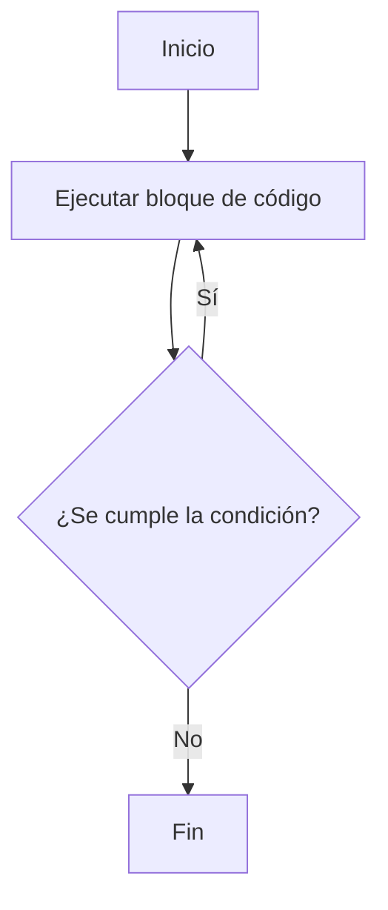

(control-flujo-capitulo)=
## Decisiones Condicionales

Las decisiones permiten que el flujo de ejecución tome distintos caminos con base en condiciones lógicas booleanas.

:::{figure} 2/if_else_flow.svg
:name: fig-if-else-flow
:alt: Flujo de control con if/else

El programa evalúa condiciones lógicas y ejecuta el bloque de instrucciones correspondiente.
:::

### Estructura `if...else if...else`

```c
if (condicion) {
    // Bloque ejecutado si la condición es verdadera
} else if (otra_condicion) {
    // Bloque ejecutado si la condición anterior fue falsa y esta es verdadera
} else {
    // Bloque ejecutado si ninguna condición fue verdadera
}
```

Las condiciones evaluadas deben ser expresiones de comparación explícitas (ver regla de estilo {ref}`0x1005h`). Recuerde que en esta cátedra **es obligatorio el uso de llaves** para delimitar el bloque de toda estructura de control (ver regla {ref}`0x0005h`).

:::{note} «Veracidad»
Para C, los valores lógicos no forman parte del lenguaje original y el mismo
considera cualquier valor entero en `0` como falso y cualquier otro como
verdadero. Esto se conoce como "veracidad" ({ref}`0x1005h`) y su uso no
está permitido, ya que puede generar confusión.
:::

### Operadores de comparación y lógicos
- `==` (Igualdad), `!=` (Desigualdad), `>`, `<`, `>=`, `<=`
- `&&` (Y lógico), `||` (O lógico), `!` (Negación lógica)

```c
if (edad >= 18) {
    printf("Mayor de edad\n");
} else {
    printf("Menor de edad\n");
}
```

### Ejercicio 3

:::{exercise}
:label: entrada-2
:enumerator: entrada-2

Pedí al usuario que ingrese su nota final (entera) e imprimí su condición:
- "Promociona" si la nota es mayor o igual a 6.
- "Aprueba" si la nota es mayor o igual a 4 pero menor a 6.
- "Desaprueba" si la nota es menor a 4.
:::

:::{solution} entrada-2
:class: dropdown

```{code-block} c
:linenos:
#include <stdio.h>

int main()
{
    int nota = 0;
    printf("Ingrese la nota: ");
    scanf("%d", &nota);

    if (nota >= 6) {
        printf("Promociona\n");
    } else if (nota >= 4) {
        printf("Aprueba\n");
    } else {
        printf("Desaprueba\n");
    }
    return 0;
}
```
:::

### Bifurcación Múltiple con `switch`

Permite comparar el valor de una variable entera contra múltiples constantes de forma directa:

```c
switch (opcion) {
    case 1:
        // Código para opción 1
        break;
    case 2:
        // Código para opción 2
        break;
    default:
        // Código si no coincide con ningún caso anterior (obligatorio)
        break;
}
```

---

## Estructuras de Repetición (Lazos)

Un **lazo** es una estructura lógica que repite un bloque de instrucciones mientras se verifique una condición de permanencia.

Hay tres construcciones principales de lazos en C:
- `while`: Evalúa la condición antes de ejecutar cada iteración.
- `for`: Lazo estructurado controlado por un contador o rango definido.
- `do...while`: Ejecuta el bloque de código al menos una vez antes de evaluar la condición.

### `while` — Iteración condicional

El bloque de código interno se ejecuta mientras la condición lógica sea verdadera.

```c
int i = 0;
while (i < 5) {
    printf("i vale %d\n", i);
    i = i + 1;
}
```

:::{figure} 2/while_loop_flow.svg
:name: fig-while-flow
:alt: Flujo del lazo while

Diagrama de flujo del lazo while: evalúa la condición, ejecuta el bloque si es verdadera, y repite hasta que la condición sea falsa.
:::

### Ejercicio 4

:::{exercise}
:label: lazo_while 
:enumerator: while

Escribí un programa en C que imprima los números del 10 al 1 de forma descendente usando un lazo `while`.
:::

:::{solution} lazo_while
:label: solucion-lazo_while
:class: dropdown

```{code-block} c
:linenos:
#include <stdio.h>

int main() {
    int i = 10;
    while (i >= 1) {
        printf("%d\n", i);
        i = i - 1;
    }
    return 0;
}
```
:::

### `for` — Iteración controlada por contador

Es la estructura recomendada para repeticiones de rango conocido. Su sintaxis concentra el control de la iteración:

```c
for (inicialización; condición; incremento)
{
    // Bloque de instrucciones
}
```

:::{admonition} Las partes del `for`
`for (inicio; condición; paso) { bloque }`

- **inicio:** una sola vez al comenzar.
- **condición:** se evalúa antes de cada iteración.
- **paso:** se ejecuta al final de cada vuelta.
- **bloque:** las instrucciones ejecutadas mientras la condición sea verdadera.
:::


Este tipo de lazo es ideal cuando se sabe cuántas veces se quiere repetir.
Aunque hace lo mismo que el `while`, este es más estructurado con secciones
específicas para cada acción del lazo.

```c
for (int i = 0; i < 5; i++) {
    printf("i vale %d\n", i);
}
```

### Ejercicio 5

:::{exercise}
:label: lazo_for
:enumerator: for
Usá un lazo `for` para mostrar los números múltiplos de 3 comprendidos en el rango de 0 a 30 inclusive.
:::

:::{solution} lazo_for
:label: solucion-lazo_for
:class: dropdown
```c
#include <stdio.h>

int main() {
    for (int i = 0; i <= 30; i = i + 1) {
        if (i % 3 == 0) {
            printf("%d es múltiplo de 3\n", i);
        }
    }
    return 0;
}
```
:::

### `do...while` — Ejecución obligatoria al menos una vez

Garantiza que el bloque se ejecutará al menos una vez antes de verificar la condición lógica de permanencia.

```{image} ./2/lazos.jpg
:alt: Ejemplo Grafico de lazos
:align: center
```

```c
int clave = 0;
do {
    printf("Ingrese la clave de acceso (1234): ");
    scanf("%d", &clave);
} while (clave != 1234);
```



### Ejercicio 6

:::{exercise}
:label: lazo_repeat
:enumerator: for

Diseñá un programa con un lazo `do...while` que solicite repetidamente una clave de acceso numérica al usuario hasta que ingrese el valor correcto `1234`.
:::

:::{solution} lazo_repeat
:label: solucion-lazo_repeat
:class: dropdown
```{code-block} c
:linenos:
#include <stdio.h>

int main() {
    int clave = 0;
    int clave_correcta = 1234;

    do {
        printf("Ingrese la clave: ");
        scanf("%d", &clave);

        if (clave != clave_correcta) {
            printf("Clave incorrecta. Reintente.\n");
        }
    } while (clave != clave_correcta);

    printf("Acceso concedido.\n");
    return 0;
}
```
:::

---

## Control de Flujo Seguro de Lazos

### Atajos en Lazos: `break` y `continue`

C provee dos instrucciones de control para alterar el flujo normal de iteración de los lazos:

#### `break` (Interrupción)
Finaliza la ejecución del lazo de forma inmediata, saltando a la primera instrucción que se encuentre fuera del bloque del ciclo.

```c
for (int i = 1; i <= 10; i++) {
    if (i == 5) {
        break; // Sale inmediatamente del lazo cuando i vale 5
    }
    printf("i = %d\n", i);
}
```

#### `continue` (Salto de iteración)
Omite el resto del bloque de instrucciones del ciclo actual y avanza directamente a evaluar la condición para la siguiente iteración.

```c
for (int i = 1; i <= 5; i++) {
    if (i == 3) {
        continue; // Salta al final del bloque e inicia la iteración de i = 4
    }
    printf("i = %d\n", i);
}
```

### Prohibición de `break` y `continue`

**En esta cátedra, el uso de las instrucciones `break` (fuera de un bloque `switch`) y `continue` para modificar el flujo de repetición de los lazos esta prohibidas** (ver regla de estilo {ref}`0x1002h`). 

Esta restricción responde a dos vectores fundamentales del diseño de software:
1.  **Legibilidad y Mantenibilidad:** Crear múltiples puntos de salida invisibles en el cuerpo de un lazo de control oscurece la trazabilidad de la lógica. El código se vuelve difícil de seguir, depurar y verificar matemáticamente.
2.  **Desarrollo del Pensamiento Algorítmico:** Evitar estos atajos obliga al estudiante a diseñar formalmente condiciones de corte coherentes y estructuradas en la cabecera de la iteración.

Para detener un lazo de forma controlada cuando se cumpla una condición anticipada, debés recurrir a la estructuración de lazos con **banderas de control** (`bool`).

### Ejercicio 7 (Refactorización de `break`)

:::{exercise}
:label: lazo_break
:enumerator: break
Modificá el siguiente programa para eliminar la instrucción `break` prohibida, estructurando correctamente el lazo:

```{code-block} c
:linenos:
#include <stdio.h>

int main() {
    int i;
    for (i = 0; i < 10; i++) {
        printf("valor actual: %d\n", i);
        if (i == 4) {
            break;
        }
    }
    return 0;
}
```
:::

:::{solution} lazo_break
:label: solucion-lazo_break
:class: dropdown
Se reestructura el lazo reemplazando el `for` e implementando un lazo `while` controlado por una bandera lógica booleana (`bool`) del encabezado `<stdbool.h>` que se establece en `false` al alcanzar la condición de parada:

```{code-block} c
:linenos:
#include <stdio.h>
#include <stdbool.h>

int main() {
    int i = 0;
    bool continuar = true;
    while (i < 10 && continuar) {
        printf("valor actual: %d\n", i);
        if (i == 4) {
            continuar = false;
        }
        i++;
    }
    return 0;
}
```
:::

### Ejercicio 8 (Refactorización de `continue`)

:::{exercise}
:label: lazo_continue
:enumerator: continue
Modificá el siguiente código para eliminar la instrucción `continue` prohibida:

```{code-block} c
:linenos:
#include <stdio.h>

int main()
{
    for (int i = 0; i <= 10; i++) {
        if (i % 2 == 0) {
            continue;
        }
        printf("i = %d\n", i);
    }
    return 0;
}
```

:::

:::{solution} lazo_continue
:label: solucion-lazo_continue
:class: dropdown
Se reestructura el lazo eliminando la instrucción `continue` y encerrando el cuerpo restante del lazo dentro de una condición positiva que filtra los elementos que se desean procesar (en este caso, los impares):

```{code-block} c
:linenos:
#include <stdio.h>

int main() {
    for (int i = 0; i <= 10; i++) {
        if (i % 2 != 0) {
            printf("i = %d\n", i);
        }
    }
    return 0;
}
```
:::

### Lazos con bandera (`flag`)

Para finalizar un lazo `while` o `do...while` por un evento lógico intermedio, se debe utilizar una variable lógica bandera (definida mediante `<stdbool.h>`). La bandera se inicializa en `true` y se establece en `false` cuando ocurre el evento de parada, controlando el lazo desde su condición formal.

```c
#include <stdio.h>
#include <stdbool.h>

int main()
{
    bool continuar = true;
    int numero = 0;

    while (continuar == true)
    {
        printf("Ingresá un número (0 para salir): ");
        scanf("%d", &numero);

        if (numero == 0)
        {
            continuar = false; // Se apaga la bandera para salir en la próxima condición
        }
        else
        {
            printf("Ingresaste: %d\n", numero);
        }
    }
    return 0;
}
```

### Ejercicio 9 (Lazo de Clave con Bandera)

:::{exercise}
:label: lazo_flag_break
:enumerator: continue

Reescribí el ingreso de clave de acceso del Ejercicio 6 utilizando un lazo controlado por una bandera booleana (`bool`) en lugar de `do...while`.
:::

:::{solution} lazo_flag_break
:label: solucion-lazo_flag_break
:class: dropdown
```{code-block} c
:linenos:
#include <stdio.h>
#include <stdbool.h>

int main()
{
    int clave = 0;
    int clave_correcta = 1234;
    bool clave_correcta_ingresada = false;

    while (clave_correcta_ingresada == false) {
        printf("Ingrese la clave de acceso: ");
        scanf("%d", &clave);

        if (clave == clave_correcta) {
            printf("Acceso concedido.\n");
            clave_correcta_ingresada = true; // Se modifica el estado de la bandera
        } else {
            printf("Clave incorrecta. Intente nuevamente.\n");
        }
    }
    return 0;
}
```
:::


## Problemas del Buffer de Entrada (stdin) y su Purgado

Cuando utilizás `scanf` para leer datos numéricos o caracteres, el flujo de entrada `stdin` puede almacenar residuos no deseados que alteran las lecturas posteriores.

### El origen del problema
Al ingresar datos desde la consola (por ejemplo, al escribir un número y presionar Enter), `scanf` lee únicamente el valor numérico correspondiente al formato especificado (como `%d`), dejando el carácter de salto de línea (`\n`) residual dentro de `stdin`.

Si a continuación intentás leer un carácter utilizando `%c` o `getchar()`, esa lectura consumirá inmediatamente el `\n` residual en lugar de esperar la nueva entrada del usuario. Esto da la sensación de que el programa "saltea" la instrucción de lectura.

### Purgado de stdin con un lazo
Para solucionar este comportamiento, debés limpiar o "purgar" el buffer de entrada, consumiendo todos los caracteres residuales hasta llegar al salto de línea inclusive. La manera estándar para lograr esto consiste en implementar un lazo simple de lectura de caracteres.

El siguiente ejemplo demuestra el problema y su solución utilizando `getchar()` dentro de un lazo `while`:

```c
#include <stdio.h>

int main() {
    int edad = 0;
    char inicial = ' ';

    printf("Ingresá tu edad: ");
    scanf("%d", &edad);

    // Purgado del buffer: lee y descarta caracteres hasta el salto de línea.
    // Usamos 'int' y no 'char' porque getchar() retorna un entero para representar EOF (-1).
    int c = 0;
    while ((c = getchar()) != '\n' && c != EOF) {
        // Lazo vacío: solo consume el buffer residual
    }

    printf("Ingresá tu inicial: ");
    scanf("%c", &inicial); // Ahora lee correctamente sin saltarse

    printf("Edad: %d, Inicial: %c\n", edad, inicial);
    return 0;
}
```

La condición `(c = getchar()) != '\n' && c != EOF` realiza tres acciones: lee un carácter de `stdin`, lo asigna a `c`, y continúa la iteración del lazo mientras no sea un salto de línea ni el fin del archivo (`EOF`). Se declara `c` como `int` porque la macro `EOF` representa habitualmente el valor entero `-1`. En plataformas donde el tipo `char` es `unsigned` (sin signo) por defecto, una variable `char` no podría almacenar un valor negativo, provocando un lazo infinito al comparar contra `EOF`.


## Ejercicios de Práctica

1. Escribí un programa que solicite dos números reales al usuario y muestre cuál es el mayor.
2. Diseñá un programa que imprima en pantalla los números enteros del 1 al 100 utilizando un lazo `for`.
3. Desarrollá un algoritmo que sume los números pares comprendidos en el rango del 1 al 100 inclusive.
4. Escribí un programa que solicite un número entero positivo e indique si es un número primo (divisible únicamente por 1 y por sí mismo).
5. Escribí un programa que pida una calificación (0 a 10) e indique si el estudiante aprobó (calificación mayor o igual a 4).
6. Escribí un programa que solicite repetidamente una contraseña de caracteres al usuario hasta que coincida con un valor establecido de acceso seguro.

---

## Recomendaciones didácticas

Cuando encuentres dificultades al depurar o diseñar un programa:
- Redactá el algoritmo en lenguaje natural de forma secuencial paso a paso.
- Graficá el algoritmo mediante un diagrama de flujo simple para validar bifurcaciones e iteraciones.
- Ejecutá una prueba de escritorio (seguimiento de variables en papel) para validar la lógica del programa.
- Utilizá llamadas a funciones de impresión (`printf`) en puntos estratégicos para examinar el estado de las variables en memoria física.

---

## Próximos Pasos

En los siguientes capítulos avanzaremos en la construcción de software modular en C:
- [](3_funciones) — Modularización y diseño de subprogramas mediante funciones con contratos y parámetros.
- [Secuencias y arreglos](7_secuencias) — Arreglos de memoria estáticos y cadenas de caracteres.
- [Compilación separada](9_compilacion) — Proceso de compilación multi-etapa y Makefile.
- [Punteros](5_punteros) — Punteros y manipulación de memoria.
- [Archivos de texto](10_archivos_texto) — Entrada y salida persistente con archivos.

---

## Bibliografía y Recursos Adicionales

- Kernighan, B. W., & Ritchie, D. M. (1988). _The C Programming Language (2nd ed.)_. Prentice Hall. (El libro de referencia de C, "K&R").
- King, K. N. (2008). _C Programming: A Modern Approach (2nd ed.)_. W. W. Norton & Company. (Libro detallado con abundantes ejercicios).

---

## Glosario

:::{glossary}
Lenguaje Ensamblador
: Lenguaje de bajo nivel que utiliza mnemónicos para representar instrucciones nativas de código máquina de un procesador específico.

Lenguaje de Máquina
: El conjunto de instrucciones binarias directas ejecutable por el circuito físico de la CPU.
:::
