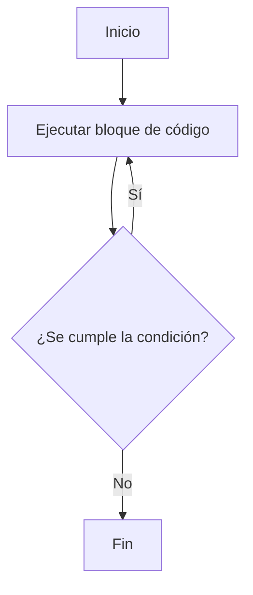

(control-flujo-capitulo)=
## Introducción al Control de Flujo

Hasta ahora, los programas que hemos escrito se ejecutan de manera estrictamente secuencial: una instrucción tras otra, de arriba a abajo. Sin embargo, para resolver problemas reales necesitamos que el programa tome decisiones y repita bloques de instrucciones de forma autónoma. El **control de flujo** es el conjunto de mecanismos que nos permite bifurcar el camino de ejecución y gobernar la repetición del código.

## Decisiones Condicionales

Las decisiones permiten que el flujo de ejecución tome distintos caminos con base en condiciones lógicas booleanas.

:::{figure} 2/if_else_flow.svg
:name: fig-if-else-flow
:alt: Flujo de control con if/else

El programa evalúa condiciones lógicas y ejecuta el bloque de instrucciones correspondiente.
:::

### Estructura `if...else if...else`

Las estructuras condicionales bifurcan el camino del programa. Es importante notar que tanto las ramas alternativas `else if` como la rama por defecto `else` son **opcionales**; podés utilizar una instrucción `if` simple para ejecutar un bloque de código únicamente si se cumple la condición, continuando de forma secuencial en caso contrario.

```{code-block}c
:linenos:
if (condicion) {
    // Bloque ejecutado si la condición es verdadera
} else if (otra_condicion) {
    // Bloque ejecutado si la condición anterior fue falsa y esta es verdadera
} else {
    // Bloque ejecutado si ninguna condición fue verdadera
}
```

Las condiciones evaluadas deben ser expresiones de comparación explícitas (ver regla de estilo {ref}`0x1005h`). Recuerde que en esta cátedra **es obligatorio el uso de llaves** para delimitar el bloque de toda estructura de control (ver regla {ref}`0x0005h`).

:::{note} «Veracidad»
Para C, los valores lógicos no forman parte del lenguaje original y el mismo
considera cualquier valor entero en `0` como falso y cualquier otro como
verdadero. Esto se conoce como "veracidad" ({ref}`0x1005h`) y su uso no
está permitido, ya que puede generar confusión.
:::

### Operadores de comparación y lógicos
- `==` (Igualdad), `!=` (Desigualdad), `>`, `<`, `>=`, `<=`
- `&&` (Y lógico), `||` (O lógico), `!` (Negación lógica)

En C estándar, los operadores relacionales y lógicos no devuelven un tipo booleano nativo, sino que **devuelven un valor entero (`int`)**: `1` para representar verdadero y `0` para representar falso. Es por esto que expresiones como `5 > 3` se evalúan físicamente como el entero `1`.

```{code-block}c
:linenos:
if (edad >= 18) {
    printf("Mayor de edad\n");
} else {
    printf("Menor de edad\n");
}
```


### Bifurcación Múltiple con `switch`

La estructura `switch` evalúa una expresión entera y busca una coincidencia con alguna de las constantes definidas en las etiquetas `case`. Al encontrarla, transfiere el control directamente a ese punto. Es una alternativa más limpia y eficiente a múltiples `if-else if` anidados cuando se compara una misma variable contra múltiples constantes de tipo entero o carácter.

```{code-block}c
:linenos:
switch (opcion) {
    case 1:
        // Código para opción 1
        break;
    case 2:
        // Código para opción 2
        break;
    default:
        // Código si no coincide con ningún caso anterior (obligatorio)
        break;
}
```

Al utilizar `switch` debés tener en cuenta dos detalles clave:
*   **La sentencia `break`:** Es fundamental colocar `break` al final de cada bloque `case`. Si no está, la ejecución continuará ("caerá") hacia las instrucciones del caso siguiente (*fall-through*), lo cual suele ser fuente de errores lógicos grandes.
*   **La etiqueta `default`:** Se ejecuta si ninguna constante coincide. Aunque técnicamente es opcional en el estándar C, la regla {ref}`0x1008h` de la cátedra **exige que siempre esté presente** como medida de diseño defensivo.

### Ejercicios de Autoevaluación (Decisiones Condicionales)

:::{exercise}
:label: ej-cond-bisiesto
Escribí la expresión condicional necesaria para determinar si un año es bisiesto. Un año es bisiesto si es divisible por 4, excepto aquellos divisibles por 100, pero sí aquellos divisibles por 400.
:::

:::{solution} ej-cond-bisiesto
:class: dropdown
La expresión lógica se traduce en C de la siguiente manera:
```c
if ((anio % 4 == 0 && anio % 100 != 0) || anio % 400 == 0) {
    printf("El año %d es bisiesto.\n", anio);
} else {
    printf("El año %d no es bisiesto.\n", anio);
}
```
:::

:::{exercise}
:label: ej-cond-switch-mes
Escribí una estructura `switch` que tome una variable entera `mes` (con valores de 1 a 12) y asigne a la variable `dias` la cantidad de días del mes. Considerá febrero con 28 días. No olvides la etiqueta `default` obligatoria.
:::

:::{solution} ej-cond-switch-mes
:class: dropdown
Aprovechando la caída (*fall-through*) controlada omitiendo el `break` en casos con el mismo valor resultante:
```c
switch (mes) {
    case 2:
        dias = 28;
        break;
    case 4:
    case 6:
    case 9:
    case 11:
        dias = 30;
        break;
    case 1:
    case 3:
    case 5:
    case 7:
    case 8:
    case 10:
    case 12:
        dias = 31;
        break;
    default:
        printf("Error: mes inválido.\n");
        dias = -1;
        break;
}
```
:::

:::{exercise}
:label: ej-cond-veracidad
Explicá detalladamente qué error semántico ocurre en el siguiente fragmento y por qué la regla {ref}`0x1005h` prohíbe el uso de la veracidad implícita:
```c
int estado = 0;
// ...
if (estado = 5) {
    printf("El estado es activo.\n");
}
```
:::

:::{solution} ej-cond-veracidad
:class: dropdown
El condicional utiliza el operador de asignación `=` en lugar del operador de comparación `==`.
1. La expresión `estado = 5` asigna el valor `5` a la variable `estado`.
2. La expresión condicional evalúa al resultado de la asignación, que es `5`.
3. Bajo el concepto de "veracidad" en C, dado que `5` es distinto de `0`, el bloque `if` se evalúa siempre como verdadero, ejecutando la rama del `printf` de forma incondicional.
La regla {ref}`0x1005h` exige comparaciones booleanas explícitas (ej: `if (estado == 5)`) para que el compilador emita una advertencia ante este error de tipeo tan común.
:::

---

## Estructuras de Repetición (Lazos)

Un **lazo** es una estructura lógica que repite un bloque de instrucciones mientras se verifique una condición de permanencia.

Hay tres construcciones principales de lazos en C:
- `while`: Evalúa la condición antes de ejecutar cada iteración.
- `for`: Lazo estructurado controlado por un contador o rango definido.
- `do...while`: Ejecuta el bloque de código al menos una vez antes de evaluar la condición.

### `while` — Iteración condicional

El bloque de código interno se ejecuta mientras la condición lógica sea verdadera.

```{code-block}c
:linenos:
int i = 0;
while (i < 5) {
    printf("i vale %d\n", i);
    i = i + 1;
}
```

:::{figure} 2/while_loop_flow.svg
:name: fig-while-flow
:alt: Flujo del lazo while

Diagrama de flujo del lazo while: evalúa la condición, ejecuta el bloque si es verdadera, y repite hasta que la condición sea falsa.
:::

### `for` — Iteración controlada por contador

Es la estructura recomendada para repeticiones de rango conocido. Su sintaxis concentra el control de la iteración:

```{code-block}c
:linenos:
for (inicialización; condición; incremento)
{
    // Bloque de instrucciones
}
```

:::{admonition} Las partes del `for`
`for (inicio; condición; paso) { bloque }`

- **inicio:** una sola vez al comenzar.
- **condición:** se evalúa antes de cada iteración.
- **paso:** se ejecuta al final de cada vuelta.
- **bloque:** las instrucciones ejecutadas mientras la condición sea verdadera.
:::


Este tipo de lazo es ideal cuando se sabe cuántas veces se quiere repetir.
Aunque hace lo mismo que el `while`, este es más estructurado con secciones
específicas para cada acción del lazo.

```{code-block}c
:linenos:
for (int i = 0; i < 5; i++) {
    printf("i vale %d\n", i);
}
```

#### Rol de variable: Control de lazo (o Iterador)

*(Para una introducción teórica sobre el propósito de los roles de variables, consultá la sección {ref}`roles-variables`*.

En el lazo anterior, la variable `i` asume el **rol de control de lazo** (o iterador). Este rol se encarga de gobernar las repeticiones del ciclo, incrementándose o decrementándose en cada vuelta hasta que se cumple la condición de parada.

Esta estructura es directamente análoga a la notación de una sumatoria matemática. Considerá el siguiente ejemplo:

$$\sum_{i=0}^{n-1} x_i$$

En esta expresión matemática, la variable $i$ funciona exactamente como nuestra variable de control:
*   **Inicialización**: Comienza en un valor de partida (el límite inferior, $i = 0$).
*   **Condición**: Continúa acumulando elementos mientras no supere el límite superior ($i \le n - 1$, lo que equivale en enteros a $i < n$).
*   **Paso**: Se incrementa implícitamente de a una unidad tras procesar cada término.

En C, trasladás esta equivalencia matemática directamente a la cabecera del lazo `for`:

```{code-block}c
:linenos:
for (int i = 0; i < n; i++) {
    // Procesar x[i]
}
```

:::{note}

El rol de control de lazo, no es exclusivo de los lazos `for`, pero es donde es más fuerte.

:::

### `do...while` — Ejecución obligatoria al menos una vez

Garantiza que el bloque se ejecutará al menos una vez antes de verificar la condición lógica de permanencia.

```{image} ./2/lazos.jpg
:alt: Ejemplo Grafico de lazos
:align: center
```

```{code-block}c
:linenos:
int clave = 0;
do {
    printf("Ingrese la clave de acceso (1234): ");
    scanf("%d", &clave);
} while (clave != 1234);
```



---

### Ejercicios de Autoevaluación (Lazos)

:::{exercise}
:label: ej-lazos-factorial
Escribí un programa en C que calcule y muestre el factorial de un número entero positivo ingresado por el usuario usando un lazo `while`.
:::

:::{solution} ej-lazos-factorial
:class: dropdown
```c
#include <stdio.h>

int main() {
    int numero = 0;
    long factorial = 1;

    printf("Ingresá un número entero positivo: ");
    scanf("%d", &numero);

    if (numero < 0) {
        printf("Error: El número debe ser positivo.\n");
    } else {
        int i = 1;
        while (i <= numero) {
            factorial = factorial * i;
            i++;
        }
        printf("El factorial de %d es: %ld\n", numero, factorial);
    }
    return 0;
}
```
:::

:::{exercise}
:label: ej-lazos-for-sumatoria
Escribí un lazo `for` que calcule la suma de todos los números impares comprendidos en un rango cerrado $[A, B]$ provisto por el usuario.
:::

:::{solution} ej-lazos-for-sumatoria
:class: dropdown
```c
#include <stdio.h>

int main() {
    int a = 0;
    int b = 0;
    int suma = 0;

    printf("Ingresá los límites A y B: ");
    scanf("%d %d", &a, &b);

    for (int i = a; i <= b; i++) {
        if (i % 2 != 0) {
            suma += i;
        }
    }

    printf("La suma de impares en el rango es: %d\n", suma);
    return 0;
}
```
:::

:::{exercise}
:label: ej-lazos-dowhile-menu
Escribí un fragmento de código que implemente un menú de usuario interactivo utilizando un lazo `do...while`. El programa debe mostrar 3 opciones de configuración y una opción `4` para salir. Si el usuario ingresa un número fuera del rango $1-4$, el programa debe indicar el error y volver a solicitar la opción.
:::

:::{solution} ej-lazos-dowhile-menu
:class: dropdown
```c
int opcion = 0;
do {
    printf("\n--- CONFIGURACIÓN ---\n");
    printf("1. Ajustar brillo\n");
    printf("2. Ajustar contraste\n");
    printf("3. Cambiar idioma\n");
    printf("4. Salir\n");
    printf("Seleccioná una opción (1-4): ");
    scanf("%d", &opcion);

    if (opcion < 1 || opcion > 4) {
        printf("Opción inválida. Reintentá.\n");
    }
} while (opcion != 4);
```
:::

---

(rol-bandera)=
## Rol Bandera (o Flag)

*(Para más información sobre la asignación semántica de roles, consultá {ref}`roles-variables` en [](2_gradual))*.

Una **bandera** (o _flag_) es una variable booleana (o un tipo entero que simula un valor booleano) que se utiliza para **registrar y señalizar un estado o la ocurrencia de un evento**. Su valor cambia para indicar que un hecho específico se ha verificado en el flujo de ejecución.

En la programación estructurada y bajo las pautas de esta cátedra, las banderas tienen dos usos fundamentales:

### 1. Señalización de un estado o evento
Se utiliza para recordar si una condición fue alcanzada durante un proceso. Por ejemplo, supongamos que queremos verificar si un número determinado existe dentro de una secuencia de elementos. Al encontrarlo, encendemos la bandera (`true`).

Para cumplir con la regla de diseño estructurado (que prohíbe el uso de interrupciones abruptas como `break` en lazos), la bandera se integra directamente como condición de corte en la cabecera del lazo:

```{code-block}c
:linenos:
#include <stdio.h>
#include <stdbool.h> // Necesario para el tipo de dato bool

int main() {
    int numeros[] = {10, 25, 4, 30, 8, 15};
    int tamano = sizeof(numeros) / sizeof(numeros[0]);
    int numero_buscado = 8;
    bool encontrado = false; // Bandera inicializada en false

    int i = 0;
    // El lazo continúa si quedan elementos por revisar Y si aún no se encontró el número
    while (i < tamano && encontrado == false) {
        if (numeros[i] == numero_buscado) {
            encontrado = true; // Se enciende la bandera
        }
        i++;
    }

    if (encontrado == true) {
        printf("El número %d fue encontrado en el arreglo.\n", numero_buscado);
    } else {
        printf("El número %d NO fue encontrado en el arreglo.\n", numero_buscado);
    }

    return 0;
}
```

### 2. Control de permanencia en lazos interactivos
Se utiliza para gobernar la repetición de un lazo cuando no se conoce de antemano la cantidad de iteraciones (por ejemplo, entrada de datos interactiva del usuario). El lazo se ejecuta mientras la bandera se mantenga activa y finaliza cuando un evento apaga la bandera:

```{code-block}c
:linenos:
#include <stdio.h>
#include <stdbool.h>

int main() {
    bool continuar = true; // Bandera de permanencia
    int numero = 0;

    while (continuar == true) {
        printf("Ingresá un número (0 para salir): ");
        scanf("%d", &numero);

        if (numero == 0) {
            continuar = false; // Se apaga la bandera para salir en la próxima iteración
        } else {
            printf("Ingresaste: %d\n", numero);
        }
    }

    return 0;
}
```


### Rol acumulador

Un **acumulador** es una variable que se utiliza para **sumar o acumular
valores** a lo largo de un proceso. Generalmente, se inicializa en cero antes de
que comience el proceso de acumulación.

---

### Ejemplo de Acumulador en C

Imaginemos que queremos calcular la suma de los primeros N números enteros.

```{code-block}c
:linenos:
#include <stdio.h>

int main() {
    int n = -1;
    int suma = 0; // Aquí, 'suma' es nuestro acumulador
    printf("Ingrese un numero entero N: ");
    scanf("%d", &n);

    for (int i = 1; i <= n; i++) {
        suma = suma + i; // Se acumulan los valores en cada iteración
    }

    printf("La suma de los primeros %d numeros es: %d\n", n, suma);
    return 0;
}
```

En este ejemplo, la variable `suma` tiene el rol de **acumulador**. En cada
iteración del lazo `for`, se le suma el valor actual de `i`, acumulando así la
suma total.

//? agregar expresion matematica equivalente

---

### Rol contador

Un **contador** es una variable que se utiliza para **contar la ocurrencia de un
evento** o para **llevar un registro del número de iteraciones** en un lazo. Se
incrementa o decrementa en un valor fijo (usualmente 1) cada vez que el evento
ocurre.


---

### Ejemplo de Contador en C

Supongamos que queremos contar cuántos números pares hay en un rango dado.

```{code-block}c
:linenos:
#include <stdio.h>

int main() {
    int inicio = -1;
    int fin = -1;
    int contadorPares = 0; // Aquí, 'contadorPares' es nuestro contador

    printf("Ingrese el inicio del rango: ");
    scanf("%d", &inicio);
    printf("Ingrese el fin del rango: ");
    scanf("%d", &fin);

    for (int i = inicio; i <= fin; i++) {
        if (i % 2 == 0) {
            contadorPares++; // Se incrementa el contador si el número es par
        }
    }

    printf("En el rango de %d a %d, hay %d numeros pares.\n", inicio, fin, contadorPares);
    return 0;
}
```

En este caso, `contadorPares` tiene el rol de **contador**. Cada vez que
encontramos un número par, incrementamos su valor en 1.


//? agregar expresion matematica equivalente

### Ejercicios de Autoevaluación (Roles de Variables)

:::{exercise}
:label: ej-roles-primo
Diseñá un algoritmo en C para determinar si un número entero positivo ingresado por el usuario es primo. Utilizá una variable con **rol bandera** booleana para detener la iteración del lazo tan pronto como encuentres un divisor, respetando las pautas de diseño estructurado.
:::

:::{solution} ej-roles-primo
:class: dropdown
```c
#include <stdio.h>
#include <stdbool.h>

int main() {
    int numero = 0;
    printf("Ingresá un entero positivo: ");
    scanf("%d", &numero);

    if (numero <= 1) {
        printf("No es primo.\n");
    } else {
        bool tiene_divisor = false; // Bandera
        int divisor = 2;

        while (divisor * divisor <= numero && tiene_divisor == false) {
            if (numero % divisor == 0) {
                tiene_divisor = true; // Se activa la bandera
            }
            divisor++;
        }

        if (tiene_divisor == false) {
            printf("El número %d es primo.\n", numero);
        } else {
            printf("El número %d no es primo.\n", numero);
        }
    }
    return 0;
}
```
:::

:::{exercise}
:label: ej-roles-promedio
Escribí un programa en C que lea valores reales del teclado de forma continua hasta que el usuario ingrese un valor negativo. Al finalizar, debe calcular e imprimir el promedio de los valores ingresados. Identificá los roles de las variables utilizadas.
:::

:::{solution} ej-roles-promedio
:class: dropdown
```c
#include <stdio.h>
#include <stdbool.h>

int main() {
    float valor = 0.0f;     // Entrada
    float acumulador = 0.0f; // Acumulador
    int contador = 0;       // Contador
    bool continuar = true;  // Bandera de control de lazo

    while (continuar == true) {
        printf("Ingresá un valor (negativo para terminar): ");
        scanf("%f", &valor);

        if (valor < 0.0f) {
            continuar = false; // Apaga la bandera
        } else {
            acumulador += valor; // Acumula
            contador++;          // Cuenta
        }
    }

    if (contador > 0) {
        printf("El promedio es: %.2f\n", acumulador / (float)contador);
    } else {
        printf("No se ingresaron valores válidos.\n");
    }
    return 0;
}
```
:::

:::{exercise}
:label: ej-roles-digitos
Escribí un fragmento de código en C que calcule el número de dígitos de un entero positivo usando divisiones enteras sucesivas. Especificá las variables correspondientes al rol de contador y de acumulador si las hubiera.
:::

:::{solution} ej-roles-digitos
:class: dropdown
```c
int numero = 12345;
int temporal = numero; // Variable auxiliar
int digitos = 0;       // Contador

if (temporal == 0) {
    digitos = 1;
} else {
    while (temporal > 0) {
        digitos++; // Cuenta la cantidad de divisiones
        temporal = temporal / 10;
    }
}
printf("El número %d tiene %d dígitos.\n", numero, digitos);
```
En este algoritmo:
- `digitos` tiene el **rol de contador** (se incrementa linealmente en 1).
- `temporal` funciona como una variable de trabajo. No se requiere un acumulador en este algoritmo ya que no estamos sumando valores variables.
:::

---

## Control de Flujo Seguro de Lazos

### Atajos en Lazos: `break` y `continue`

C provee dos instrucciones de control para alterar el flujo normal de iteración de los lazos:

#### `break` (Interrupción)
Finaliza la ejecución del lazo de forma inmediata, saltando a la primera instrucción que se encuentre fuera del bloque del ciclo.

```{code-block}c
:linenos:
for (int i = 1; i <= 10; i++) {
    if (i == 5) {
        break; // Sale inmediatamente del lazo cuando i vale 5
    }
    printf("i = %d\n", i);
}
```

#### `continue` (Salto de iteración)
Omite el resto del bloque de instrucciones del ciclo actual y avanza directamente a evaluar la condición para la siguiente iteración.

```{code-block}c
:linenos:
for (int i = 1; i <= 5; i++) {
    if (i == 3) {
        continue; // Salta al final del bloque e inicia la iteración de i = 4
    }
    printf("i = %d\n", i);
}
```

### Prohibición de `break` y `continue`

**En esta cátedra, el uso de las instrucciones `break` (fuera de un bloque `switch`) y `continue` para modificar el flujo de repetición de los lazos esta prohibidas** (ver regla de estilo {ref}`0x1002h`). 

Esta restricción responde a dos cuestiones fundamentales del diseño de software:
1.  **Legibilidad y Mantenibilidad:** Crear múltiples puntos de salida invisibles en el cuerpo de un lazo de control oscurece la trazabilidad de la lógica. El código se vuelve difícil de seguir, depurar y verificar matemáticamente.
2.  **Desarrollo del Pensamiento Algorítmico:** Evitar estos atajos obliga al estudiante a diseñar formalmente condiciones de corte coherentes y estructuradas en la cabecera de la iteración.

Para detener un lazo de forma controlada cuando se cumpla una condición anticipada, debés recurrir a la estructuración de lazos con **banderas de control** (`bool`). Consultá la sección {ref}`rol-bandera` para ver la explicación teórica y los ejemplos detallados de implementación estructurada.

:::{tip} Ejercicio Práctico Resuelto
Podés consultar la resolución del **Ejercicio 9 (ingreso de clave con bandera)** en el documento de [](2c_ejercicios_control).
:::


## Problemas del Buffer de Entrada (stdin) y su Purgado

Cuando usas `scanf` para leer datos numéricos o caracteres, el flujo de entrada `stdin` puede almacenar residuos no deseados que alteran las lecturas posteriores.

### El origen del problema
Al ingresar datos desde la consola (por ejemplo, al escribir un número y presionar Enter), `scanf` lee únicamente el valor numérico correspondiente al formato especificado (como `%d`), dejando el carácter de salto de línea (`\n`) residual dentro de `stdin`.

Si a continuación intentás leer un carácter utilizando `%c` o `getchar()`, esa lectura consumirá inmediatamente el `\n` residual en lugar de esperar la nueva entrada del usuario. Esto da la sensación de que el programa "saltea" la instrucción de lectura.

### Purgado de stdin con un lazo
Para solucionar este comportamiento, debés limpiar o "purgar" el buffer de entrada, consumiendo todos los caracteres residuales hasta llegar al salto de línea inclusive. La manera estándar para lograr esto consiste en implementar un lazo simple de lectura de caracteres.

El siguiente ejemplo demuestra el problema y su solución utilizando `getchar()` dentro de un lazo `while`:

```{code-block}c
:linenos:
#include <stdio.h>

int main() {
    int edad = 0;
    char inicial = ' ';

    printf("Ingresá tu edad: ");
    scanf("%d", &edad);

    // Purgado del buffer: lee y descarta caracteres hasta el salto de línea.
    // Usamos 'int' y no 'char' porque getchar() retorna un entero para representar EOF (-1).
    int c = 0;
    while ((c = getchar()) != '\n' && c != EOF) {
        // Lazo vacío: solo consume el buffer residual
    }

    printf("Ingresá tu inicial: ");
    scanf("%c", &inicial); // Ahora lee correctamente sin saltarse

    printf("Edad: %d, Inicial: %c\n", edad, inicial);
    return 0;
}
```

La condición `(c = getchar()) != '\n' && c != EOF` realiza tres acciones: lee un carácter de `stdin`, lo asigna a `c`, y continúa la iteración del lazo mientras no sea un salto de línea ni el fin del archivo (`EOF`). Se declara `c` como `int` porque la macro `EOF` representa habitualmente el valor entero `-1`. En plataformas donde el tipo `char` es `unsigned` (sin signo) por defecto, una variable `char` no podría almacenar un valor negativo, provocando un lazo infinito al comparar contra `EOF`.


### Ejercicios de Autoevaluación (Flujo Seguro y Buffer)

:::{exercise}
:label: ej-seguro-busqueda-bandera
El siguiente lazo de búsqueda utiliza la instrucción prohibida `break`. Reescribilo para que cumpla con el estándar de programación estructurada utilizando una bandera booleana.
```c
int numeros[] = {3, 7, 2, 9, 5};
int buscado = 9;
int posicion = -1;
for (int i = 0; i < 5; i++) {
    if (numeros[i] == buscado) {
        posicion = i;
        break; // PROHIBIDO
    }
}
```
:::

:::{solution} ej-seguro-busqueda-bandera
:class: dropdown
Se reescribe transformándolo en un lazo `while` que integre el estado de la bandera booleana en su condición de corte:
```c
int numeros[] = {3, 7, 2, 9, 5};
int buscado = 9;
int posicion = -1;
bool encontrado = false;

int i = 0;
while (i < 5 && encontrado == false) {
    if (numeros[i] == buscado) {
        posicion = i;
        encontrado = true; // Activa la bandera para cortar el ciclo
    }
    i++;
}
```
:::

:::{exercise}
:label: ej-purgado-lectura-caracter
Explicá por qué en C se "saltea" la lectura de un carácter al ejecutar `scanf("%c", &char_var)` inmediatamente después de haber ejecutado `scanf("%d", &int_var)`, y cómo lo resuelve el purgado manual con `getchar()`.
:::

:::{solution} ej-purgado-lectura-caracter
:class: dropdown
Al ingresar el número entero y presionar Enter, en el buffer de entrada `stdin` se almacenan los dígitos del número y el salto de línea `\n`.
- `scanf("%d", ...)` consume únicamente los caracteres numéricos y deja el `\n` en el buffer.
- `scanf("%c", ...)` busca el siguiente carácter en el buffer y, al no descartar espacios en blanco por defecto, consume inmediatamente el `\n` residual.
El purgado manual con `while (getchar() != '\n');` lee y descarta todos los caracteres que queden en el buffer hasta el salto de línea inclusive, dejando `stdin` vacío para la siguiente entrada interactiva.
:::

:::{exercise}
:label: ej-seguro-menu-completo
Escribí un programa en C estructurado y seguro que solicite al usuario ingresar su edad. Tras leer la edad, debe purgar el buffer `stdin` y solicitar si desea continuar ('S' o 'N'), validando que el carácter ingresado sea uno de estos dos únicamente.
:::

:::{solution} ej-seguro-menu-completo
:class: dropdown
```c
#include <stdio.h>
#include <stdbool.h>

int main() {
    int edad = 0;
    char respuesta = ' ';
    bool respuesta_valida = false;

    printf("Ingresá tu edad: ");
    scanf("%d", &edad);

    // Purgado del buffer stdin
    int c;
    while ((c = getchar()) != '\n' && c != EOF);

    // Bucle de lectura segura con validación
    while (respuesta_valida == false) {
        printf("¿Deseás continuar? (S/N): ");
        scanf("%c", &respuesta);

        // Purgar de nuevo en caso de entradas inválidas
        while ((c = getchar()) != '\n' && c != EOF);

        if (respuesta == 'S' || respuesta == 's' || respuesta == 'N' || respuesta == 'n') {
            respuesta_valida = true;
        } else {
            printf("Respuesta inválida. Por favor, ingresá S o N.\n");
        }
    }

    printf("Edad ingresada: %d. Elección: %c\n", edad, respuesta);
    return 0;
}
```
:::

---

## Recomendaciones didácticas

Cuando encuentres dificultades al depurar o diseñar un programa:
- Redactá el algoritmo en lenguaje natural de forma secuencial paso a paso.
- Graficá el algoritmo mediante un diagrama de flujo simple para validar bifurcaciones e iteraciones.
- Ejecutá una prueba de escritorio (seguimiento de variables en papel) para validar la lógica del programa.
- Utilizá llamadas a funciones de impresión (`printf`) en puntos estratégicos para examinar el estado de las variables en memoria física.

---

## Próximos Pasos

En los siguientes capítulos avanzaremos en la construcción de software modular en C:
- [](4_funciones) — Modularización y diseño de subprogramas mediante funciones con contratos y parámetros.
- [Secuencias y arreglos](6_secuencias) — Arreglos de memoria estáticos y cadenas de caracteres.
- [Compilación separada](5_compilacion) — Proceso de compilación multi-etapa y Makefile.
- [Punteros](9_punteros) — Punteros y manipulación de memoria.
- [Archivos de texto](11_archivos_texto) — Entrada y salida persistente con archivos.

---

## Bibliografía y Recursos Adicionales

- Kernighan, B. W., & Ritchie, D. M. (1988). _The C Programming Language (2nd ed.)_. Prentice Hall. (El libro de referencia de C, "K&R").
- King, K. N. (2008). _C Programming: A Modern Approach (2nd ed.)_. W. W. Norton & Company. (Libro detallado con abundantes ejercicios).

---

## Glosario

:::{glossary}
Lenguaje Ensamblador
: Lenguaje de bajo nivel que utiliza mnemónicos para representar instrucciones nativas de código máquina de un procesador específico.

Lenguaje de Máquina
: El conjunto de instrucciones binarias directas ejecutable por el circuito físico de la CPU.
:::
