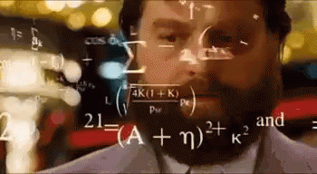

## Introducción

Antes de lanzarte al mundo de la programación, hay algo que tiene quedar claro:
programar no es aprender un lenguaje, es aprender a pensar. El lenguaje es la
herramienta, pero el arte está en construir instrucciones lógicas para resolver
problemas.

Programar es darle instrucciones exactas a una computadora para que haga algo
por vos. Pero hay una diferencia clave: la computadora **no entiende
ambigüedades**. No sabe lo que "más o menos" significa. Cada paso tiene que
estar perfectamente definido.

Al programar si te olvidás un detalle, deja de funcionar. Por eso hay que
aprender a **pensar como una máquina**, pero también a **estructurar como un
humano inteligente**.

En C, no hay atajos y eso es bueno. Te obliga a pensar de forma clara y lógica.

## 1. Las herramientas del aprendiz

### Instalá lo justo y necesario

- **Compilador C:** `gcc` o `clang`
- **Editor de texto:** `vim`, `nano`, `gedit`, VSCode... o lo que te haga feliz.
- **Terminal:** vas a vivir acá. Aprendé a amar el prompt.

En Debian/Ubuntu,

```bash
sudo apt install build-essential     # en
```

Para Windows, podes seguir la guia [../guias/compilador.md]

### Primer programa: el "Hola Mundo" al C

```c
#include <stdio.h>

int main() {
    printf("Hola, mundo!\n");
    return 0;
}
```

Compilá:

```sh
gcc hola.c -o hola
./hola
Hola, mundo!

```

:::{attention}

No te dejes estar Si no ves el mensaje que esta dentro de la instrucción
`printf`, hay algún problema que es necesario solucionar. No te trabes acá que
bloquea lo que viene a continuación.

:::

## 2. El Algoritmo: pensar antes de escribir

### Mentalidad de programador

1. **Leé el problema. Entendelo. Dibujalo.**
2. **Dividilo en pasos simples**, cosa que una máquina sin intuición pueda
   seguir.
3. **Usá papel y lápiz**. No escribas código antes de saber qué querés que haga.
4. **Convertí esos pasos en instrucciones en C.**

> _Pensar es más importante que escribir._


### Ejemplo simple pero clave: sumar dos números

1. Leer un número.
2. Leer otro número.
3. Sumar.
4. Mostrar el resultado.

```c
#include <stdio.h>

int main() {
    int a, b;
    printf("Ingresá dos números: ");
    scanf("%d %d", &a, &b);
    printf("La suma es: %d\n", a + b);
    return 0;
}
```

## 3. Variables: tus cajas

### ¿Qué son?

Una variable es un nombre simbólico para un espacio en memoria que guarda un
valor. Pensalo como una caja con una etiqueta y un contenido que podés cambiar.

### Tipos básicos en C

- `int`: números enteros (sin decimales)
- `float`: números reales con coma
- `char`: un carácter

### Declaración y asignación

```c
int edad = 42;      // caja llamada edad, con 42 adentro
float pi = 3.14;    // caja llamada pi, con 3.14
char inicial = 'A'; // caja llamada inicial, con 'A'
```

Podés declarar y luego asignar:

```c
int numero;
numero = 17;
```

### ¿Es necesario inicializar las variables?

Pero si siempre tiene cero...

Si declarás una variable pero no le das un valor inicial, su contenido es
**indeterminado**: puede tener cualquier cosa, lo que se conoce como "basura".
En sistemas operativos modernos, muchas veces la memoria se entrega inicializada
en cero para evitar que se filtren datos de otros programas, pero **no podés
confiar en esto**.

A medida que tu programa corre y reutiliza memoria, es posible que una variable
sin inicializar contenga valores viejos, distintos de cero, o cualquier cosa
inesperada. Por eso, **siempre inicializá tus variables** antes de usarlas. Esto
evita errores difíciles de detectar y hace tu código más seguro y predecible.

### Reglas del juego

- Las variables deben declararse antes de usarse.
- No podés cambiar el tipo una vez declarado.
- C es fuertemente tipado: `int` no es `float` ni `char`.

### Ejercicio 1

```{exercise}
:label: Mostrando valores
:enumerator: Valores

Escribí un programa que guarde tu edad, tu altura en metros y tu inicial, y los
muestre por pantalla. Dejá esta información directamente en las variables, a
continuación vamos a ver como pedir esto por teclado.
```

````{solution} Mostrando valores
:class: dropdown

```{code-block} c
:linenos:

#include <stdio.h>

int main() {
    int edad = 30;
    float altura = 1.75;
    char inicial = 'M';

    printf("Edad: %d\n", edad);
    printf("Altura: %.2f\n", altura);
    printf("Inicial: %c\n", inicial);

    return 0;
}
```
````

## 4. Entrada y salida: hablar con el usuario

### `scanf()` - Leer datos desde el teclado

La función `scanf()` sirve para que el programa reciba datos del usuario.
Necesitás indicar el tipo de dato y pasar a que variable le asignaras el valor
obtenido. (mas adelante vamos a ver para que esta el `&` y que significa)

```c
int edad;
printf("Ingresá tu edad: ");
scanf("%d", &edad);
```

### `printf()` - Mostrar resultados

Sirve para mostrar texto y valores como mensajes:

```c
printf("Tenés %d años\n", edad);
```

### Especificadores más comunes

| Tipo     | Especificador       |
| -------- | ------------------- |
| `int`    | `%d`                |
| `float`  | `%f`                |
| `char`   | `%c`                |
| `string` | `%s` (con `char[])` |

### Ejercicio 2

```{exercise}
:label: entrada
:enumerator: entrada
Pedí al usuario la inicial de su nombre (un solo carácter), edad y nota promedio, y mostralos formateados.
```

````{solution} entrada
:class: dropdown

```{code-block} c
:linenos:

#include <stdio.h>

int main() {
    char inicial;
    int edad;
    float nota;

    printf("Ingresá tu inicial: ");
    scanf(" %c", &inicial);  // espacio antes de %c para evitar problemas de buffer

    printf("Edad: ");
    scanf("%d", &edad);

    printf("Nota promedio: ");
    scanf("%f", &nota);

    printf("\nHola %c, tenés %d años y tu promedio es %.1f\n", inicial, edad, nota);

    return 0;
}
```
````

## 5. Condicionales: decisiones

Las estructuras condicionales permiten que el programa tome decisiones.

### `if`, `else if`, `else`

```c
if (condicion) {
    // bloque si se cumple
} else if (otra_condicion) {
    // otro camino
} else {
    // camino por defecto
}
```

### Operadores lógicos comunes

- `==` igual
- `!=` distinto
- `>` mayor
- `<` menor
- `>=`, `<=`
- `&&` y lógico
- `||` o lógico

### Ejemplo

```c
int edad;
scanf("%d", &edad);

if (edad >= 18) {
    printf("Mayor de edad\n");
} else {
    printf("Menor de edad\n");
}
```

### Ejercicio 3

```{exercise}
:label: entrada
:enumerator: entrada
Pedí una nota y mostra su resultado en palabras:
- Promociona, con la nota mayor o igual a 6.
- Aprueba, con la nota mayor o igual a 4.
- Desaprueba: menor a 4
```

````{solution} entrada
:class: dropdown

```{code-block} c
:linenos:
#include <stdio.h>

int main() {
    int nota;
    printf("Ingresá tu nota: ");
    scanf("%d", &nota);

    if (nota >= 6) {
        printf("Promociona\n");
    } else if (nota >= 4) {
        printf("Aprueba\n");
    } else {
        printf("Desaprueba\n");
    }
}
```
````

## 6. Bucles: repetir hasta dominar el universo

Un **bucle** (o _loop_) es una estructura que permite repetir una o más
instrucciones mientras se cumpla una condición. Esta es la forma en la que le
decís a la máquina: _"hacelo muchas veces sin que yo tenga que copiar y pegar"_.

Hay tres formas principales de bucles en C:

- `while` — mientras la condición sea verdadera.
- `for` — cuando sabés de antemano cuántas veces repetir.
- `do...while` — ejecuta el bloque al menos una vez.

### `while` — Repetición basada en condición

```c
int i = 0;
while (i < 5) {
    printf("i vale %d\n", i);
    i = i + 1; // o i++
}
```

:::{note} `while`

El bloque dentro de `while` se ejecuta mientras la condición
(`i < 5`) sea verdadera. Si nunca lo es, el bloque no se ejecuta.

:::

#### Flujo

```{mermaid}
---
config:
  theme: neutral
  layout: dagre
---
flowchart TD
    subgraph while
      Inicio --> EvaluarCondicion{"¿Se cumple la condición?"}
      EvaluarCondicion -- "Verdadero" --> EjecutarBloque[Ejecutar bloque de código]
      EjecutarBloque --> EvaluarCondicion
      EvaluarCondicion -- "Falso" --> Fin
    end
```

### Ejercicio 4

:::{exercise}
:label: lazo_while
:enumerator: while

Escribí un programa que imprima los números del 10 al 1 usando `while`.

:::

````{solution} lazo_while
:label: solucion-lazo_while
:class: dropdown

```{code-block} c
:linenos:
#include <stdio.h>

int main() {
    int i = 10;
    while (i >= 1) {
        printf("%d\n", i);
        i--;
    }
    return 0;
}
```
````

### `for` — Repetición controlada por contador

```c
for (int i = 0; i < 5; i++) {
    printf("i vale %d\n", i);
}
```

Este tipo de bucle es ideal cuando sabés cuántas veces querés repetir.

:::{admonition} Las partes del `for`

 `for (inicio; condición; paso) { bloque }`

- **inicio:** una sola vez al comenzar.
- **condición:** se evalúa antes de cada iteración.
- **paso:** se ejecuta al final de cada vuelta.
- **bloque:** las instrucciones ejecutas mientras la condición sea verdadera.

:::

**Y su equivalente con `while`:**

```c
int i = 0;                      // inicio
while (i < 5) {                 // condición
    printf("i vale %d\n", i);   // bloque
    i++;                        // paso
}
```

### Ejercicio 5

:::{exercise}
:label: lazo_for
:enumerator: for

Usá un `for` para mostrar los múltiplos de 3 entre 0 y 30. 

:::

````{solution} lazo_for
:label: solucion-lazo_while
:class: dropdown
```{code-block} c
:linenos:
#include <stdio.h>

int main() {
    for (int i = 0; i <= 30; i++) {
        if (i % 3 == 0) {
            printf("%d es múltiplo de 3\n", i);
        }
    }
    return 0;
}
```
````

### `do...while` — Ejecuta primero, pregunta después

```c
int clave;
do {
    printf("Ingresá la clave (123): ");
    scanf("%d", &clave);
} while (clave != 123);
```

Este tipo de bucle garantiza **al menos una ejecución**. Ideal para menús o
ingreso de datos que deben ejecutarse al menos una vez.

:::{warning} Tené cuidado con los bucles infinitos. Si la condición **nunca** se
vuelve falsa, el programa quedará atrapado en un ciclo eterno. :::

#### Flujo

```{mermaid}
flowchart TD
    subgraph do..while
        Inicio --> EjecutarBloque["Ejecutar bloque de código"]
        EjecutarBloque --> EvaluarCondicion{"¿Se cumple la condición?"}
        EvaluarCondicion -- "Verdadero" --> EjecutarBloque
        EvaluarCondicion -- "Falso" --> Fin
    end
```

### Ejercicio 6

:::{exercise}
:label: lazo_repeat
:enumerator: for

Usá un lazo `do..while` para controlar el acceso a un edificio, pidiendole al
usuario que ingrese un número usado como clave. 

:::

````{solution} lazo_repeat
:label: solucion-lazo_repeat
:class: dropdown
```{code-block} c
:linenos:
#include <stdio.h>

int main() {
    int clave;
    int clave_correcta = 1234; // Definimos una clave correcta

    do {
        printf("Ingresá la clave: ");
        scanf("%d", &clave);

        if (clave == clave_correcta) {
            printf("Acceso concedido. ¡Bienvenido!\n");
        } else {
            printf("Clave incorrecta. Intentá de nuevo.\n");
        }
    } while (clave != clave_correcta);

    return 0;
}
```
````

```{image} lazos.jpg
:alt: Ejemplo Grafico de lazos
:align: center
```

### `break` y `continue` — Atajos dentro del ciclo

En C, `break` y `continue` son dos instrucciones de control que permiten
modificar el flujo normal de un bucle. Aunque pueden resultar útiles en ciertos
contextos, su uso abusivo o descontrolado puede reducir la claridad del código.

#### `break`

Sirve para **salir completamente del bucle**, sin importar si la condición sigue
siendo verdadera.

```c
for (int i = 1; i <= 10; i++) {
    if (i == 5) {
        break; // termina el bucle cuando i vale 5
    }
    printf("i = %d", i);
}
```

#### `continue`

Sirve para **saltar al final del ciclo actual** y seguir con la siguiente
vuelta.

```c
for (int i = 1; i <= 5; i++) {
    if (i == 3) {
        continue; // omite imprimir cuando i vale 3
    }
    printf("i = %d", i);
}
```

:::{tip} 

Usá `break` cuando ya no tenga sentido seguir iterando, y `continue`
cuando quieras saltear un caso particular. 

:::

:::{admonition} Observación

La cátedra establece que el uso de `break` y `continue` no esta permitido 
por dos motivos:

1. **Reducen la legibilidad del código**: cuando hay muchas salidas posibles
   dentro de un bucle, se vuelve más difícil entender cuándo y por qué termina.
2. **Evitan el desarrollo del pensamiento algorítmico**: recurrir a estos atajos
   puede impedir que el estudiante busque una solución más clara, estructurada y
   general al problema.

Por eso, en las primeras etapas del aprendizaje, los evitaremos para fortalecer
la comprensión de la lógica de control.

En lugar de usar estos atajos, les pediremos que utilicen lazos con bandera, que
se explican a continuación. :::

### Ejercicio 7

:::{exercise}
:label: lazo_break
:enumerator: break

Modificá el siguiente código para que no utilice la instrucción `break`.

```{code-block} c
:linenos:
#include <stdio.h>

int main() {
    int i;
    for (i = 0; i < 10; i++) {
        printf("valor actual: %d\n", i);
        if (i == 4) {
            break;
        }
    }
    return 0;
}
```

:::

````{solution} lazo_break
:label: solucion-lazo_break
:class: dropdown
```{code-block} c
:linenos:
#include <stdio.h>

int main() {
    int i;
    for (i = 0; i < 5; i++) {
        printf("valor actual: %d\n", i);
    }
    return 0;
}
```
````

### Ejercicio 8

:::{exercise}
:label: lazo_continue
:enumerator: continue

Modificá el siguiente código para que no utilice la instrucción `continue`.

```{code-block} c
:linenos:
#include <stdio.h>

int main() {
    for (int i = 0; i <= 10; i++) {
        if (i % 2 == 0) {
            continue;
        }
        printf("i = %d\n", i);
    }
    return 0;
}
```

:::

````{solution} lazo_continue
:label: solucion-lazo_continue
:class: dropdown
```{code-block} c
:linenos:
#include <stdio.h>

int main() {
    for (int i = 1; i <= 10; i = i + 2) {
        printf("i = %d\n", i);
    }
    return 0;
}
```
````

### Bucles con bandera (`flag`)

En algunos casos, no podemos reescribir el lazo para que no utilice break,
simplemente por que no hay una expresion que lo permita, o porque simplemente es
necesario salir del lazo antes, por lo que es necesario aplicar una estrategia
clásica en programación estructurada.

El uso de una **variable bandera** para controlar la repetición de un bucle. En
lugar de usar `break`, se define una variable booleana que indica si se debe
continuar o no.

Desde el estándar C99, podés usar el tipo `bool` del encabezado `stdbool.h`, lo
cual mejora la legibilidad.

#### Ejemplo:

```c
#include <stdio.h>
#include <stdbool.h>

int main() {
    bool continuar = true;
    int numero;

    while (continuar) {
        printf("Ingresá un número (0 para salir): ");
        scanf("%d", &numero);

        if (numero == 0) {
            continuar = false; // apagamos la bandera
        } else {
            printf("Ingresaste: %d", numero);
        }
    }
    return 0;
}
```

#### Ventajas

- Mejora la legibilidad y estructura lógica.
- Permite definir con claridad la condición de corte.
- Favorece el razonamiento algorítmico en vez de usar interrupciones abruptas
  como `break`.

### Ejercicio 8

:::{exercise}
:label: lazo_continue
:enumerator: continue

Reescribí el ingreso de clave usando una bandera booleana en lugar de `break` o
`do...while`. 

:::

````{solution} lazo_continue
:label: solucion-lazo_continue
:class: dropdown
```{code-block} c
:linenos:
#include <stdio.h>
#include <stdbool.h> // Necesitamos esta librería para usar 'bool'

int main() {
    int clave;
    int clave_correcta = 1234; // Definimos la clave correcta
    bool acceso_concedido = false; // Nuestra bandera booleana

    // Usamos un bucle while y controlamos la salida con la bandera
    while (!acceso_concedido) {
        printf("Ingresá la clave: ");
        scanf("%d", &clave);

        if (clave == clave_correcta) {
            printf("Acceso concedido. ¡Bienvenido!\n");
            acceso_concedido = true; // Cambiamos la bandera para salir del bucle
        } else {
            printf("Clave incorrecta. Intentá de nuevo.\n");
        }
    }

    return 0;
}
```
````

## 7. Ejercicios

1. Pedí dos números y mostrá el mayor.
2. Mostrá los números del 1 al 100.
3. Sumá los números pares del 1 al 100.
4. Pedí un número y decí si es primo.
5. Pedí una nota (0 a 10) e indicá si aprobó.
6. Hacé un programa que pida contraseña hasta que sea la correcta.

## 8. Pensar antes de escribir (otra vez)

Cuando estés atascado:

- Escribí el algoritmo en tus propias palabras, si, en español.
- Dibujá un diagrama de flujo, no tiene que ser perfecto, solo para cambiar el
  punto de vista.
- Usá una prueba de escritorio (dry-run).
- Y si todo lo demas falla, meté `printf` por todos.

> _El compilador te va a decir qué no entiende. Escuchalo. Corregilo. Probalo._



## 9. No sigas más allá (todavía)

No te adelantes a funciones, punteros, structs ni arrays. Primero entendé lo
esencial:

- El código se ejecuta de arriba a abajo.
- Las variables viven en la memoria.
- Los algoritmos son secuencias lógicas.

## 10. Código afilado

Programar bien es:

- Pensar simple.
- Probar seguido.
- No repetir código, esto casi siempre es mala señal.
- Comentar lo que no sea obvio.
- Leer programas ajenos y {del}`robar`tomar buenas ideas.

> _"Escribí código que el profe sin mate pueda entender a las 3 AM."_
