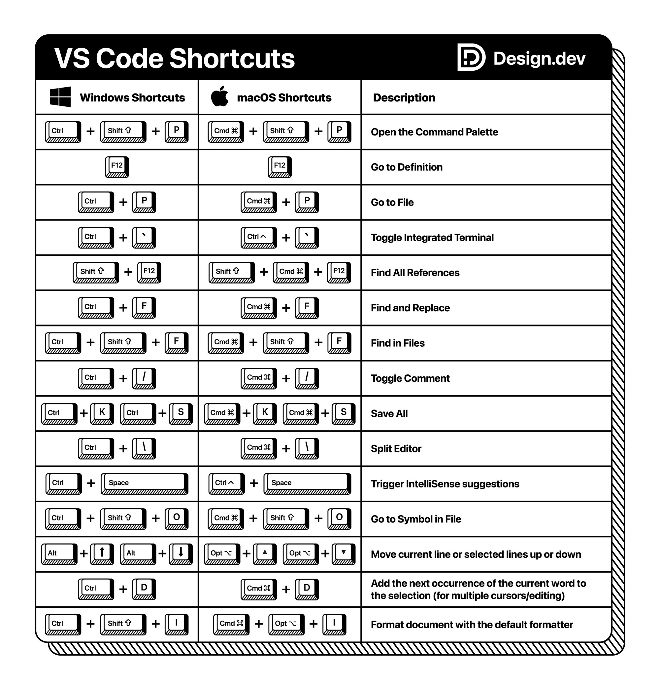

# Recursos

Aquí hay una pequeña colección de apuntes que pueden serles útiles.

[Guía linea de comandos Bash](101-BASH-r72.pdf)
Como usar la linea de comandos UNIX, Bourne Shell Again como 101 recetas y tips.

[Introducción a Git y GitHub](cversiones-git-r76.pdf)
es un apunte para empezar a usar estas herramientas que les daremos mucho uso
en esta cátedra y en Programación II.

[Como crear y trabajar con Pull Requests](claaj-pull_requests-r8) este es
un apunte de como interactuar con el profe vía Pull Request y como mejorar
las preguntas y respuestas.

[Guía de campo `sed`](sed-field-guide-r39.pdf) esta guia se creó en su momento
para complementar Bash. `sed` es el Stream Editor, una potente herramienta que
nos permite modificar archivos de texto en scripts de manera automatizada.

[Guía de campo `grep`](grep-field-guide-r34.pdf), lo mismo que la guía anterior,
esta herramienta nos permite buscar dentro de archivos de texto siguiendo
patrones indicados como 'expresiones regulares', una forma muy precisa de
indicar búsquedas.

## Machetes de las herramientas

[Machete de Markdown](markdown.pdf)

Hoy en día, prácticamente todo texto con formato se puede expresar de esta
manera. Los chats de Discord o de Whatsapp soportan bastante, así como todo
Google Docs y en particular, Github.

