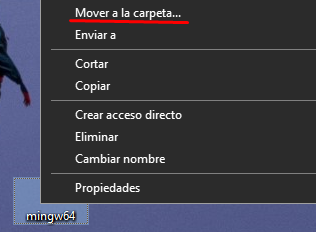
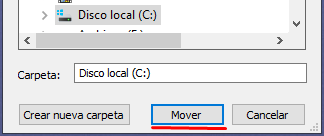
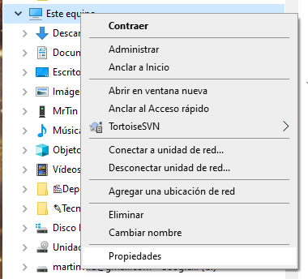
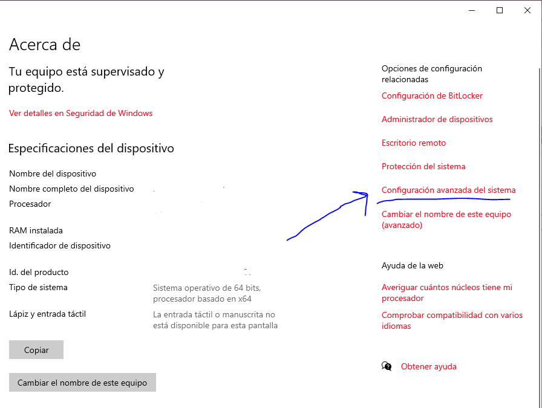
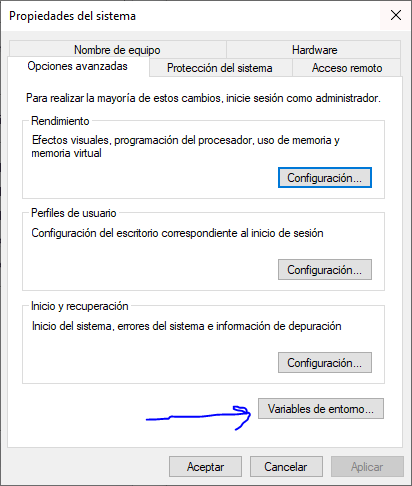
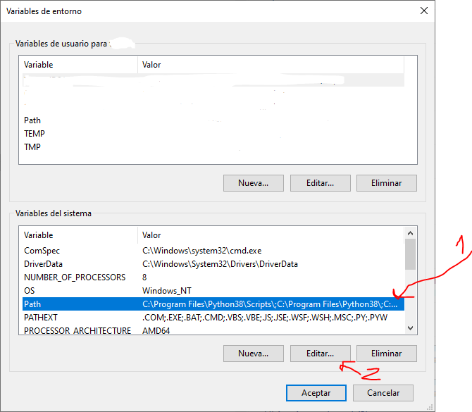
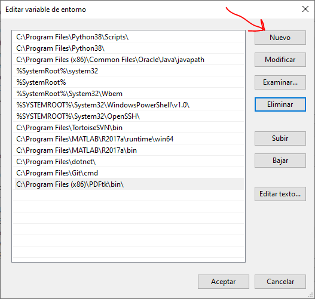
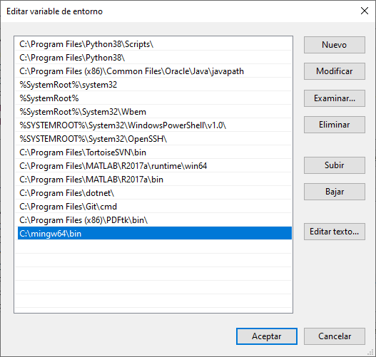

# Instalación del Compilador

## GCC en Windows

### Paso 1. Descargar el compilador:

Desde [aquí](https://github.com/brechtsanders/winlibs_mingw/releases/download/14.2.0posix-18.1.8-12.0.0-ucrt-r1/winlibs-x86_64-posix-seh-gcc-14.2.0-llvm-18.1.8-mingw-w64ucrt-12.0.0-r1.zip)

### Paso 2. Descompacten el zip de forma que ver el directorio `mingw64`. 
[Botón derecho sobre el archivo descargado, y dar a la opción de “Extraer aquí”]

### Paso 3. debiera de quedar una carpeta llamada `mingw64`, sobre esa carpeta, 
click derecho y usando la opción "Mover a la carpeta" -> Disco Local (C:) y apretás Mover

De forma que quede «`C:\mingw64`»

(Pasos mejorados por JeanFranco99)

### Paso 4. Configuren la ruta de acceso a las herramientas:

Haciendo clic derecho sobre “Este Equipo” en el Explorador de archivos.

(También pueden acceder vía Configuración de Windows ⇾ Acerca de)

Ahí, clic en `Configuración avanzada del sistema`

Clic en "Variables de entorno"

Ubiquen la "Variable de Sistema" ⇾ `Path`⇾ `Editar`

Ahí, usen el botón “Nuevo” y agreguen la dirección `C:\mingw64\bin` (exactamente como está)

De forma que quede:

### Paso 5. Cierren sesión en Windows (o reinicien)
Técnicamente, no es necesario en Windows 11.

### Paso 6. Verifiquen que el compilador funciona

En una terminal (Con las teclas {kbd}`WIN` + {kbd}`R` `cmd` y enter), prueben ejecutar `gcc --version`

## Visual Studio Code

Instalen desde [Visual Studio Code](https://code.visualstudio.com/) el entorno.
