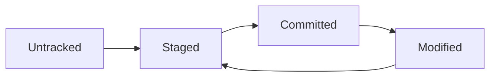

(intro-git)=
## ¿Por qué usar Git?

Git es un sistema de control de versiones distribuido que te permite llevar un
registro detallado de los cambios en tu código. Es como tener un "historial de
cambios" súper poderoso que no solo guarda qué cambió, sino también quién lo
cambió, cuándo y por qué.

Esta guía te llevará desde la {ref}`instalacion-git` hasta dominar los
{ref}`comandos-esenciales` para uso diario, incluyendo cómo trabajar con
{ref}`repositorios-remotos` como GitHub. Al final entenderás perfectamente el
{ref}`flujo-trabajo-basico` que usan los desarrolladores profesionales.

### Ventajas del control de versiones

- **Historial completo**: Podés ver cada cambio que hiciste en tu proyecto
- **Respaldo automático**: Tu código está seguro, nunca más vas a perder trabajo
- **Experimentación segura**: Probá cambios sin miedo a romper lo que funciona
- **Colaboración**: Trabajá con otros sin pisar el código del compañero
- **Portabilidad**: Llevá tu proyecto completo a cualquier computadora

:::{note} Un poco de historia

Git fue creado por Linus Torvalds (el mismo creador de Linux) en 2005. Hoy en
día es el estándar de facto para control de versiones en el desarrollo de
software.

:::

(conceptos-fundamentales)=
## Conceptos fundamentales

Antes de empezar a usar Git, es importante entender algunos conceptos clave.
Estos conceptos aparecerán constantemente cuando uses los
{ref}`comandos-esenciales` y entender bien la diferencia entre el
{ref}`working-directory`, {ref}`staging-area` y los {ref}`commit-concepto` es
fundamental para dominar Git.

(repositorio-concepto)=
### Repositorio (repo)

Es una carpeta de proyecto que Git está "controlando". Contiene todos los
archivos de tu proyecto más un historial completo de sus cambios.

(commit-concepto)=
### commit

Es como una "foto" de tu proyecto en un momento específico. Cada commit tiene:

- Los cambios realizados
- Un mensaje descriptivo
- Fecha y hora
- Autor del cambio

(working-directory)=
### Working Directory (Directorio de trabajo)

Es donde tenés los archivos en los que estás trabajando actualmente.

(staging-area)=
### Staging Area (Área de preparación)

Es un espacio intermedio donde "preparás" los cambios antes de confirmarlos con
un commit.

(estados-archivos)=
### Estados de los archivos



- **Untracked**: Git no conoce el archivo
- **Staged**: El archivo está preparado para el próximo commit
- **Committed**: El archivo está guardado en el historial
- **Modified**: El archivo fue modificado desde el último commit

(instalacion-configuracion)=
## Instalación y configuración inicial

(instalacion-git)=
### Instalación

**En Linux (Ubuntu/Debian):**

```bash
sudo apt update
sudo apt install git
```

**En Linux (CentOS/RHEL/Fedora):**

```bash
sudo dnf install git
```

**En macOS:**

```bash
# Con Homebrew
brew install git

# O usar el que viene con Xcode
xcode-select --install
```

**En Windows:**

- Descargá Git desde [git-scm.com](https://git-scm.com)
- O usá Git Bash que viene incluido

(configuracion-inicial)=
### Configuración inicial

Antes de usar Git por primera vez, configurá tu identidad. Esta información
aparecerá en todos los {ref}`commit-concepto` que hagas:

```bash
git config --global user.name "Tu Nombre"
git config --global user.email "tu.email@ejemplo.com"
```

Configuraciones útiles adicionales:

```bash
# Editor por defecto (opcional)
git config --global core.editor "code --wait"  # VS Code
git config --global core.editor "nano"         # Nano (simple)

# Colores en la terminal
git config --global color.ui auto

# Verificar configuración
git config --list
```

(primeros-pasos)=
## Primeros pasos: tu primer repositorio

(crear-repositorio)=
### Crear un nuevo repositorio

```bash
# Crear directorio y entrar
mkdir mi-proyecto
cd mi-proyecto

# Inicializar Git
git init
```

Esto crea una carpeta oculta `.git` donde Git guarda toda la información del
repositorio. Una vez inicializado, podés comenzar a usar todos los
{ref}`comandos-esenciales` para gestionar tus archivos.

(primer-commit)=
### Tu primer commit

```bash
# Crear un archivo
echo "# Mi Primer Proyecto" > README.md

# Ver el estado
git status

# Agregar archivo al staging area
git add README.md

# Verificar el estado nuevamente
git status

# Hacer el commit
git commit -m "Primer commit: agregar README"
```

:::{tip} Próximo paso Después de tu primer commit, considerá crear un
{ref}`archivo-gitignore` para evitar agregar archivos innecesarios a tu
repositorio. :::

:::{tip} Mensajes de commit

Los mensajes de commit deben ser claros y descriptivos. Explicá qué hiciste, no
cómo lo hiciste. Ejemplo: "Agregar validación de email" en lugar de "cambios". Y
aunque para empezar, podemos dejar cualquier cosa, con el tiempo van a ver lo
poderoso que es tener un historial más detallado.

:::

(comandos-esenciales)=
## Comandos esenciales para uso diario

(git-status)=
### git status - ¿Qué está pasando?

`git status` es tu comando de diagnóstico más importante. Te muestra el estado
actual de tu repositorio, incluyendo qué archivos fueron modificados, cuáles
están en el staging area listos para commit, y cuáles son completamente nuevos
(untracked). Es como preguntarle a Git "¿qué está pasando aquí?" y obtener un
resumen completo de la situación. Usalo constantemente para entender dónde estás
parado antes de hacer cualquier operación.

```bash
git status
```

Este comando te muestra:

- Qué archivos cambiaron
- Qué está en el staging area
- Qué archivos son nuevos (untracked)

(git-add)=
### git add - Preparar cambios

`git add` es el comando que mueve archivos desde tu directorio de trabajo al
{ref}`staging-area`. Piensa en el staging area como un "área de preparación"
donde seleccionás exactamente qué cambios querés incluir en tu próximo
{ref}`commit-concepto`. Esto te permite hacer commits granulares y específicos,
incluso si modificaste múltiples archivos. Podés agregar archivos individuales,
grupos de archivos, o todos los cambios de una vez. Es fundamental para mantener
un historial limpio y organizado.

```bash
# Agregar un archivo específico
git add archivo.txt

# Agregar varios archivos
git add archivo1.txt archivo2.txt

# Agregar todos los archivos modificados
git add .

# Agregar archivos por patrón
git add *.py        # todos los .py
git add src/        # todo en la carpeta src
```

(git-commit)=
### git commit - Confirmar cambios

`git commit` toma todos los archivos que están en el {ref}`staging-area` y los
guarda permanentemente en el historial de tu {ref}`repositorio-concepto`. Cada
commit es como una "fotografía" de tu proyecto en ese momento específico, con un
mensaje descriptivo que explica qué cambios se hicieron y por qué. Es
irreversible en el sentido de que una vez hecho el commit, esos cambios quedan
grabados en la historia para siempre. Los buenos mensajes de commit son
cruciales para entender la evolución del proyecto más adelante.

```bash
# Commit con mensaje
git commit -m "Descripción del cambio"

# Commit con mensaje más detallado
git commit -m "Título del commit

Descripción más detallada de lo que se cambió
y por qué se hizo el cambio."

# Agregar y hacer commit en un paso (solo archivos ya tracked)
git commit -am "Mensaje del commit"
```

(git-log)=
### git log - Historial de cambios

`git log` te muestra el historial completo de commits en tu
{ref}`repositorio-concepto`. Es como un libro de registro que documenta toda la
evolución de tu proyecto, mostrando quién hizo qué cambios, cuándo y por qué.
Cada entrada incluye el hash único del commit, el autor, la fecha y el mensaje
descriptivo. Con diferentes opciones podés personalizar la vista: ver solo una
línea por commit, buscar commits específicos, ver estadísticas de archivos
modificados, o incluso filtrar por autor o fecha. Es esencial para entender cómo
llegó tu proyecto al estado actual.

```bash
# Ver historial completo
git log

# Ver historial compacto (una línea por commit)
git log --oneline

# Ver últimos 5 commits
git log -5

# Ver cambios en archivos
git log --stat

# Buscar commits por mensaje
git log --grep="bugfix"
```

(git-diff)=
### git diff - Ver diferencias

`git diff` te muestra exactamente qué cambió entre diferentes estados de tu
proyecto. Sin argumentos, compara tu {ref}`working-directory` actual con el
{ref}`staging-area`, mostrándote qué modificaciones aún no agregaste. Con
`--staged` compara el staging area con el último commit, y con referencias
específicas podés comparar cualquier punto en la historia. Cada diferencia se
muestra línea por línea, con colores que indican qué se agregó (verde) y qué se
eliminó (rojo). Es fundamental para revisar tus cambios antes de hacer un commit
y para entender qué modificó alguien más en el código.

```bash
# Ver cambios no preparados (working directory vs staging)
git diff

# Ver cambios preparados (staging vs último commit)
git diff --staged

# Ver diferencias de un archivo específico
git diff archivo.txt

# Comparar con un commit anterior
git diff HEAD~1    # comparar con el commit anterior
git diff HEAD~3    # comparar con 3 commits atrás
```

(trabajando-archivos)=
## Trabajando con archivos

(agregar-archivos-nuevos)=
### Agregar archivos nuevos

Para que Git empiece a hacer seguimiento de un archivo nuevo, primero tenés que
agregarlo explícitamente con {ref}`git-add`. Los archivos nuevos aparecen como
"untracked" en {ref}`git-status` hasta que los agregues al staging area. Una vez
agregados y confirmados con {ref}`git-commit`, Git comenzará a monitorear todos
los cambios futuros en esos archivos.

```bash
# Creamos el archivo
touch nuevo-archivo.py
echo 'print("Hola mundo")' > nuevo-archivo.py

# Git no lo conoce todavía
git status

# Agregarlo al tracking
git add nuevo-archivo.py
git commit -m "Agregar script hola mundo"
```

(modificar-archivos)=
### Modificar archivos existentes

Cuando modificás un archivo que Git ya está trackeando, aparecerá como
"modified" en {ref}`git-status`. Git detecta automáticamente todos los cambios,
pero no los incluye en commits hasta que explícitamente los agregues con
{ref}`git-add`. Esto te permite revisar los cambios con {ref}`git-diff` antes de
confirmarlos, asegurándote de que solo incluís las modificaciones que realmente
querés guardar en el historial.

```bash
# Modificar archivo
echo 'print("Hola Git!")' >> nuevo-archivo.py

# Ver los cambios
git diff nuevo-archivo.py

# Preparar y confirmar cambios
git add nuevo-archivo.py
git commit -m "Actualizar mensaje de saludo"
```

(git-mv)=
### git mv - Renombrar archivos

`git mv` le dice a Git que un archivo fue renombrado o movido, preservando su
historial completo. Es superior a renombrar manualmente porque Git entiende que
es el mismo archivo con nuevo nombre, manteniendo todo el historial de cambios
asociado. Si renombrás manualmente, Git lo ve como un archivo eliminado y otro
nuevo creado, perdiendo la continuidad histórica. Siempre usá `git mv` para
mantener la integridad del historial de versiones.

```bash
# Renombrar usando Git (recomendado)
git mv archivo-viejo.txt archivo-nuevo.txt
git commit -m "Renombrar archivo"

# Si ya renombraste manualmente
mv archivo-viejo.txt archivo-nuevo.txt
git add archivo-nuevo.txt
git rm archivo-viejo.txt
git commit -m "Renombrar archivo"
```

(git-rm)=
### git rm - Eliminar archivos

`git rm` elimina archivos tanto del sistema de archivos como del tracking de Git
en una sola operación. Es diferente a simplemente borrar el archivo manualmente,
porque también le dice a Git que deje de hacerle seguimiento. Con `--cached`
podés mantener el archivo físicamente pero sacarlo del control de versiones
(útil para archivos que agregaste por error al repo). Es la forma correcta de
"des-trackear" archivos sin perder el trabajo local.

```bash
# Eliminar del sistema de archivos y de Git
git rm archivo-innecesario.txt
git commit -m "Eliminar archivo innecesario"

# Solo eliminar de Git (mantener en el sistema)
git rm --cached archivo-secreto.txt
git commit -m "Dejar de trackear archivo secreto"
```

(deshaciendo-cambios)=
## Deshaciendo cambios

(git-restore)=
### git restore - Descartar cambios no confirmados

`git restore` (o `git checkout --` en versiones anteriores) descarta
completamente las modificaciones no guardadas en tu {ref}`working-directory`,
regresando los archivos al estado del último commit. Es como un "deshacer"
definitivo para cambios que no querés conservar. Una vez ejecutado, los cambios
se pierden permanentemente, así que usalo solo cuando estés seguro de que querés
eliminar las modificaciones. Es útil cuando experimentaste algo que no funcionó
y querés volver al estado conocido y estable.

```bash
# Descartar cambios en un archivo específico
git checkout -- archivo.txt

# Descartar todos los cambios no confirmados
git checkout -- .

# Alternativa moderna (Git 2.23+)
git restore archivo.txt
git restore .
```

(git-restore-staged)=
### git restore --staged - Quitar archivos del staging area

`git restore --staged` (o `git reset HEAD` en versiones anteriores) mueve
archivos desde el {ref}`staging-area` de vuelta al {ref}`working-directory` sin
perder los cambios. Es como "desagregar" archivos que agregaste con
{ref}`git-add` pero que decidiste no incluir en el próximo commit. Los cambios
permanecen en tus archivos, solo se quitan del área de preparación. Es perfecto
para cuando agregaste demasiados archivos de una vez y querés hacer commits más
específicos y granulares.

```bash
# Quitar archivo específico del staging
git reset HEAD archivo.txt

# Quitar todos los archivos del staging
git reset HEAD

# Alternativa moderna (Git 2.23+)
git restore --staged archivo.txt
git restore --staged .
```

(git-commit-amend)=
### git commit --amend - Modificar el último commit

`git commit --amend` te permite "editar" el último commit, ya sea cambiando su
mensaje o agregando archivos que olvidaste incluir. En realidad no modifica el
commit existente, sino que crea uno nuevo reemplazando al anterior. Es
extremadamente útil para corregir errores menores inmediatamente después de
hacer un commit, como typos en el mensaje o archivos olvidados. Sin embargo, es
peligroso si ya compartiste el commit con otros ({ref}`git-push`), porque
cambiar el historial público puede crear conflictos para otros colaboradores.

```bash
# Cambiar el mensaje del último commit
git commit --amend -m "Mensaje corregido"

# Agregar archivos olvidados al último commit
git add archivo-olvidado.txt
git commit --amend --no-edit
```

:::{important} Cuidado con `--amend`

Solo usá `--amend` en commits que **no hayas compartido con otros** (`git push`)
ya que cambiar el historial público puede causar problemas.

:::

(git-reset-revert)=
### git reset y git revert - Volver atrás en el tiempo

`git reset --hard` mueve tu {ref}`repositorio-concepto` a un commit anterior,
eliminando completamente todos los commits posteriores. Es "destructivo" porque
pierdes permanentemente el trabajo realizado después de ese punto. En contraste,
`git revert` crea un nuevo commit que deshace los cambios de un commit
específico, preservando todo el historial. `git reset` reescribe la historia,
`git revert` la extiende. Para trabajo colaborativo siempre preferí `git revert`
porque no altera el historial que otros podrían tener.

```bash
# Ver historial para encontrar el commit
git log --oneline

# Volver a un commit específico (DESTRUCTIVO)
git reset --hard abc1234

# Crear un nuevo commit que deshace cambios (SEGURO)
git revert abc1234
```

(archivo-gitignore)=
## Archivo .gitignore

El archivo `.gitignore` le dice a Git qué archivos o carpetas debe ignorar
completamente, como si no existieran. Es esencial para evitar que archivos
temporales, dependencias generadas automáticamente, o información sensible
terminen en tu {ref}`repositorio-concepto`. Una vez que un archivo está listado
en `.gitignore`, Git no lo mostrará en {ref}`git-status` ni permitirá agregarlo
accidentalmente. Es una de las primeras cosas que deberías configurar en
cualquier proyecto nuevo.

Podemos revisar [GitHub/gitignore](https://github.com/github/gitignore) para
ejemplos ajustados a diferentes tipos de proyectos.

(crear-gitignore)=
### Crear .gitignore

```bash
# Crear el archivo
touch .gitignore
```

### Patrones comunes

```gitignore
# Archivos del sistema
.DS_Store
Thumbs.db

# Archivos de backup
*.bak
*.tmp
*~

# Logs
*.log
logs/

# Dependencias
node_modules/
venv/
__pycache__/

# Archivos de configuración local
.env
config.local.json

# Archivos compilados
*.o
*.exe
*.class

# IDEs
.vscode/
.idea/
*.swp
*.swo
```

(sintaxis-gitignore)=
### Sintaxis de .gitignore

```gitignore
archivo.txt         # ignorar archivo específico
*.log              # ignorar todos los .log
logs/              # ignorar carpeta completa
!importante.log    # NO ignorar este archivo (excepción)
docs/**/*.pdf      # ignorar PDFs en docs y subcarpetas
temp/*             # ignorar contenido de temp, pero no temp/
```

(repositorios-remotos)=
## Trabajando con repositorios remotos

(git-remote)=
### git remote - Conectar con GitHub/GitLab

`git remote` gestiona las conexiones entre tu repositorio local y repositorios
remotos (como GitHub). Un "remoto" es simplemente un repositorio que existe en
otro lugar (servidor, nube, otra computadora) al que podés enviar y desde el
cual podés recibir cambios. Por convención, el remoto principal se llama
"origin". Configurar remotos te permite sincronizar tu trabajo local con
servicios en la nube, colaborar con otros, y tener respaldos automáticos de tu
código.

```bash
# Agregar un remoto llamado 'origin'
git remote add origin https://github.com/usuario/mi-proyecto.git

# Ver remotos configurados
git remote -v

# Cambiar URL del remoto
git remote set-url origin https://github.com/usuario/nuevo-repo.git
```

(git-push)=
### git push - Subir cambios

`git push` envía tus commits locales al repositorio remoto, sincronizando tu
trabajo con el servidor. Es como "publicar" tus cambios para que otros los vean
o para tener una copia de respaldo en la nube. La primera vez necesitás
especificar con `-u` (upstream) qué rama remota debe trackear tu rama local.
Después de eso, un simple `git push` es suficiente. Solo podés hacer push de
commits que ya confirmaste localmente; los cambios en tu
{ref}`working-directory` o {ref}`staging-area` no se suben hasta que hagas
{ref}`git-commit`.

```bash
# Primera vez (establecer upstream)
git push -u origin main

# Siguientes veces
git push

# Push específico
git push origin main
```

(git-pull)=
### git pull - Bajar cambios

`git pull` descarga commits del repositorio remoto y los fusiona automáticamente
con tu trabajo local. Es la combinación de `git fetch` (descargar cambios) y
`git merge` (fusionar cambios). Usalo al comenzar a trabajar para asegurarte de
tener la versión más reciente del proyecto, especialmente en proyectos
colaborativos. Si hay conflictos entre tu trabajo local y los cambios remotos,
Git te pedirá que los resuelvas manualmente. Es esencial para mantener tu copia
local sincronizada con el trabajo de otros colaboradores.

```bash
# Bajar y fusionar cambios del remoto
git pull

# Equivale a hacer:
git fetch    # descargar cambios
git merge    # fusionar cambios
```

(git-clone)=
### git clone - Clonar un repositorio existente

`git clone` descarga una copia completa de un repositorio remoto a tu
computadora local, incluyendo todo el historial de commits, todas las ramas, y
toda la información del proyecto. Es como "fotocopiar" un proyecto completo
desde GitHub (u otro servicio) a tu máquina. Automáticamente configura el remoto
"origin" apuntando al repositorio original y establece el tracking de ramas. Es
la forma estándar de comenzar a trabajar en un proyecto existente o de obtener
el código de cualquier proyecto open source.

```bash
# Clonar repositorio
git clone https://github.com/usuario/proyecto.git

# Clonar en carpeta específica
git clone https://github.com/usuario/proyecto.git mi-carpeta

# Ver información del repositorio clonado
cd proyecto
git remote -v
git log --oneline -5
```

(flujo-trabajo-basico)=
## Flujo de trabajo básico

(flujo-diario)=
### Flujo diario típico

Este es el flujo que vas a repetir docenas de veces por día cuando trabajes con
Git. Primero verificás el estado con {ref}`git-status`, hacés modificaciones a
tus archivos, revisás los cambios con {ref}`git-diff`, los preparás con
{ref}`git-add`, los confirmás con {ref}`git-commit` con un mensaje descriptivo,
y finalmente los subís con {ref}`git-push`. Este ciclo se vuelve tan natural
como respirar y es la base de todo desarrollo profesional con control de
versiones.

```bash
# 1. Ver estado actual
git status

# 2. Hacer cambios en archivos
# ... editar código ...

# 3. Ver qué cambió
git diff

# 4. Preparar cambios
git add .

# 5. Confirmar cambios
git commit -m "Descripción clara del cambio"

# 6. Subir al repositorio remoto
git push
```

(flujo-nuevo-proyecto)=
### Flujo para nuevo proyecto

Este flujo te guía desde una carpeta vacía hasta un proyecto completamente
configurado con Git y conectado a un repositorio remoto. Iniciás creando el
{ref}`repositorio-concepto` local con `git init`, configurás el
{ref}`archivo-gitignore` desde el principio para evitar problemas futuros, hacés
tu {ref}`primer-commit`, conectás con el remoto usando {ref}`git-remote`, y
subís todo con {ref}`git-push`. Es el proceso estándar para comenzar cualquier
proyecto nuevo que querés versionar.

```bash
# 1. Crear proyecto local
mkdir mi-proyecto
cd mi-proyecto
git init

# 2. Crear archivos iniciales
echo "# Mi Proyecto" > README.md
echo "*.log" > .gitignore

# 3. Primer commit
git add .
git commit -m "Primer commit: estructura inicial"

# 4. Conectar con remoto
git remote add origin https://github.com/usuario/mi-proyecto.git

# 5. Subir código
git push -u origin main
```

(comandos-informacion)=
## Comandos de información útiles

(estado-configuracion)=
### Estado y configuración

Estos comandos te dan información crucial sobre el estado actual de tu
repositorio y su configuración. {ref}`git-status` te muestra qué está pasando
ahora, `git config --list` muestra toda tu configuración de Git, y
{ref}`git-remote` con `git log` te dan contexto sobre conexiones remotas e
historial. Son comandos "de solo lectura" que nunca modifican nada, perfectos
para orientarte cuando no estás seguro del estado actual del proyecto.

```bash
# Estado actual
git status

# Configuración actual
git config --list

# Información del repositorio
git remote -v
git log --oneline -10

# Ver archivos tracked
git ls-files

# Ver espacio usado
du -sh .git
```

### Exploración del historial

```bash
# Historial gráfico simple
git log --graph --oneline

# Historial con detalles
git log --stat

# Buscar en commits
git log --grep="fix"
git log --author="mi-nombre"

# Ver cambios de un archivo
git log -p archivo.txt

# Ver quién modificó cada línea
git blame archivo.txt
```

## Configuraciones útiles

### Alias para comandos frecuentes

```bash
# Crear aliases útiles
git config --global alias.st status
git config --global alias.co checkout
git config --global alias.br branch
git config --global alias.ci commit
git config --global alias.lg "log --oneline --graph"
git config --global alias.unstage "reset HEAD --"

# Usar los aliases
git st        # equivale a git status
git lg        # log gráfico compacto
```

### Configuraciones de editor

```bash
# Configurar VS Code como editor
git config --global core.editor "code --wait"

# Configurar Vim
git config --global core.editor "vim"

# Configurar Nano (más simple)
git config --global core.editor "nano"
```

### Configuración de colores

```bash
# Habilitar colores
git config --global color.ui auto
git config --global color.status auto
git config --global color.diff auto
git config --global color.branch auto
```

## Errores comunes y soluciones

### "fatal: not a git repository"

```bash
# Verificar que estás en un directorio con Git
ls -la | grep .git

# Si no existe, inicializar
git init
```

### "Author identity unknown"

```bash
# Configurar identidad
git config --global user.name "Tu Nombre"
git config --global user.email "tu@email.com"
```

### Commit sin mensaje

```bash
# Si se abre un editor, escribir mensaje y guardar
# Para salir de Vim: presionar ESC, luego :wq

# Para evitarlo, siempre usar -m
git commit -m "Mensaje descriptivo"
```

### Archivos grandes en el historial

```bash
# Ver archivos más grandes en el repo
git ls-tree -r -t -l --full-name HEAD | sort -n -k 4

# Para eliminar archivos grandes del historial (avanzado)
# Considerar usar git-filter-branch o BFG Repo-Cleaner
```

### Problema con line endings (Windows/Linux)

```bash
# Para Windows (convierte LF a CRLF al checkout)
git config --global core.autocrlf true

# Para Linux/Mac (mantiene LF)
git config --global core.autocrlf input
```

(ejercicios-git-basico)=
## Ejercicios prácticos

:::{exercise}
:label: ejercicio-primer-repo

**Ejercicio 1: Tu primer repositorio**

Este ejercicio integra todo lo que aprendiste sobre {ref}`crear-repositorio`,
{ref}`git-add`, {ref}`git-commit`, y {ref}`archivo-gitignore`. Es tu oportunidad
de practicar el {ref}`flujo-diario` completo.

1. Creá un directorio llamado `mi-blog`
2. Inicializá Git en ese directorio
3. Creá un archivo `index.html` con contenido HTML básico
4. Creá un archivo `.gitignore` que ignore archivos `.tmp` y `.log`
5. Hacé el primer commit con ambos archivos
6. Modificá el `index.html` agregando más contenido
7. Hacé un segundo commit con los cambios :::

:::{solution}
:for: ejercicio-primer-repo

```bash
# 1. Crear directorio
mkdir mi-blog
cd mi-blog

# 2. Inicializar Git
git init

# 3. Crear archivo HTML
cat > index.html << EOF
<!DOCTYPE html>
<html>
<head>
    <title>Mi Blog</title>
</head>
<body>
    <h1>Bienvenido a mi blog</h1>
    <p>Este es mi primer proyecto con Git.</p>
</body>
</html>
EOF

# 4. Crear .gitignore
echo -e "*.tmp\n*.log" > .gitignore

# 5. Primer commit
git add .
git commit -m "Primer commit: estructura inicial del blog"

# 6. Modificar HTML
cat >> index.html << EOF
    <h2>Primer artículo</h2>
    <p>Aquí escribiré sobre mi experiencia aprendiendo Git.</p>
EOF

# 7. Segundo commit
git add index.html
git commit -m "Agregar primer artículo al blog"

# Verificar historial
git log --oneline
```

:::

:::{exercise}
:label: ejercicio-manejo-cambios

**Ejercicio 2: Manejo de cambios**

1. En el proyecto anterior, creá un archivo `estilos.css`
2. Agregalo al staging area pero NO hagas commit todavía
3. Modificá el archivo `index.html` para incluir el CSS
4. Usá `git diff` para ver las diferencias
5. Sacá el CSS del staging area
6. Volvé a agregarlo junto con el HTML modificado
7. Hacé commit de ambos cambios juntos 

:::

:::{solution}
:for: ejercicio-manejo-cambios

```bash
# 1. Crear archivo CSS
cat > estilos.css << EOF
body {
    font-family: Arial, sans-serif;
    margin: 20px;
    background-color: #f5f5f5;
}

h1 {
    color: #333;
    border-bottom: 2px solid #007acc;
}
EOF

# 2. Agregar al staging
git add estilos.css

# 3. Modificar HTML para incluir CSS
sed -i '4i\    <link rel="stylesheet" href="estilos.css">' index.html

# 4. Ver diferencias
git diff                    # cambios en working directory
git diff --staged          # cambios en staging area

# 5. Sacar CSS del staging
git reset HEAD estilos.css

# 6. Agregar ambos archivos
git add .

# 7. Commit conjunto
git commit -m "Agregar estilos CSS y vincular con HTML"

# Verificar resultado
git log --oneline
git status
```

:::

### Ejercicios adicionales para practicar

#### Nivel Básico

1. **Exploración del historial**: En un proyecto existente, usá diferentes
   opciones de `git log` para explorar el historial de commits.

2. **Práctica con .gitignore**: Creá un proyecto con diferentes tipos de
   archivos (código, imágenes, logs, archivos temporales) y configurá un
   `.gitignore` apropiado.

3. **Simulación de errores**: Practicá deshacer cambios usando `git checkout`,
   `git reset` y `git revert`.

#### Nivel Intermedio

4. **Proyecto completo**: Desarrollá un pequeño sitio web con HTML, CSS y
   JavaScript, usando Git para el control de versiones. Hacé commits frecuentes
   y descriptivos.

5. **Colaboración simulada**: Cloná un repositorio público de GitHub, hacé
   cambios locales y practicá con `git pull` y `git push`.

6. **Historial limpio**: Practicá usar `git commit --amend` para corregir
   commits y mantener un historial limpio.

## Buenas prácticas

### Mensajes de commit

**✅ Buenos ejemplos:**

```
Agregar validación de email en formulario de registro
Corregir bug en cálculo de precios con descuentos
Actualizar documentación de API de usuarios
Refactorizar función de autenticación para mejor legibilidad
```

**❌ Malos ejemplos:**

```
fix
cambios
wip
asdasd
```

### Cuándo hacer commit

- **Hacé commits frecuentes** pero con cambios completos
- **Un commit por funcionalidad** o fix
- **Commits que no rompan el código** (que compile/funcione)
- **Antes de cambios grandes** hacé un commit de respaldo

### Organización de archivos

```
mi-proyecto/
├── .git/                 # Git (automático, no tocar)
├── .gitignore           # Qué ignorar
├── README.md            # Documentación del proyecto
├── src/                 # Código fuente
│   ├── main.py
│   └── utils.py
├── docs/                # Documentación
├── tests/               # Pruebas
└── requirements.txt     # Dependencias
```

## Recursos para seguir aprendiendo

### Documentación oficial

- [Git Documentation](https://git-scm.com/doc) - documentación oficial completa
- [Pro Git Book](https://git-scm.com/book) - libro gratuito y completo
- `git help <comando>` - ayuda de cualquier comando

### Herramientas gráficas

- **GitHub Desktop** - cliente gráfico simple para principiantes
- **GitKraken** - cliente gráfico avanzado y visual
- **VS Code Git** - integración nativa en VS Code
- **SourceTree** - cliente gratuito de Atlassian

### Plataformas de hosting

- **GitHub** - la más popular, gratis para repositorios públicos
- **GitLab** - alternativa con CI/CD integrado
- **Bitbucket** - de Atlassian, integra con Jira

### Comandos de referencia rápida

```bash
# Configuración inicial
git config --global user.name "Nombre"
git config --global user.email "email@ejemplo.com"

# Repositorio nuevo
git init
git add .
git commit -m "Primer commit"

# Día a día
git status              # ver estado
git add archivo         # preparar archivo
git commit -m "msg"     # confirmar cambios
git push               # subir cambios
git pull               # bajar cambios

# Historial
git log --oneline      # ver commits
git diff               # ver cambios
git show HEAD          # ver último commit

# Deshacer
git checkout -- archivo    # descartar cambios
git reset HEAD archivo     # quitar de staging
git commit --amend         # corregir último commit
```

(github-intro)=
## 🐙 GitHub y GitHub CLI

GitHub es la plataforma de hosting de repositorios Git más popular del mundo.
Además del hosting, ofrece herramientas de colaboración, gestión de proyectos y
automatización que lo convierten en el ecosistema central del desarrollo de
software moderno. Es el complemento natural de todo lo que aprendiste sobre
{ref}`repositorios-remotos` - GitHub es donde normalmente "viven" esos
repositorios remotos.

### ¿Qué es GitHub?

GitHub es mucho más que un simple hosting de Git:

- **Hosting de repositorios**: Almacena tu código en la nube
- **Interfaz web**: Navega y gestiona repositorios desde el navegador
- **Colaboración**: Issues, pull requests, discussions
- **Portfolio**: Muestra tu trabajo y contribuciones
- **GitHub Actions**: CI/CD y automatización
- **GitHub Pages**: Hosting gratuito para sitios web estáticos

:::{note} GitHub

Ofrece repositorios públicos gratuitos ilimitados y
repositorios privados gratuitos para cuentas personales con algunas
limitaciones. Para equipos y empresas hay planes de pago con funcionalidades
adicionales. 

:::

### Crear cuenta y primer repositorio en GitHub

#### Registro inicial

1. Visitá [github.com](https://github.com) y creá una cuenta
2. Elegí un username que sea profesional (va a ser parte de tu identidad online)
3. Verificá tu email
4. Configurá tu perfil con foto y descripción

#### Crear tu primer repositorio remoto

Ahora que ya sabés usar {ref}`git-clone`, {ref}`git-add`, {ref}`git-commit`, y
{ref}`git-push`, podés conectar tu trabajo local con GitHub. Tenés dos opciones
principales:

```bash
# Opción 1: Crear repositorio vacío en GitHub primero
# 1. Click en "New repository" en github.com
# 2. Ingresá nombre, descripción y configuración
# 3. Clonar localmente:

git clone https://github.com/tu-usuario/mi-proyecto.git
cd mi-proyecto

# Crear archivos y hacer primer commit
echo "# Mi Proyecto" > README.md
git add README.md
git commit -m "Initial commit"
git push origin main
```

```bash
# Opción 2: Subir repositorio local existente
# Crear repositorio vacío en GitHub (sin README)
# Luego conectar tu repo local:

git remote add origin https://github.com/tu-usuario/mi-proyecto.git
git branch -M main
git push -u origin main
```

### Flujo básico con GitHub

#### Flujo diario típico

```bash
# 1. Comenzar el día - sincronizar con remoto
git pull origin main

# 2. Trabajar localmente
# ... hacer cambios en archivos ...
git add .
git commit -m "Implementar nueva funcionalidad"

# 3. Subir cambios al final del día
git push origin main

# 4. Verificar en GitHub web que los cambios están
```

#### Mantener historial sincronizado

```bash
# Antes de empezar a trabajar siempre:
git status                    # verificar estado local
git pull origin main         # traer últimos cambios

# Después de cada sesión de trabajo:
git log --oneline -5         # revisar commits locales
git push origin main         # subir cambios
```

### Autenticación con GitHub

GitHub cambió la autenticación y ya no permite passwords simples. Tenés varias
opciones:

#### Personal Access Token (PAT)

```bash
# 1. En GitHub: Settings > Developer settings > Personal access tokens > Tokens (classic)
# 2. Generate new token con scopes: repo, workflow
# 3. Copiar el token (¡guardarlo seguro!)

# 4. Configurar Git para usar el token
git config --global credential.helper store

# 5. La primera vez que hagas push, usar:
# Username: tu-usuario-github
# Password: ghp_tu_personal_access_token
```

#### SSH Keys (Recomendado para uso frecuente)

```bash
# 1. Generar clave SSH (si no tenés)
ssh-keygen -t ed25519 -C "tu.email@ejemplo.com"

# 2. Agregar clave al ssh-agent
eval "$(ssh-agent -s)"
ssh-add ~/.ssh/id_ed25519

# 3. Copiar clave pública
cat ~/.ssh/id_ed25519.pub

# 4. En GitHub: Settings > SSH and GPG keys > New SSH key
# 5. Pegar la clave pública

# 6. Cambiar remote de HTTPS a SSH
git remote set-url origin git@github.com:tu-usuario/mi-proyecto.git

# 7. Probar conexión
ssh -T git@github.com
```

### Explorando repositorios en GitHub

#### Interfaz web principal

- **Code tab**: Navegá archivos y directorios
- **Issues**: Reportá bugs o solicitá features
- **Pull requests**: Revisá y fusioná cambios
- **Actions**: Ve el estado de CI/CD
- **Projects**: Gestión de tareas tipo Kanban
- **Settings**: Configuración del repositorio

#### Funcionalidades útiles de la interfaz

```bash
# Ver historial de un archivo específico
# En GitHub web: navegar al archivo > History

# Ver diferencias entre commits
# En GitHub web: Compare & pull request

# Descargar como ZIP
# En GitHub web: Code > Download ZIP

# Ver releases
# En GitHub web: Releases section
```

(github-cli-intro)=
#### GitHub CLI - Herramienta de línea de comandos

GitHub CLI (`gh`) es la herramienta oficial para interactuar con GitHub desde la
terminal.

(instalacion-github-cli)=
### Instalación de GitHub CLI

#### Linux (Ubuntu/Debian)

```bash
# Método oficial
curl -fsSL https://cli.github.com/packages/githubcli-archive-keyring.gpg | sudo dd of=/usr/share/keyrings/githubcli-archive-keyring.gpg
echo "deb [arch=$(dpkg --print-architecture) signed-by=/usr/share/keyrings/githubcli-archive-keyring.gpg] https://cli.github.com/packages stable main" | sudo tee /etc/apt/sources.list.d/github-cli.list > /dev/null
sudo apt update
sudo apt install gh

# Método alternativo con snap
sudo snap install gh
```

#### Linux (CentOS/RHEL/Fedora)

```bash
sudo dnf install gh
```

#### macOS

```bash
# Con Homebrew
brew install gh

# Con MacPorts
sudo port install gh
```

#### Windows

```bash
# Con winget
winget install --id GitHub.cli

# Con Chocolatey
choco install gh

# Con Scoop
scoop install gh
```

### Configuración inicial de GitHub CLI

```bash
# Autenticarse con GitHub
gh auth login

# Seguir el flujo interactivo:
# 1. Elegir GitHub.com
# 2. Elegir HTTPS o SSH
# 3. Authenticarse con token o browser
# 4. Elegir protocolo preferido

# Verificar autenticación
gh auth status

# Ver configuración actual
gh config list
```

(comandos-github-cli)=
### Comandos esenciales de GitHub CLI

#### Gestión de repositorios

```bash
# Crear repositorio nuevo
gh repo create mi-nuevo-proyecto --public --clone
gh repo create mi-proyecto-privado --private --clone

# Clonar repositorio
gh repo clone usuario/proyecto
gh repo clone https://github.com/usuario/proyecto.git

# Ver información del repositorio actual
gh repo view

# Ver información de otro repositorio
gh repo view microsoft/vscode

# Listar tus repositorios
gh repo list

# Hacer fork de un repositorio
gh repo fork usuario/proyecto --clone
```

#### Issues (problemas/tareas)

```bash
# Listar issues del repositorio actual
gh issue list

# Ver issue específico
gh issue view 123

# Crear nuevo issue
gh issue create --title "Bug en validación" --body "Descripción detallada del problema"

# Crear issue interactivo
gh issue create

# Cerrar issue
gh issue close 123

# Asignar issue
gh issue edit 123 --assignee @me
```

#### Pull Requests

```bash
# Listar pull requests
gh pr list

# Ver pull request específico
gh pr view 456

# Crear pull request
gh pr create --title "Nueva funcionalidad" --body "Descripción de cambios"

# Crear PR interactivo
gh pr create

# Hacer checkout de un PR
gh pr checkout 456

# Mergear pull request
gh pr merge 456

# Cerrar pull request
gh pr close 456
```

#### Releases

```bash
# Listar releases
gh release list

# Ver release específico
gh release view v1.0.0

# Crear release
gh release create v1.0.0 --title "Primera versión" --notes "Cambios principales"

# Descargar assets de release
gh release download v1.0.0
```

#### Gists (snippets de código)

```bash
# Crear gist público
gh gist create archivo.py --public

# Crear gist privado
gh gist create archivo.py

# Listar tus gists
gh gist list

# Ver gist específico
gh gist view abc123def456

# Editar gist
gh gist edit abc123def456
```

### Workflows comunes con GitHub CLI

#### Flujo completo de nuevo proyecto

```bash
# 1. Crear repositorio y clonarlo
gh repo create mi-proyecto --public --clone
cd mi-proyecto

# 2. Crear estructura inicial
echo "# Mi Proyecto" > README.md
echo "node_modules/" > .gitignore
git add .
git commit -m "Initial commit"
git push

# 3. Crear primer issue
gh issue create --title "Setup inicial" --body "Configurar estructura del proyecto"

# 4. Ver el repositorio en GitHub
gh repo view --web
```

#### Contribuir a proyecto existente

```bash
# 1. Fork del proyecto
gh repo fork usuario/proyecto --clone
cd proyecto

# 2. Crear rama para tu contribución
git checkout -b mi-funcionalidad

# 3. Hacer cambios y commit
# ... editar archivos ...
git add .
git commit -m "Agregar nueva funcionalidad"

# 4. Subir rama
git push origin mi-funcionalidad

# 5. Crear pull request
gh pr create --title "Nueva funcionalidad" --body "Descripción detallada"

# 6. Ver el PR en navegador
gh pr view --web
```

#### Gestión de issues como tareas

```bash
# Crear lista de tareas para sprint
gh issue create --title "Implementar autenticación" --label "feature"
gh issue create --title "Agregar tests unitarios" --label "testing"
gh issue create --title "Documentar API" --label "documentation"

# Ver dashboard de issues
gh issue list --state open

# Trabajar en issue específico
gh issue view 123
# ... hacer el trabajo ...
git commit -m "Fix #123: implementar autenticación"

# Cerrar issue automáticamente al hacer push
git push
```

### Integración con workflow diario

#### Alias útiles para GitHub CLI

```bash
# Agregar aliases a tu .bashrc o .zshrc
alias ghs="gh status"
alias ghi="gh issue list"
alias ghp="gh pr list"
alias ghr="gh repo view"
alias ghc="gh pr create"

# O crear aliases de gh
gh alias set prs "pr list"
gh alias set issues "issue list"
gh alias set repo "repo view"
```

#### Scripts de automatización

```bash
# Script para inicio de día
#!/bin/bash
echo "=== GitHub Dashboard ==="
echo "Repositorio actual:"
gh repo view

echo -e "\nIssues abiertas:"
gh issue list --limit 5

echo -e "\nPull requests pendientes:"
gh pr list --limit 5

echo -e "\nStatus de Actions:"
gh run list --limit 3
```

### GitHub Pages - Hosting gratuito

GitHub Pages te permite hospedar sitios web estáticos directamente desde tu
repositorio.

```bash
# 1. Crear repositorio para GitHub Pages
gh repo create mi-usuario.github.io --public --clone

# 2. Crear sitio web simple
cd mi-usuario.github.io
cat > index.html << EOF
<!DOCTYPE html>
<html>
<head>
    <title>Mi Portfolio</title>
</head>
<body>
    <h1>Bienvenido a mi sitio</h1>
    <p>Este sitio está hospedado en GitHub Pages</p>
</body>
</html>
EOF

# 3. Subir y activar GitHub Pages
git add .
git commit -m "Add initial website"
git push

# 4. Configurar GitHub Pages desde Settings o CLI
gh api repos/:owner/:repo --method PATCH --field "has_pages=true"

# 5. Tu sitio estará disponible en https://mi-usuario.github.io
```

### Ejercicios prácticos con GitHub y CLI

:::{exercise}
:label: ejercicio-github-setup

**Ejercicio 1: Setup completo de GitHub**

1. Creá una cuenta en GitHub si no tenés
2. Instalá GitHub CLI en tu sistema
3. Autenticáte con `gh auth login`
4. Creá un repositorio público llamado `mi-portfolio` usando GitHub CLI
5. Agregá un README.md con información sobre vos
6. Subí el proyecto y verificá que se vea correctamente en GitHub web 

:::

:::{solution}
:for: ejercicio-github-setup

```bash
# 1. Crear cuenta en github.com (manual)

# 2. Instalar GitHub CLI (según tu sistema)
# En Ubuntu:
curl -fsSL https://cli.github.com/packages/githubcli-archive-keyring.gpg | sudo dd of=/usr/share/keyrings/githubcli-archive-keyring.gpg
echo "deb [arch=$(dpkg --print-architecture) signed-by=/usr/share/keyrings/githubcli-archive-keyring.gpg] https://cli.github.com/packages stable main" | sudo tee /etc/apt/sources.list.d/github-cli.list > /dev/null
sudo apt update && sudo apt install gh

# 3. Autenticar
gh auth login
# Seguir el flujo interactivo

# 4. Crear repositorio
gh repo create mi-portfolio --public --clone
cd mi-portfolio

# 5. Crear README con información personal
cat > README.md << EOF
# Mi Portfolio

## Sobre mí
Soy un desarrollador aprendiendo Git y GitHub.

## Habilidades
- Git y control de versiones
- Desarrollo web básico
- GitHub y colaboración

## Proyectos
- [Mi Portfolio](https://github.com/$(gh api user --jq '.login')/mi-portfolio)

## Contacto
- GitHub: [@$(gh api user --jq '.login')](https://github.com/$(gh api user --jq '.login'))
- Email: $(gh api user --jq '.email // "email@ejemplo.com"')
EOF

# 6. Subir y verificar
git add README.md
git commit -m "Add portfolio README with personal information"
git push

# Ver en web
gh repo view --web
```

:::

:::{exercise}
:label: ejercicio-github-workflow

**Ejercicio 2: Workflow completo con issues y CLI**

1. En tu repositorio `mi-portfolio`, creá 3 issues usando GitHub CLI:
   - "Agregar página de proyectos"
   - "Mejorar diseño del README"
   - "Agregar información de contacto"
2. Trabajá en uno de los issues, hacé los cambios necesarios
3. Cerrá el issue automáticamente con el commit message
4. Verificá que el issue se cerró correctamente

:::

:::{solution}
:for: ejercicio-github-workflow

```bash
# Asegurate de estar en el repositorio mi-portfolio
cd mi-portfolio

# 1. Crear issues usando GitHub CLI
gh issue create --title "Agregar página de proyectos" --body "Crear una sección dedicada a mostrar mis proyectos con descripciones y enlaces"

gh issue create --title "Mejorar diseño del README" --body "Usar markdown avanzado para hacer el README más atractivo visualmente"

gh issue create --title "Agregar información de contacto" --body "Incluir enlaces a redes sociales y formas de contacto profesional"

# Ver los issues creados
gh issue list

# 2. Trabajar en el primer issue (agregar página de proyectos)
cat >> README.md << EOF

## Mis Proyectos

### 1. Mi Portfolio
- **Descripción**: Mi primera experiencia con Git y GitHub
- **Tecnologías**: Markdown, Git, GitHub
- **Estado**: En desarrollo
- **Link**: [Ver repositorio](https://github.com/$(gh api user --jq '.login')/mi-portfolio)

### 2. Próximos proyectos
- Sitio web personal
- Aplicación de tareas
- Blog técnico

---
*Última actualización: $(date +"%d/%m/%Y")*
EOF

# 3. Commit que cierra automáticamente el issue #1
git add README.md
git commit -m "Add projects section

Close #1 - Agregar página de proyectos

- Agregar sección de proyectos al README
- Incluir proyecto actual y roadmap futuro
- Mejorar estructura general del documento"

git push

# 4. Verificar que el issue se cerró
gh issue list
gh issue view 1

echo "¡El issue #1 debería aparecer como cerrado!"
```

:::

(repositorios-especiales-github)=
### Repositorios especiales de GitHub

GitHub tiene varios tipos de repositorios especiales que tienen funcionalidades
únicas más allá del simple hosting de código. Conocer estos repositorios te
permite aprovechar al máximo la plataforma y crear una presencia profesional
sólida.

#### 1. Repositorio de perfil (USERNAME/USERNAME)

El repositorio más importante para tu presencia online es el **repositorio de
perfil**. Este es un repositorio especial que debe tener exactamente el mismo
nombre que tu username de GitHub.

**Características únicas:**

- El README.md se muestra automáticamente en tu página de perfil
- Funciona como tu "carta de presentación" profesional
- Es lo primero que ven los reclutadores y otros desarrolladores
- Permite usar Markdown, imágenes, GIFs, y widgets interactivos

#### 2. GitHub Pages (usuario.github.io)

Un repositorio llamado `tu-usuario.github.io` automáticamente se convierte en tu
sitio web personal.

**Funcionalidades:**

- Hosting gratuito de sitios web estáticos
- Dominio personalizado: `https://tu-usuario.github.io`
- Soporte para Jekyll (generador de sitios estáticos)
- Perfect para portfolios, blogs, o documentación

#### 3. Repositorios .github

Repositorios que empiezan con `.github` tienen funciones especiales:

- **`.github`**: Plantillas de issues, pull requests, y configuración para toda
  tu cuenta
- **`.github.io`**: Alias para tu sitio de GitHub Pages
- **`tu-org/.github`**: Configuración por defecto para toda una organización

#### 4. Gists especiales

Aunque no son repositorios tradicionales, los Gists también tienen
características especiales:

- **Gists públicos**: Se indexan en buscadores
- **Gists con nombre específico**: Pueden embeberse fácilmente
- **Gists con múltiples archivos**: Funcionan como mini-proyectos

:::{exercise}
:label: ejercicio-repositorio-perfil

**Ejercicio 3: Crear tu repositorio de perfil profesional**

En este ejercicio vas a crear tu repositorio de perfil de GitHub, que será tu
carta de presentación profesional. Integrará todo lo aprendido sobre
{ref}`git-clone`, {ref}`git-add`, {ref}`git-commit`, {ref}`git-push`, y
{ref}`comandos-github-cli`.

**Objetivos:**

1. Crear el repositorio especial de perfil usando GitHub CLI
2. Diseñar un README.md profesional con información personal
3. Agregar badges, estadísticas y elementos visuales atractivos
4. Usar el flujo completo Git + GitHub para gestionarlo
5. Entender cómo este repositorio mejora tu presencia online

**Pasos a seguir:**

1. **Preparación inicial**: Verificá que tenés GitHub CLI configurado
2. **Crear repositorio de perfil**: Usar tu username exacto como nombre
3. **Diseñar contenido profesional**: README con secciones bien estructuradas
4. **Agregar elementos interactivos**: Badges, stats, y enlaces
5. **Gestionar con Git**: Usar el flujo completo de commits y push
6. **Verificar resultado**: Confirmar que aparece en tu perfil

**Resultado esperado:** Un perfil de GitHub profesional que muestre tus
habilidades, proyectos e intereses, y que puedas usar como referencia en
aplicaciones laborales. 

:::

:::{solution}
:for: ejercicio-repositorio-perfil

```bash
# 1. Verificar configuración de GitHub CLI
gh auth status
echo "Tu username actual de GitHub:"
gh api user --jq '.login'

# Guardar username en variable para reutilizar
USERNAME=$(gh api user --jq '.login')
echo "Creando repositorio de perfil para: $USERNAME"

# 2. Crear repositorio especial de perfil
# IMPORTANTE: el nombre debe ser exactamente igual a tu username
gh repo create "$USERNAME" --public --clone --description "Mi repositorio de perfil profesional"
cd "$USERNAME"

# 3. Crear README.md profesional y completo
cat > README.md << EOF
# ¡Hola! 👋 Soy $(gh api user --jq '.name // .login')

<div align="center">
  
</div>

## 🚀 Sobre mí

- 🔭 **Actualmente trabajando en:** Proyectos de aprendizaje con Git y GitHub
- 🌱 **Aprendiendo:** Control de versiones, desarrollo web, y mejores prácticas de código
- 💬 **Preguntame sobre:** Git, GitHub, primeros pasos en programación
- 📫 **Contacto:** [Mi email](mailto:$(gh api user --jq '.email // "tu-email@ejemplo.com"'))
- ⚡ **Dato curioso:** Este README fue creado completamente desde la terminal usando Git y GitHub CLI

## 🛠️ Tecnologías y herramientas

### Lenguajes de programación


### Herramientas de desarrollo


## 📊 Estadísticas de GitHub

<div align="center">
  
  
</div>

## 🏆 GitHub Achievements

<div align="center">
  
</div>

## 📈 Actividad reciente

<!--START_SECTION:activity-->
<!--END_SECTION:activity-->

## 🎯 Proyectos destacados

### 🔧 Repositorios principales

- **[mi-portfolio](https://github.com/$USERNAME/mi-portfolio)** - Mi primer proyecto con Git y GitHub
- **[aprendiendo-git](https://github.com/$USERNAME/aprendiendo-git)** - Ejercicios y práctica con control de versiones
- **[proyectos-web](https://github.com/$USERNAME/proyectos-web)** - Colección de proyectos web básicos

### 🚧 En desarrollo

- **Sitio web personal** - Portfolio online con GitHub Pages
- **Blog técnico** - Compartiendo lo que aprendo
- **Proyectos de práctica** - Ejercicios de programación y Git

## 🌐 Encuéntrame en

[](https://linkedin.com/in/tu-perfil)
[](https://twitter.com/tu-usuario)
[](mailto:$(gh api user --jq '.email // "tu-email@ejemplo.com"'))
[](https://$USERNAME.github.io)

## 💡 Quote que me inspira

> *"El control de versiones no es solo sobre código, es sobre la evolución de las ideas."*

---

<div align="center">
  
</div>

<div align="center">

**¡Gracias por visitar mi perfil! 🚀**

*Siempre abierto a nuevas oportunidades y colaboraciones*

</div>
EOF

# 4. Crear archivo de configuración para GitHub Actions (opcional)
mkdir -p .github/workflows
cat > .github/workflows/update-readme.yml << EOF
name: Update README

on:
  schedule:
    - cron: '0 0 * * 0'  # Actualizar cada domingo
  workflow_dispatch:

jobs:
  update-readme:
    runs-on: ubuntu-latest
    steps:
      - uses: actions/checkout@v2
      - name: Update activity
        uses: jamesgeorge007/github-activity-readme@master
        env:
          GITHUB_TOKEN: \${{ secrets.GITHUB_TOKEN }}
EOF

# 5. Agregar .gitignore básico
cat > .gitignore << EOF
# Archivos temporales
*.tmp
*.log
*~

# Archivos del sistema
.DS_Store
Thumbs.db

# Backups
*.backup
EOF

# 6. Flujo completo Git: add, commit, push
echo "📝 Agregando archivos al staging area..."
git add .

echo "💾 Haciendo commit del perfil profesional..."
git commit -m "🚀 Add professional profile README

✨ Features added:
- Personal introduction with typing animation
- Technology badges and skills section
- GitHub statistics and achievement trophies
- Project showcase and social links
- Automated activity updates with GitHub Actions
- Professional styling with emojis and alignment

🔧 Technical implementation:
- Markdown with HTML for enhanced formatting
- External services integration (shields.io, vercel apps)
- GitHub Actions workflow for dynamic content
- Responsive design with proper image sizing
- SEO-friendly structure with semantic headers

🎯 Purpose: Professional online presence for networking and job applications"

echo "🚀 Subiendo al repositorio remoto..."
git push origin main

# 7. Verificar resultado
echo ""
echo "✅ ¡Repositorio de perfil creado exitosamente!"
echo ""
echo "🔍 Verificaciones:"
echo "1. Repositorio en GitHub: https://github.com/$USERNAME/$USERNAME"
echo "2. Tu perfil actualizado: https://github.com/$USERNAME"
echo "3. Verificar con GitHub CLI:"

gh repo view "$USERNAME"

echo ""
echo "🎨 Tu README ahora aparece en tu perfil de GitHub como una carta de presentación profesional."
echo "💡 Tip: Actualizá regularmente este README con nuevos proyectos y habilidades."
echo ""
echo "🔗 Próximos pasos opcionales:"
echo "- Crear repositorio $USERNAME.github.io para tu sitio web personal"
echo "- Agregar más repositorios públicos para mostrar tu trabajo"
echo "- Contribuir a proyectos open source para mejorar tus estadísticas"
echo "- Configurar LinkedIn y otros perfiles para coincidir con tu GitHub"
```

:::

(otros-repositorios-especiales)=
### Guía completa de repositorios especiales

#### Repositorio GitHub Pages (usuario.github.io)

```bash
# Crear tu sitio web personal
gh repo create "$USERNAME.github.io" --public --clone
cd "$USERNAME.github.io"

# Crear página web básica
cat > index.html << EOF
<!DOCTYPE html>
<html lang="es">
<head>
    <meta charset="UTF-8">
    <meta name="viewport" content="width=device-width, initial-scale=1.0">
    <title>$(gh api user --jq '.name // .login') - Portfolio</title>
    <style>
        body {
            font-family: Arial, sans-serif;
            max-width: 800px;
            margin: 0 auto;
            padding: 20px;
            line-height: 1.6;
        }
        .hero { text-align: center; padding: 50px 0; }
        .projects { display: grid; grid-template-columns: repeat(auto-fit, minmax(300px, 1fr)); gap: 20px; }
        .project { border: 1px solid #ddd; padding: 20px; border-radius: 8px; }
    </style>
</head>
<body>
    <div class="hero">
        <h1>¡Hola! Soy $(gh api user --jq '.name // .login')</h1>
        <p>Desarrollador en crecimiento, apasionado por la tecnología</p>
    </div>

    <section>
        <h2>Sobre mí</h2>
        <p>Estoy aprendiendo desarrollo web y control de versiones con Git y GitHub.</p>
    </section>

    <section>
        <h2>Proyectos</h2>
        <div class="projects">
            <div class="project">
                <h3>Mi Portfolio GitHub</h3>
                <p>Repositorio especial de perfil con información profesional</p>
                <a href="https://github.com/$USERNAME">Ver en GitHub</a>
            </div>
        </div>
    </section>
</body>
</html>
EOF

git add .
git commit -m "🌐 Add personal website homepage"
git push origin main

echo "🌐 Tu sitio web estará disponible en: https://$USERNAME.github.io"
```

#### Repositorio de configuración (.github)

```bash
# Crear repositorio para templates y configuración
gh repo create ".github" --public --clone
cd ".github"

# Template para issues
mkdir -p .github/ISSUE_TEMPLATE
cat > .github/ISSUE_TEMPLATE/bug_report.md << EOF
---
name: 🐛 Bug Report
about: Reportar un error o problema
title: '[BUG] '
labels: bug
assignees: ''
---

## 🐛 Descripción del bug
Una descripción clara y concisa del problema.

## 🔄 Pasos para reproducir
1. Ir a '...'
2. Hacer click en '....'
3. Scroll down a '....'
4. Ver error

## ✅ Comportamiento esperado
Descripción clara de lo que esperabas que pasara.

## 📸 Screenshots
Si es aplicable, agregá screenshots para ayudar a explicar el problema.

## 🖥️ Información del entorno
- OS: [ej. macOS, Windows, Linux]
- Browser: [ej. Chrome, Safari]
- Versión: [ej. 22]
EOF

# Template para feature requests
cat > .github/ISSUE_TEMPLATE/feature_request.md << EOF
---
name: 💡 Feature Request
about: Sugerir una nueva funcionalidad
title: '[FEATURE] '
labels: enhancement
assignees: ''
---

## 💡 ¿Tu feature request está relacionado a un problema?
Una descripción clara y concisa del problema. Ej. Siempre me frustra cuando [...]

## 🎯 Describe la solución que te gustaría
Descripción clara y concisa de lo que querés que pase.

## 🤔 Describe alternativas que consideraste
Descripción clara y concisa de soluciones o features alternativas.

## 📝 Contexto adicional
Agregá cualquier otro contexto o screenshots sobre el feature request.
EOF

git add .
git commit -m "📝 Add issue templates for better project management"
git push origin main
```

#### Resumen de repositorios especiales

| Repositorio          | Función                       | URL resultante                      |
| -------------------- | ----------------------------- | ----------------------------------- |
| `username/username`  | **Perfil README**             | Se muestra en `github.com/username` |
| `username.github.io` | **Sitio web personal**        | `https://username.github.io`        |
| `.github`            | **Templates y configuración** | Aplicable a todos tus repos         |
| `.github.io`         | **Alias de GitHub Pages**     | Alternativa a `username.github.io`  |

:::{tip} Estrategia de presencia online completa 

Para una presencia profesional sólida en GitHub:

1. **Repositorio de perfil**: Tu carta de presentación (README llamativo)
2. **GitHub Pages**: Tu portfolio/CV online (sitio web profesional)
3. **Repositorios de proyectos**: Demostrar habilidades técnicas
4. **Contribuciones open source**: Mostrar colaboración y compromiso
5. **Actividad consistente**: Commits regulares demuestran dedicación 

:::

### Buenas prácticas con GitHub

#### Repositorios públicos

- **README claro**: Explicá qué hace tu proyecto y cómo usarlo
- **Licencia**: Agregá un archivo LICENSE apropiado
- **Gitignore**: Configuralo para tu lenguaje/framework
- **Releases**: Usá tags para versiones estables
- **Issues templates**: Facilita el reporte de problemas

#### Perfil profesional

Ya viste en el {ref}`ejercicio-repositorio-perfil` cómo crear un repositorio de
perfil profesional. Acá hay algunos consejos adicionales para maximizar su
impacto:

```bash
# El proceso completo está detallado en el ejercicio anterior
# Puntos clave para un perfil efectivo:

# 1. Información personal clara y profesional
# 2. Tecnologías con badges visuales atractivos
# 3. Estadísticas de GitHub dinámicas
# 4. Enlaces a proyectos y redes sociales
# 5. Diseño responsive y bien estructurado

# Ver ejercicio completo: {ref}`ejercicio-repositorio-perfil`
echo "Consulta el ejercicio anterior para el proceso completo paso a paso"
```

**Elementos clave de un perfil profesional efectivo:**

- **Header atractivo**: Nombre, título, y animación de texto
- **Sección "Sobre mí"**: Información personal y profesional
- **Tecnologías**: Badges coloridos de lenguajes y herramientas
- **Estadísticas**: GitHub stats automáticas y trophies
- **Proyectos**: Enlaces a repositorios importantes
- **Contacto**: Redes sociales y email profesional
- **Actualización regular**: Mantener información actualizada

#### Colaboración efectiva

- **Commits descriptivos**: Explicá el "qué" y el "por qué"
- **Issues claros**: Usá templates y labels consistentemente
- **Pull requests pequeños**: Cambios enfocados y revisables
- **Documentación**: Mantené README y docs actualizadas

### Troubleshooting común

#### Problemas de autenticación

```bash
# Verificar autenticación actual
gh auth status

# Re-autenticar si hay problemas
gh auth logout
gh auth login

# Verificar configuración de Git
git config --global user.name
git config --global user.email
```

#### Problemas con permisos

```bash
# Si tenés problemas de permisos, verificar:
gh repo view
gh auth status

# Para repositorios de organizaciones
gh auth refresh --scopes repo,org:read
```

#### Sincronización de cambios

```bash
# Si hay conflictos al hacer push
git status
git pull origin main
# Resolver conflictos si existen
git push origin main
```

## Epílogo

Git puede parecer intimidante al principio, pero con la práctica se vuelve una
herramienta indispensable. Los {ref}`comandos-esenciales` que viste en esta guía
son suficientes para el 90% del uso diario. Dominando el
{ref}`flujo-trabajo-basico`, el trabajo con {ref}`repositorios-remotos`, y las
herramientas de {ref}`github-intro`, tenés toda la base para ser productivo
profesionalmente.

:::{tip} Práctica constante

La mejor forma de aprender Git es usándolo en
proyectos reales. Empezá practicando con los {ref}`ejercicios-git-basico` de
esta guía, luego con proyectos pequeños y personales para ganar confianza antes
de usar Git en proyectos importantes. 

:::

Recordá que Git es una herramienta poderosa que te va a acompañar durante toda
tu carrera como programador. Entender bien los {ref}`conceptos-fundamentales` y
practicar constantemente el {ref}`flujo-diario` te dará una base sólida para
eventualmente aprender técnicas más avanzadas.

¡Felicitaciones! Ya tenés todo lo necesario para usar Git de forma efectiva en
tu trabajo diario.

```bash
$ git log --oneline
a1b2c3d (HEAD -> main) docs: completar guía de Git para principiantes
4d5e6f7 feat: agregar conceptos fundamentales y flujo básico
8g9h0i1 init: crear estructura inicial de la guía
```

---

_"El control de versiones no es solo sobre código, es sobre la evolución de las
ideas."_
