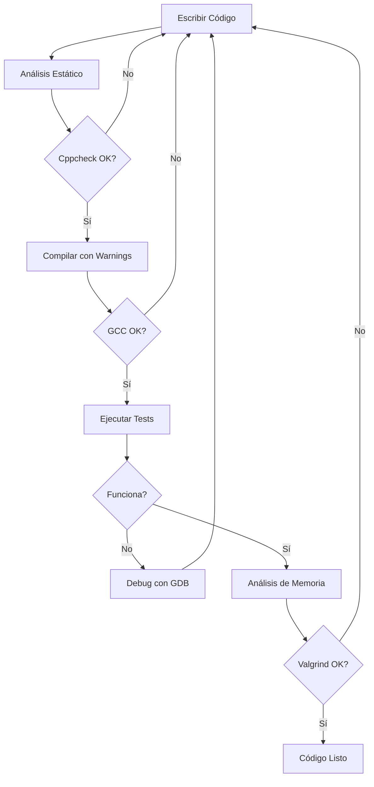

# Herramientas de Desarrollo para C

Esta guía detalla la instalación y uso de herramientas esenciales para el desarrollo profesional en C. Estas herramientas te ayudarán a detectar errores, depurar código y mantener la calidad del software.

:::{important}
Las herramientas presentadas aquí son fundamentales para escribir código robusto y confiable. Se recomienda incorporarlas gradualmente en tu flujo de trabajo.
:::

## Tabla de Contenidos

```{contents}
:depth: 3
:local:
```

---

## Cppcheck: Análisis Estático de Código

Cppcheck es una herramienta de análisis estático que detecta errores en el código sin necesidad de ejecutarlo. Identifica problemas como accesos fuera de límites, fugas de memoria, condiciones redundantes y más.

### Instalación

#### En Windows

1. **Descargar el instalador:**
   - Visitá la [página de releases de Cppcheck](https://github.com/danmar/cppcheck/releases)
   - Descargá el archivo `.msi` más reciente (por ejemplo, `cppcheck-2.12-x64-Setup.msi`)

2. **Ejecutar el instalador:**
   - Hacé doble clic en el archivo descargado
   - Seguí el asistente de instalación
   - Marcá la opción "Add to PATH" si está disponible

3. **Verificar la instalación:**
   ```sh
   cppcheck --version
   ```

#### En Linux (Debian/Ubuntu)

```sh
sudo apt update
sudo apt install cppcheck
```

#### En Linux (Fedora/RHEL)

```sh
sudo dnf install cppcheck
```

#### En macOS

```sh
brew install cppcheck
```

### Uso Básico

#### Análisis de un Archivo Individual

```sh
cppcheck archivo.c
```

#### Análisis con Más Verificaciones

```sh
cppcheck --enable=all --suppress=missingIncludeSystem archivo.c
```

**Opciones explicadas:**
- `--enable=all`: Habilita todas las verificaciones
- `--suppress=missingIncludeSystem`: Suprime advertencias sobre archivos de sistema no encontrados

#### Análisis de Todo un Proyecto

```sh
cppcheck --enable=all --suppress=missingIncludeSystem src/
```

### Interpretación de Resultados

Cppcheck reporta diferentes tipos de problemas:

```{list-table}
:header-rows: 1

* - Tipo
  - Severidad
  - Descripción
* - `error`
  - Alta
  - Errores que causarán fallas en tiempo de ejecución
* - `warning`
  - Media
  - Código potencialmente problemático
* - `style`
  - Baja
  - Sugerencias de estilo y mejora
* - `performance`
  - Media
  - Optimizaciones posibles
* - `portability`
  - Media
  - Problemas de portabilidad entre plataformas
```

### Ejemplo Práctico

Considerá el siguiente código con errores:

```c
#include <stdio.h>
#include <stdlib.h>

int main() {
    int *arr = malloc(10 * sizeof(int));
    
    for (int i = 0; i <= 10; i++) {  // Error: acceso fuera de límites
        arr[i] = i;
    }
    
    // Error: no se libera la memoria
    return 0;
}
```

Al ejecutar cppcheck:

```sh
cppcheck ejemplo.c
```

Salida esperada:
```
[ejemplo.c:6]: (error) Array 'arr[10]' accessed at index 10, which is out of bounds.
[ejemplo.c:4]: (error) Memory leak: arr
```

:::{tip}
Incorporá cppcheck en tu flujo de trabajo antes de compilar. Esto te ayudará a detectar errores tempranamente.
:::

---

## Valgrind: Detección de Errores de Memoria

Valgrind es una suite de herramientas para debugging y profiling. Su herramienta más utilizada, Memcheck, detecta fugas de memoria, accesos inválidos y otros problemas relacionados con el manejo de memoria.

:::{warning}
Valgrind **no está disponible nativamente en Windows**. En Windows, considerá usar alternativas como Dr. Memory o WSL (Windows Subsystem for Linux).
:::

### Instalación

#### En Linux (Debian/Ubuntu)

```sh
sudo apt update
sudo apt install valgrind
```

#### En Linux (Fedora/RHEL)

```sh
sudo dnf install valgrind
```

#### En macOS

```sh
brew install valgrind
```

:::{note}
En macOS reciente (con procesadores Apple Silicon), Valgrind tiene soporte limitado. Considerá usar las herramientas de Xcode como alternativa.
:::

#### En Windows (usando WSL)

1. **Instalar WSL:**
   ```powershell
   wsl --install
   ```

2. **Dentro de WSL, instalar Valgrind:**
   ```sh
   sudo apt update
   sudo apt install valgrind
   ```

### Uso Básico

#### Compilación para Valgrind

Para obtener información detallada en los reportes, compilá con símbolos de debugging:

```sh
gcc -g -Wall -Wextra programa.c -o programa
```

La opción `-g` incluye información de debugging que permite a Valgrind mostrar números de línea.

#### Ejecución con Valgrind

```sh
valgrind ./programa
```

#### Opciones Recomendadas

Para un análisis más completo:

```sh
valgrind --leak-check=full --show-leak-kinds=all --track-origins=yes ./programa
```

**Opciones explicadas:**
- `--leak-check=full`: Muestra detalles completos de fugas de memoria
- `--show-leak-kinds=all`: Muestra todos los tipos de fugas
- `--track-origins=yes`: Rastrea el origen de valores no inicializados

### Tipos de Errores que Detecta

```{list-table}
:header-rows: 1

* - Error
  - Descripción
  - Ejemplo
* - Invalid read/write
  - Acceso a memoria no asignada
  - `arr[100]` en array de 10
* - Memory leak
  - Memoria asignada nunca liberada
  - `malloc()` sin `free()`
* - Use of uninitialized value
  - Uso de variable sin inicializar
  - `int x; printf("%d", x);`
* - Invalid free
  - Liberar memoria ya liberada
  - `free(ptr); free(ptr);`
* - Mismatched free
  - Liberar con función incorrecta
  - `new[]` con `free()`
```

### Ejemplo Práctico

Código con errores de memoria:

```c
#include <stdio.h>
#include <stdlib.h>

int main() {
    int *arr = malloc(5 * sizeof(int));
    
    // Error 1: Acceso fuera de límites
    arr[10] = 42;
    
    // Error 2: Uso de variable no inicializada
    int x;
    printf("Valor: %d\n", x);
    
    // Error 3: Memory leak (no se llama a free)
    return 0;
}
```

Compilación y análisis:

```sh
gcc -g -Wall -Wextra ejemplo.c -o ejemplo
valgrind --leak-check=full ./ejemplo
```

Salida parcial de Valgrind:

```
==12345== Invalid write of size 4
==12345==    at 0x401234: main (ejemplo.c:7)
==12345==  Address 0x... is 0 bytes after a block of size 20 alloc'd

==12345== Conditional jump or move depends on uninitialised value(s)
==12345==    at 0x401245: main (ejemplo.c:10)

==12345== LEAK SUMMARY:
==12345==    definitely lost: 20 bytes in 1 blocks
```

:::{tip}
Ejecutá Valgrind regularmente, especialmente antes de entregar trabajos prácticos. Un programa sin errores de memoria es señal de código profesional.
:::

---

## GDB: GNU Debugger

GDB es el debugger estándar para C/C++ en sistemas Unix-like. Permite ejecutar programas paso a paso, inspeccionar variables, establecer breakpoints y analizar el comportamiento del programa en tiempo de ejecución.

### Instalación

#### En Windows (MinGW incluye GDB)

Si instalaste GCC mediante MinGW (como se describe en la guía de GCC), GDB ya está disponible.

Verificá la instalación:
```sh
gdb --version
```

#### En Linux (Debian/Ubuntu)

```sh
sudo apt update
sudo apt install gdb
```

#### En Linux (Fedora/RHEL)

```sh
sudo dnf install gdb
```

#### En macOS

```sh
brew install gdb
```

:::{note}
En macOS, puede ser necesario firmar el certificado de GDB para que funcione correctamente. Consultá la documentación oficial para este proceso.
:::

### Compilación para Debugging

Para usar GDB efectivamente, compilá tu programa con la opción `-g`:

```sh
gcc -g -Wall -Wextra programa.c -o programa
```

:::{important}
No uses la opción `-O2` o superiores al compilar para debugging, ya que las optimizaciones dificultan el análisis del código.
:::

### Comandos Básicos de GDB

#### Iniciar GDB

```sh
gdb ./programa
```

#### Comandos Fundamentales

```{list-table}
:header-rows: 1

* - Comando
  - Abreviación
  - Descripción
* - `run [args]`
  - `r`
  - Ejecuta el programa
* - `break <ubicación>`
  - `b`
  - Establece un breakpoint
* - `next`
  - `n`
  - Ejecuta la siguiente línea (sin entrar en funciones)
* - `step`
  - `s`
  - Ejecuta la siguiente línea (entrando en funciones)
* - `continue`
  - `c`
  - Continúa la ejecución hasta el próximo breakpoint
* - `print <variable>`
  - `p`
  - Muestra el valor de una variable
* - `list`
  - `l`
  - Muestra el código fuente
* - `backtrace`
  - `bt`
  - Muestra la pila de llamadas
* - `quit`
  - `q`
  - Sale de GDB
```

### Ejemplo Práctico de Debugging

Considerá un programa con un bug:

```c
#include <stdio.h>

int calcular_suma(int n) {
    int suma = 0;
    for (int i = 1; i < n; i++) {  // Bug: debería ser i <= n
        suma += i;
    }
    return suma;
}

int main() {
    int resultado = calcular_suma(5);
    printf("Suma: %d\n", resultado);  // Esperado: 15, Obtiene: 10
    return 0;
}
```

#### Sesión de Debugging

```sh
# Compilar con información de debug
gcc -g suma.c -o suma

# Iniciar GDB
gdb ./suma
```

Dentro de GDB:

```gdb
(gdb) break main
Breakpoint 1 at 0x401156: file suma.c, line 11.

(gdb) run
Starting program: ./suma
Breakpoint 1, main () at suma.c:11
11          int resultado = calcular_suma(5);

(gdb) step
calcular_suma (n=5) at suma.c:4
4           int suma = 0;

(gdb) next
5           for (int i = 1; i < n; i++) {

(gdb) print i
$1 = 1

(gdb) continue
Suma: 10

(gdb) quit
```

:::{tip}
Usá GDB cuando:
- Un programa crashea y no sabés por qué
- Los resultados no son los esperados
- Necesitás entender el flujo de ejecución
- Querés inspeccionar valores de variables en tiempo de ejecución
:::

### Comandos Avanzados

#### Watchpoints (Puntos de Observación)

Detiene la ejecución cuando una variable cambia:

```gdb
(gdb) watch variable
```

#### Breakpoints Condicionales

```gdb
(gdb) break suma.c:5 if i == 3
```

#### Examinar Memoria

```gdb
(gdb) x/10d &array    # Muestra 10 enteros desde la dirección de array
```

#### Pretty Printing de Estructuras

```gdb
(gdb) set print pretty on
(gdb) print mi_estructura
```

---

## Otras Herramientas Útiles

### AddressSanitizer (ASan)

AddressSanitizer es una herramienta de detección de errores de memoria integrada en GCC y Clang. Es más rápida que Valgrind pero requiere recompilación.

#### Uso

```sh
gcc -g -fsanitize=address -fno-omit-frame-pointer programa.c -o programa
./programa
```

#### Ventajas

- Más rápido que Valgrind (overhead ~2x vs ~20x)
- Detecta errores similares a Valgrind
- Integrado en el compilador

:::{note}
ASan no detecta fugas de memoria por defecto. Para habilitarlas, configurá:
```sh
export ASAN_OPTIONS=detect_leaks=1
```
:::

### UndefinedBehaviorSanitizer (UBSan)

Detecta comportamiento indefinido en C:

```sh
gcc -g -fsanitize=undefined programa.c -o programa
./programa
```

Detecta:
- Desbordamientos de enteros
- Conversiones inválidas
- Desalineación de punteros
- Accesos fuera de límites

### Gcov: Cobertura de Código

Gcov mide qué partes del código se ejecutan durante las pruebas:

```sh
gcc -fprofile-arcs -ftest-coverage programa.c -o programa
./programa
gcov programa.c
```

Genera un reporte mostrando qué líneas se ejecutaron.

### Gprof: Profiling de Rendimiento

Identifica qué funciones consumen más tiempo:

```sh
gcc -pg programa.c -o programa
./programa
gprof programa gmon.out > analisis.txt
```

---

## Flujo de Trabajo Recomendado



### Checklist de Calidad

Antes de entregar un trabajo práctico, verificá:

- [ ] El código compila sin warnings (`gcc -Wall -Wextra -Werror`)
- [ ] Cppcheck no reporta errores (`cppcheck --enable=all`)
- [ ] No hay fugas de memoria (`valgrind --leak-check=full`)
- [ ] El programa funciona correctamente con todos los casos de prueba
- [ ] El código está documentado y formateado consistentemente

:::{important}
Estas herramientas no reemplazan las buenas prácticas de programación, pero ayudan a detectar errores que pueden pasar desapercibidos durante el desarrollo.
:::

---

## Integración con VS Code

Visual Studio Code puede integrar estas herramientas para facilitar su uso.

### Extensiones Recomendadas

1. **C/C++** (Microsoft): Soporte básico para C
2. **C/C++ Extension Pack**: Bundle de extensiones útiles
3. **Cppcheck Extension**: Integración de cppcheck
4. **Native Debug**: Soporte para GDB

### Configuración de Tasks

Creá un archivo `.vscode/tasks.json` en tu proyecto:

```json
{
    "version": "2.0.0",
    "tasks": [
        {
            "label": "Compile with Debug",
            "type": "shell",
            "command": "gcc",
            "args": [
                "-g",
                "-Wall",
                "-Wextra",
                "${file}",
                "-o",
                "${fileDirname}/${fileBasenameNoExtension}"
            ],
            "group": {
                "kind": "build",
                "isDefault": true
            }
        },
        {
            "label": "Run Cppcheck",
            "type": "shell",
            "command": "cppcheck",
            "args": [
                "--enable=all",
                "--suppress=missingIncludeSystem",
                "${file}"
            ]
        },
        {
            "label": "Run Valgrind",
            "type": "shell",
            "command": "valgrind",
            "args": [
                "--leak-check=full",
                "--show-leak-kinds=all",
                "${fileDirname}/${fileBasenameNoExtension}"
            ],
            "dependsOn": ["Compile with Debug"]
        }
    ]
}
```

### Configuración de Launch para GDB

Creá un archivo `.vscode/launch.json`:

```json
{
    "version": "0.2.0",
    "configurations": [
        {
            "name": "GDB Debug",
            "type": "cppdbg",
            "request": "launch",
            "program": "${fileDirname}/${fileBasenameNoExtension}",
            "args": [],
            "stopAtEntry": false,
            "cwd": "${fileDirname}",
            "environment": [],
            "externalConsole": false,
            "MIMode": "gdb",
            "preLaunchTask": "Compile with Debug"
        }
    ]
}
```

:::{tip}
Con estas configuraciones, podés compilar, analizar y depurar directamente desde VS Code usando atajos de teclado.
:::

---

## Recursos Adicionales

### Documentación Oficial

- [Cppcheck Manual](https://cppcheck.sourceforge.io/manual.pdf)
- [Valgrind User Manual](https://valgrind.org/docs/manual/manual.html)
- [GDB Documentation](https://sourceware.org/gdb/documentation/)
- [GCC Sanitizers](https://gcc.gnu.org/onlinedocs/gcc/Instrumentation-Options.html)

### Tutoriales Interactivos

- [GDB Tutorial - CS Visualized](https://www.cs.cmu.edu/~gilpin/tutorial/)
- [Valgrind Quick Start](https://valgrind.org/docs/manual/quick-start.html)

### Cheat Sheets

```{list-table} Comandos Rápidos
:header-rows: 1

* - Herramienta
  - Comando Más Usado
  - Propósito
* - Cppcheck
  - `cppcheck --enable=all archivo.c`
  - Análisis estático completo
* - Valgrind
  - `valgrind --leak-check=full ./programa`
  - Detección de fugas de memoria
* - GDB
  - `gdb ./programa` → `run` → `backtrace`
  - Debugging interactivo
* - ASan
  - `gcc -fsanitize=address -g archivo.c`
  - Detección rápida de errores
```

---

## Conclusión

El dominio de estas herramientas es fundamental para desarrollar software de calidad en C. Incorporarlas en tu flujo de trabajo te ayudará a:

- Detectar errores tempranamente
- Entender mejor el comportamiento de tu código
- Escribir programas más robustos y confiables
- Desarrollar habilidades profesionales valoradas en la industria

:::{important}
La mejor herramienta de debugging es tu cerebro. Estas herramientas son asistentes poderosos, pero no reemplazan el pensamiento crítico y el análisis cuidadoso del código.
:::

---

## Ejercicios Prácticos

```exercise
:label: ex-herramientas-1

Creá un programa en C que tenga al menos tres errores diferentes (fuga de memoria, acceso fuera de límites, variable no inicializada). Luego:

1. Usá Cppcheck para identificar errores estáticos
2. Compilá y ejecutá con Valgrind
3. Corregí todos los errores reportados
4. Verificá que el programa pase todas las verificaciones
```

```exercise
:label: ex-herramientas-2

Tomá uno de tus ejercicios anteriores y usá GDB para:

1. Establecer un breakpoint en la función main
2. Ejecutar el programa paso a paso
3. Inspeccionar el valor de al menos tres variables en diferentes puntos
4. Documentar el flujo de ejecución
```

```exercise
:label: ex-herramientas-3

Configurá VS Code con las tasks proporcionadas en esta guía. Verificá que podés:

1. Compilar con {kbd}`Ctrl+Shift+B`
2. Ejecutar Cppcheck desde el menú de tasks
3. Iniciar una sesión de debugging con {kbd}`F5`
```
